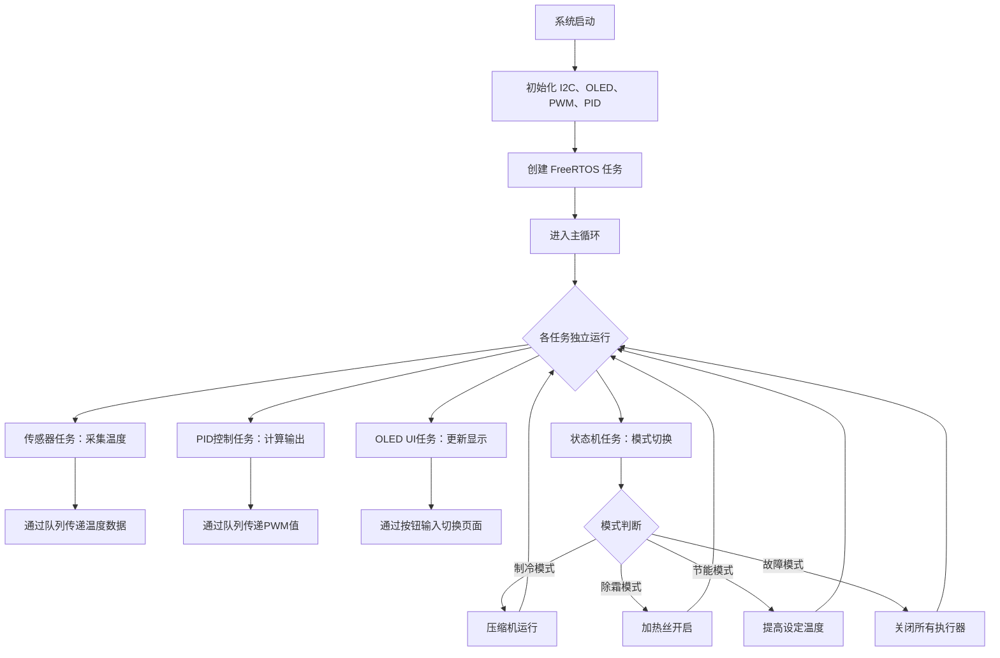
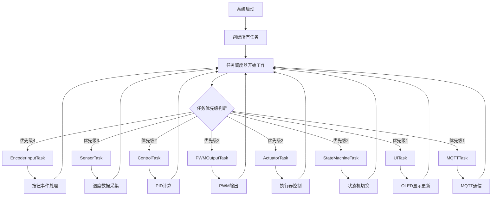
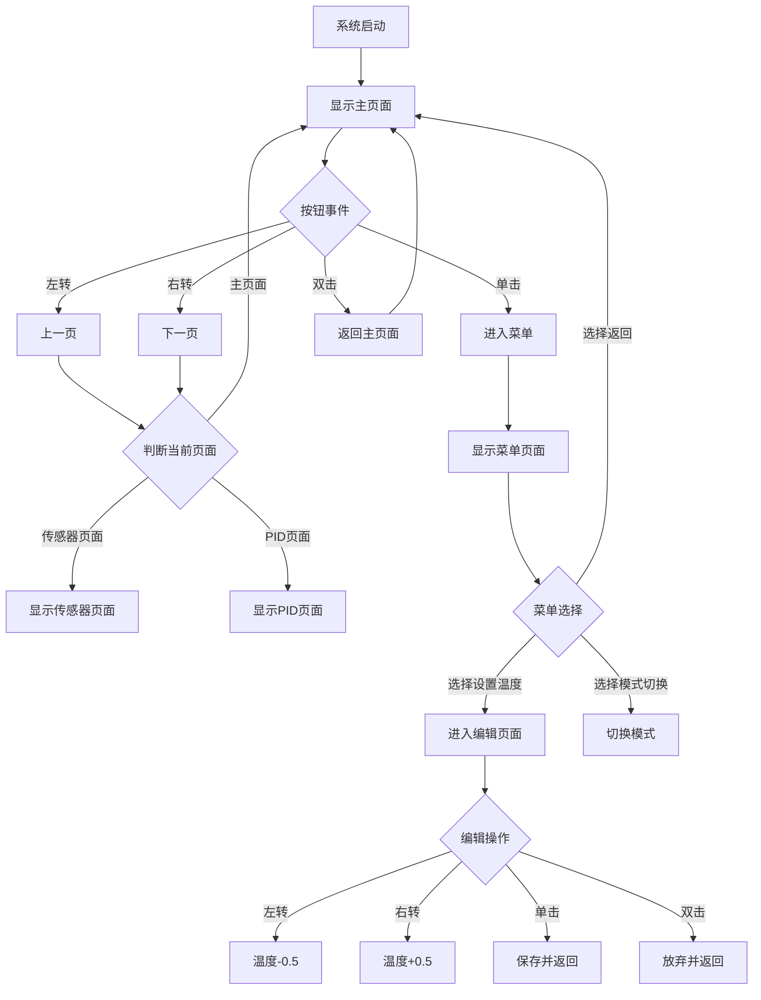
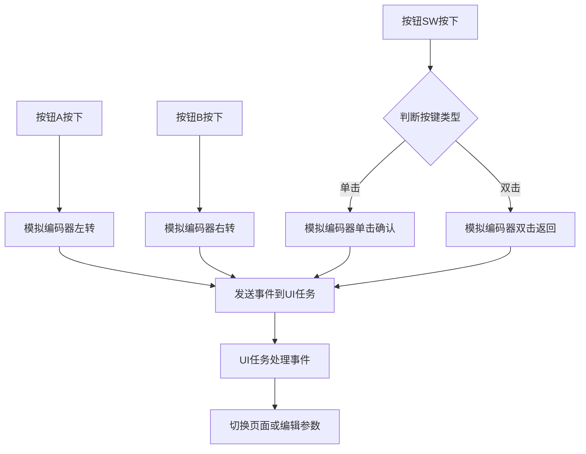
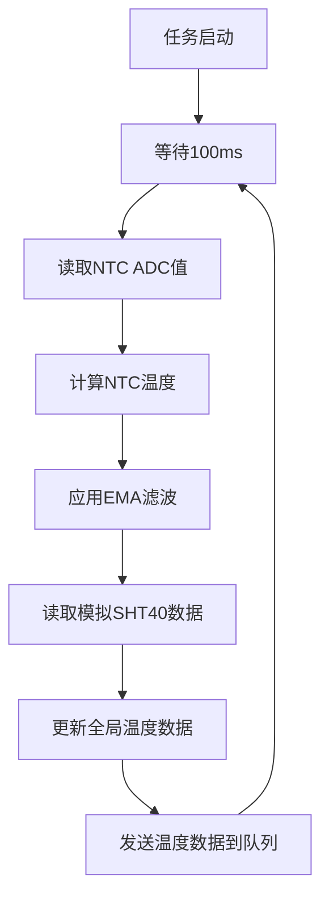
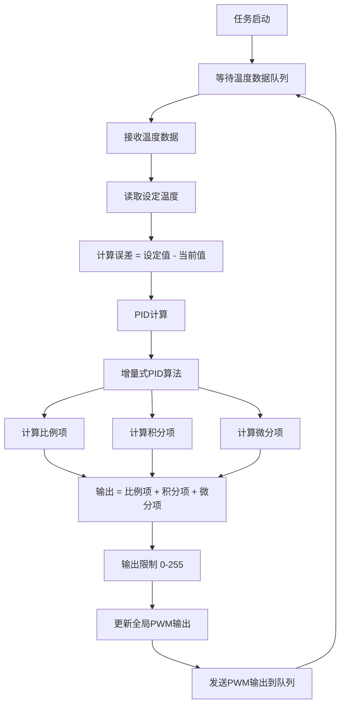
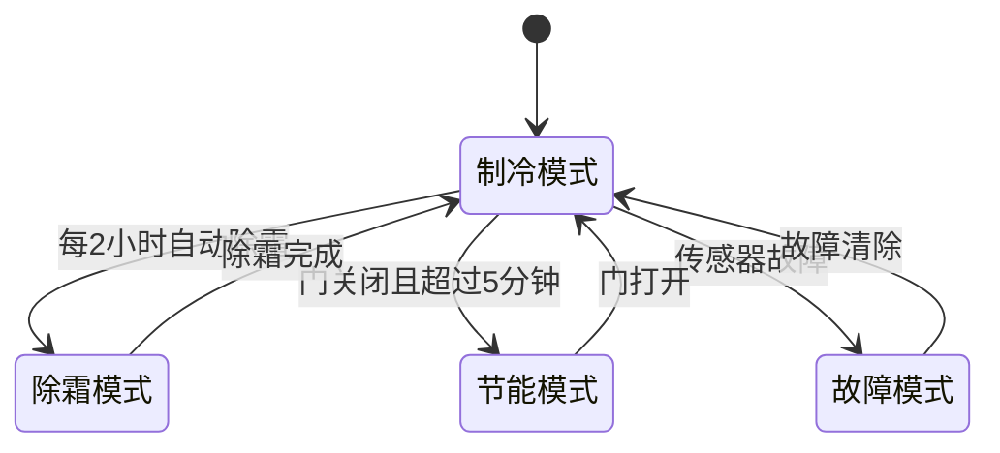

# 课程设计报告【初期】

**2025 - 2026 学年 第 2 学期**

---

**题目：** 基于ESP32-S3的冰箱智能PID控制系统设计

**课程名称：** 计算系统课程设计**

**专  业：** ____________计算机科学与技术____

**班  级：** ____________4231090303____

**姓  名：** ________________（组长）

**学  号：** ________________

---

**信息工程学院**

**2026 年 6 月**

---

## 小组成员（列表）：包括组长

| 学号 | 姓名 | 班级 |
|------|------|------|
|      |      |      |
|      |      |      |
|      |      |      |
|      |      |      |

---

## 题目：基于ESP32-S3的冰箱智能PID控制系统设计

---

## 正文：

### 一、项目背景与意义

我们一开始想做一个温控系统，后来发现冰箱温控其实挺有意思的。传统冰箱的温度控制不够精确，有时候温度波动大，影响食物保鲜。我们想用ESP32-S3做一个智能的冰箱PID控制系统，让温度控制更精确、更稳定。

我们做这个项目的想法是：
1. **温度控制要精确**：用PID算法，让温度波动在±0.5°C以内，这样食物保鲜效果更好
2. **要省电**：通过智能除霜、节能模式这些策略，优化压缩机运行时间，省电
3. **要好用**：要有OLED显示屏，能用旋转编码器操作，最好还能用手机远程监控
4. **要学到东西**：把《计算机系统结构》课程里学的I/O控制、中断系统、存储层次、多任务调度这些知识用起来
5. **用仿真就行**：我们用Wokwi在线仿真平台做，不用买硬件，省成本，开发效率也高

---

### 二、需求分析

我们课程设计时间有限，所以**不买实物硬件**，直接用 **Wokwi在线仿真平台**（https://wokwi.com）做仿真测试。Wokwi支持ESP32-S3仿真，可以模拟GPIO、I2C、ADC这些外设，挺适合我们这个项目用的。

#### 2.1 功能需求

##### 2.1.1 温度采集功能（仿真）
我们想同时监测冷冻室（-18°C）和冷藏室（4°C）的温度。
- 在Wokwi里用 **NTC温度传感器组件** 来模拟温度变化
- 用ESP32内置ADC读NTC电阻值（Wokwi不支持ADS1115，就用内置ADC替代）
- SHT40温湿度传感器我们用 **串口模拟数据** 或者 **随机数据** 来替代
- 采集精度要达到±0.5°C（仿真目标）
- 每100ms采集一次（10Hz）
- 数据要滤波，用指数移动平均（EMA），滤波系数α=0.2

##### 2.1.2 PID控制功能
这部分我们用增量式PID控制算法。
- 冷冻室和冷藏室分别用独立的PID控制器
- PID参数先这样设：
  - 冷冻室：Kp=2.0, Ki=5.0, Kd=1.0
  - 冷藏室：Kp=1.0, Ki=0.5, Kd=0.1
- PWM输出范围0-255，对应0-100%功率
- 还要支持PID参数自动调谐（用PID_AutoTune库）

##### 2.1.3 执行器控制功能（仿真）
这部分我们用仿真来实现：
- 压缩机控制：用LED亮灭来模拟（LED亮=压缩机运行）
- 除霜加热丝控制：也用LED来模拟
- 风扇控制：用PWM控制LED亮度来模拟风扇速度
- 蜂鸣器报警：用Wokwi的 **Piezo Buzzer组件** 来模拟报警

##### 2.1.4 人机交互功能（仿真）
我们要做个OLED显示屏界面，用Wokwi的 **SSD1306 OLED组件**（128×64，I2C接口）。
- 要做5个页面：
  1. 主页面：显示冷冻室/冷藏室温度
  2. 传感器页面：显示模拟的SHT40和NTC数据
  3. PID参数页面：显示Kp/Ki/Kd和PWM输出
  4. 设置菜单页面：选择设置项$
  5. 编辑页面：修改设定温度$
- 输入设备：Wokwi不支持EC11旋转编码器组件，所以我们用 **3个按钮** 来替代（按钮A=左转，按钮B=右转，按钮SW=确认）

##### 2.1.5 状态机管理功能
这部分我们设计了4种工作模式：
1. **制冷模式**：PID正常运行，压缩机根据输出启停
2. **除霜模式**：每2小时自动除霜，除霜时压缩机关闭，加热丝开启
3. **节能模式**：门关闭且超过5分钟时进入，设定温度提高2°C$
4. **故障模式**：传感器故障时进入，关闭所有执行器，蜂鸣器报警$

模式要根据温度、时间、门状态这些条件自动切换。

##### 2.1.6 远程监控功能（可选，仿真）
- WiFi连接：Wokwi里 **不支持WiFi仿真**，所以WiFi/MQTT功能我们在实际硬件上测试，仿真时只实现逻辑$
- MQTT通信：仿真时不实际连接MQTT Broker，只打印调试信息$
- 微信小程序：用 **微信开发者工具** 模拟器测试界面，不实际连接MQTT$

#### 2.2 性能需求（仿真目标）

| 指标 | 要求 | 说明 |
|------|------|------|
| 温度控制精度 | ±0.5°C | 仿真目标，稳态时温度波动范围 |
| 温度采集精度 | ±0.5°C | 仿真目标 |
| 系统响应时间 | < 5秒 | 从温度变化到PID输出调整 |
| 显示刷新率 | 10Hz | OLED界面刷新频率 |
| 仿真运行时间 | > 10分钟 | Wokwi仿真连续运行无崩溃 |

#### 2.3 硬件资源需求（仿真）

因为用Wokwi仿真，**不用买实物硬件**。只要有一台能上网的电脑就行了。

##### 2.3.1 开发平台需求$
- **Wokwi在线仿真平台**：https://wokwi.com$
- **PlatformIO IDE**：可以本地安装，也可以直接用Wokwi在线编辑代码$
- **ESP32-S3 DevKitC-1 虚拟开发板**：Wokwi提供$

##### 2.3.2 仿真组件需求$
- **ESP32-S3 DevKitC-1**：Wokwi虚拟开发板$
- **SSD1306 OLED**：0.96寸，128×64，I2C接口$
- **NTC温度传感器** × 2：Wokwi组件，模拟冷冻室和冷藏室温度$
- **按钮** × 3：替代旋转编码器$
- **LED** × 2：模拟压缩机和除霜加热丝状态$
- **Piezo Buzzer**：模拟蜂鸣器报警$

#### 2.4 软件资源需求$

##### 2.4.1 开发环境$
- **PlatformIO IDE**：跨平台IoT开发平台（本地安装或用Wokwi在线IDE）$
- **Arduino框架**：简化ESP32开发$
- **FreeRTOS**：实时操作系统，支持多任务调度$
- **Wokwi**：在线仿真平台，无需安装本地环境$

##### 2.4.2 依赖库$
| 库名称 | 版本 | 用途 | Wokwi支持 |
|--------|------|------|----------|
| U8g2 | ^2.36.5 | OLED图形库 | ✅ 支持 |
| Adafruit ADS1X15 | ^2.5.0 | ADS1115 ADC驱动 | ❌ 不支持（用内置ADC替代） |
| Adafruit SHT4x | ^1.0.5 | SHT40传感器驱动 | ❌ 不支持（用模拟数据替代） |
| GyverEncoder | ^4.10 | 旋转编码器驱动 | ❌ 不支持（用按钮替代） |
| PID | ^1.2.1 | PID控制库 | ✅ 支持 |
| PID-AutoTune | ^1.0.0 | PID自动调谐库 | ✅ 支持 |
| PubSubClient | ^2.8 | MQTT客户端库 | ❌ 仿真时不实际使用 |
| ArduinoJson | ^6.21 | JSON解析库 | ✅ 支持 |

##### 2.4.3 内存需求（仿真）$
- **Flash**：约1MB（程序代码 + 文件系统）$
- **RAM**：约200KB（FreeRTOS堆 + 任务栈 + 全局变量）$
- **PSRAM**：约500KB（可选，用于大型数据结构）$

#### 2.5 可靠性需求（仿真）$

因为是仿真项目，可靠性需求主要关注 **软件逻辑的正确性** 和 **系统稳定性**。

##### 2.5.1 软件可靠性$
- **任务看门狗**：每个FreeRTOS任务都有看门狗监控（仿真中可以不实现）$
- **异常处理**：传感器故障、WiFi断开、MQTT断开这些异常情况都要有处理逻辑$
- **数据校验**：MQTT通信要用JSON格式，要有数据校验（仿真时只打印调试信息）$

##### 2.5.2 系统稳定性（仿真）$
- **内存泄漏检测**：定期检查内存使用情况（仿真中可以不实现）$
- **任务栈溢出检测**：FreeRTOS自带栈溢出检测$
- **系统复位**：严重错误时自动复位（仿真中可以不实现）$

---

### 三、系统总体设计$

#### 3.1 系统架构图$

我们画了个系统架构图，大概是这样的：$

```
+-------------------+     +-------------------+     +-------------------+
|   传感器模块       |     |   PID控制模块      |     |   执行器模块      |
| - NTC 100K × 2   | --> | - 增量式PID       | --> | - LED × 2         |
| - 模拟SHT40      |     | - 自动调谐        |     | - PWM风扇         |
+-------------------+     +-------------------+     | - 蜂鸣器          |
         |                       |                       +-------------------+
         v                       v                       |
+-------------------+     +-------------------+     +-------------------+
|   OLED UI模块     |     |   状态机模块       |     |   仿真专用模块     |
| - 多页面显示      | <-> | - 制冷模式        |     | - 温度模拟         |
| - 菜单操作        |     | - 除霜模式        |     | - 传感器模拟       |
| - 参数设置        |     | - 节能模式        |     | - 执行器模拟       |
+-------------------+     | - 故障模式        |     +-------------------+
                          +-------------------+
```

**说明**：因为用Wokwi仿真，传感器模块和执行器模块都是 **仿真实现**，不涉及实物硬件。

#### 3.2 系统总体流程图$

我们画了个系统总体流程图，描述系统从启动到稳定运行的整个过程：$



#### 3.3 硬件架构设计（仿真）$

##### 3.3.1 主控模块（仿真）$
- **ESP32-S3 DevKitC-1（Wokwi虚拟开发板）**：
  - 核心：Xtensa® 32-bit LX7 双核处理器，主频240MHz$
  - 存储：8MB Flash + 2MB PSRAM$
  - 无线：WiFi 802.11 b/g/n + Bluetooth 5.0（Wokwi不支持WiFi仿真）$
  - 接口：GPIO、ADC、DAC、I2C、SPI、UART、PWM、I2S$

##### 3.3.2 传感器模块（仿真）$
- **NTC温度传感器** × 2（Wokwi组件）：
  - 测量范围：-50°C ~ +150°C$
  - 精度：±0.5°C（仿真目标）$
  - Beta值：3950$
  - 标称电阻：100KΩ at 25°C$
  - 电路：3.3V → 100K串联电阻 → ADC → NTC → GND$
  - **仿真方式**：在Wokwi中添加NTC组件，通过读取ADC电压值计算温度$
- **SHT40温湿度传感器（仿真）**：
  - **Wokwi不支持SHT40组件**，所以用 **模拟数据** 替代$
  - 方式1：用随机数生成模拟温湿度$
  - 方式2：通过串口输入模拟数据$

##### 3.3.3 人机交互模块（仿真）$
- **SSD1306 OLED显示屏（Wokwi组件）**：
  - 尺寸：0.96寸$
  - 分辨率：128×64$
  - 接口：I2C，地址0x3C$
  - 驱动：U8g2图形库$
- **旋转编码器（仿真）**：
  - **Wokwi不支持EC11旋转编码器组件**，所以用 **3个按钮** 替代$
  - 按钮A：模拟编码器左转$
  - 按钮B：模拟编码器右转$
  - 按钮SW：模拟编码器按键确认$

##### 3.3.4 执行器模块（仿真）$
- **压缩机继电器（仿真）**：
  - 用 **LED** 模拟压缩机继电器状态$
  - LED亮 = 压缩机运行$
  - LED灭 = 压缩机关闭$
- **除霜加热丝继电器（仿真）**：
  - 用 **LED** 模拟除霜加热丝状态$
  - LED亮 = 除霜加热丝开启$
  - LED灭 = 除霜加热丝关闭$
- **PWM风扇（仿真）**：
  - 用 **LED亮度** 模拟风扇速度$
  - PWM值越大，LED越亮$
- **蜂鸣器（Wokwi组件）**：
  - 用 **Piezo Buzzer组件** 模拟报警$
  - 有源蜂鸣器，高电平响$

##### 3.3.5 引脚分配表（仿真）$

| 模块 | 引脚 | 说明 |
|------|------|------|
| I2C SDA | GPIO 8 | OLED共用 |
| I2C SCL | GPIO 9 | OLED共用 |
| 按钮 A（替代编码器A） | GPIO 4 | 左转 |
| 按钮 B（替代编码器B） | GPIO 5 | 右转 |
| 按钮 SW（替代编码器按键） | GPIO 6 | 确认 |
| 压缩机LED | GPIO 18 | 亮=压缩机运行 |
| 除霜LED | GPIO 19 | 亮=除霜加热丝开启 |
| 蜂鸣器 | GPIO 21 | 高电平响 |

**说明**：因为用Wokwi仿真，不连接实物硬件，所以引脚分配可以根据Wokwi组件的实际引脚进行调整。

#### 3.4 软件架构设计$

##### 3.4.1 开发环境$
- **Wokwi在线仿真平台**：
  - 网址：https://wokwi.com$
  - 支持ESP32-S3仿真$
  - 在线编辑代码，无需安装本地IDE$
- **PlatformIO IDE（可选）**：
  - 版本：Core 6.x$
  - 框架：Arduino$
  - 平台：espressif32$
  - 板型：esp32-s3-devkitm-1$

##### 3.4.2 FreeRTOS任务划分（仿真）$

| 任务名称 | 优先级 | 栈大小 | 功能描述 |
|----------|--------|--------|----------|
| SensorTask | 3 | 4096 | 传感器数据采集（模拟NTC温度） |
| ControlTask | 2 | 4096 | PID控制算法计算 |
| PWMOutputTask | 2 | 2048 | PWM输出更新（控制LED亮度） |
| EncoderInputTask | 4 | 2048 | 按钮输入处理（替代编码器） |
| UITask | 1 | 4096 | OLED界面更新 |
| ActuatorTask | 2 | 2048 | 执行器控制（LED、蜂鸣器） |
| StateMachineTask | 2 | 3072 | 状态机管理（模式切换） |
| MQTTTask | 1 | 5120 | WiFi/MQTT通信（仿真时不实际使用，只打印调试信息） |

##### 3.4.3 FreeRTOS任务调度流程图$

我们画了个FreeRTOS任务调度流程图，描述各个任务是怎么协同工作的：$



##### 3.4.4 任务间通信（仿真）$
- **互斥锁（Mutex）**：
  - `i2cMutex`：保护I2C总线访问（OLED）$
  - `setpointMutex`：保护设定温度全局变量$
  - `displayDataMutex`：保护显示数据全局变量$
  - `pwmMutex`：保护PWM输出全局变量$
- **队列（Queue）**：
  - `temperatureQueue`：传感器任务 → 控制任务，传递温度数据$
  - `pwmOutputQueue`：控制任务 → PWM输出任务，传递PWM值$
  - `uiEventQueue`：按钮任务 → UI任务，传递按钮事件$
  - `alarmQueue`：状态机任务 → MQTT任务，传递报警信息$

##### 3.4.5 系统流程图（仿真）$

```
[Wokwi仿真启动]
    |
    v
[初始化 I2C、OLED、PWM、PID]
    |
    v
[创建 FreeRTOS 任务]
    |
    v
[进入主循环（vTaskDelay(portMAX_DELAY)）]
    |
    v
[各任务独立运行，通过队列和互斥锁通信]
    |
    v
[OLED显示温度变化、PID输出、系统状态]
    |
    v
[通过按钮模拟编码器输入，切换页面、修改设定温度]
    |
    v
[通过LED模拟压缩机、除霜加热丝状态]
    |
    v
[仿真运行10分钟以上，观察系统稳定性]
```

---

### 四、硬件选型依据（仿真）$

因为用Wokwi仿真，**不用进行硬件选型**。这部分我们只说明为什么选Wokwi仿真平台。

#### 4.1 仿真平台选型$

| 方案 | 平台 | 优点 | 缺点 | 结论 |
|------|------|------|------|------|
| 方案1 | 实物硬件 | 真实可靠，有实际意义 | 需要购买硬件，成本高，耗时长 | 不采用 |
| 方案2 | Proteus仿真 | 经典的仿真软件，元件库丰富 | 不支持ESP32，操作简单 | 不采用 |
| 方案3 | Wokwi仿真 | 在线平台，支持ESP32，无需安装 | 部分组件不支持（如ADS1115、SHT40） | **采用** |

**我们选Wokwi仿真平台的理由**：
1. **不用买硬件**：省成本，适合课程设计$
2. **支持ESP32-S3**：符合我们项目需求$
3. **在线平台**：不用安装本地IDE，打开浏览器就能用$
4. **社区活跃**：有丰富的示例项目和文档$
5. **适合教学**：我们可以快速上手，专注于软件开发$

#### 4.2 仿真组件选型$

因为Wokwi组件库有限，部分硬件无法仿真，需要进行替代。

| 实物硬件 | Wokwi替代方案 | 说明 |
|----------|----------------|------|
| ADS1115 ADC | ESP32内置ADC | Wokwi不支持ADS1115，用内置ADC读NTC电压 |
| SHT40传感器 | 模拟数据（随机数） | Wokwi不支持SHT40，用随机数生成模拟温湿度 |
| EC11旋转编码器 | 3个按钮 | Wokwi不支持旋转编码器，用按钮替代 |
| 继电器 | LED | 用LED亮灭模拟继电器吸合/断开 |
| PWM风扇 | LED亮度 | 用LED亮度模拟风扇速度 |

---

### 五、软件模块设计$

#### 5.1 主程序模块（main.cpp 和 wokwi_main.cpp）$

##### 5.1.1 功能描述$
- **main.cpp**：完整版代码，用于实际硬件（如果有）$
- **wokwi_main.cpp**：Wokwi仿真版代码，用模拟数据替代ADS1115和SHT40$
- 初始化I2C、OLED、PWM、PID$
- 创建FreeRTOS任务$
- 实现5页OLED界面$
- 处理按钮事件（替代编码器事件）$

##### 5.1.2 关键代码（wokwi_main.cpp）$
```cpp
// 初始化
void setup() {
    Serial.begin(115200);
    Wire.begin(OLED_SDA, OLED_SCL);
    // ... 初始化各个模块
    // 创建FreeRTOS任务
    xTaskCreate(sensorTask, "SensorTask", 4096, NULL, 3, NULL);
    // ...
}

// 主循环
void loop() {
    vTaskDelay(portMAX_DELAY);  // 主循环阻塞，由FreeRTOS任务调度
}
```

##### 5.1.3 OLED UI界面切换流程图$

我们画了个OLED UI界面切换流程图，描述用户怎么通过按钮切换各个页面：$



##### 5.1.4 编码器事件处理流程图$

因为我们用按钮替代旋转编码器，所以画了个按钮事件处理流程图：$



#### 5.2 传感器采集模块（test_sensors.cpp 和 wokwi_main.cpp）$

##### 5.2.1 功能描述$
- **test_sensors.cpp**：测试NTC温度采集和SHT40温湿度采集（用于实际硬件）$
- **wokwi_main.cpp**：用模拟数据替代传感器采集（用于仿真）$
- 模拟NTC温度变化（制冷时温度下降，自然升温）$
- 模拟SHT40温湿度（随机数）$

##### 5.2.2 NTC温度计算（仿真）$
用Steinhart-Hart公式（和实际硬件一样）：$
```cpp
float calculateNTCTemperature(int16_t adcValue) {
    float voltage = adcValue * (4.096 / 32767.0);
    float ntcResistance = R_SERIES * voltage / (ADC_VREF - voltage);
    double logArg = (double)ntcResistance / NTC_R0;
    float steinhart = log(logArg) / NTC_BETA + (1.0 / NTC_T0);
    float temperature = (1.0 / steinhart) - 273.15;
    return temperature;
}
```

**仿真时的修改**：因为Wokwi不支持ADS1115，用ESP32内置ADC读NTC电压。内置ADC是12位分辨率（0-4095），参考电压3.3V。

##### 5.2.3 温度模拟（wokwi_main.cpp）$
```cpp
void simulateTemperature() {
    if (millis() - lastTempChange > 1000) {  // 每秒更新一次
        if (compressorOn) {
            simulatedTemp -= 0.5;  // 制冷时温度下降
        } else {
            simulatedTemp += 0.1;  // 自然升温
        }
        lastTempChange = millis();
    }
}
```

##### 5.2.4 传感器数据采集流程图$

我们画了个传感器数据采集流程图：$



#### 5.3 PID控制模块（test_pid.cpp）$

##### 5.3.1 功能描述$
- 实现增量式PID控制$
- 支持PID参数自动调谐$
- 支持死区控制$
- 支持积分抗饱和$

##### 5.3.2 PID参数$
- 冷冻室：Kp=2.0, Ki=5.0, Kd=1.0$
- 冷藏室：Kp=1.0, Ki=0.5, Kd=0.1$

##### 5.3.3 PID控制算法流程图$

我们画了个PID控制算法流程图：$



#### 5.4 执行器控制模块（actuator.cpp 和 wokwi_main.cpp）$

##### 5.4.1 功能描述$
- **actuator.cpp**：实际控制继电器、PWM风扇、蜂鸣器（用于实际硬件）$
- **wokwi_main.cpp**：用LED模拟执行器（用于仿真）$
- 控制LED亮灭（模拟压缩机、除霜加热丝）$
- 控制LED亮度（模拟风扇速度）$
- 控制蜂鸣器（Wokwi的Piezo Buzzer组件）$

##### 5.4.2 压缩机保护（仿真）$
- 最小停机时间：3分钟（仿真时可以缩短，比如3秒）$
- 最小运行时间：5分钟（仿真时可以缩短，比如5秒）$

#### 5.5 状态机控制模块（state_machine.cpp）$

##### 5.5.1 功能描述$
- 实现4种工作模式（制冷、除霜、节能、故障）$
- 根据温度、时间、门状态这些条件自动切换模式$

##### 5.5.2 模式切换条件$
- **制冷 → 除霜**：每2小时自动除霜（仿真时可以缩短，比如2分钟）$
- **制冷 → 节能**：门关闭且超过5分钟（仿真时可以缩短，比如5秒）$
- **任意模式 → 故障**：传感器故障（仿真时可以通过按钮触发）$
- **故障 → 制冷**：故障清除后$

##### 5.5.3 状态机切换流程图$

我们画了个状态机切换流程图：$



#### 5.6 WiFi/MQTT通信模块（wifi_mqtt.cpp，仿真时不实际使用）$

##### 5.6.1 功能描述$
- **因为Wokwi不支持WiFi仿真**，所以WiFi/MQTT功能在仿真时不实际使用$
- 只实现逻辑，打印调试信息$
- 实际硬件测试时再启用WiFi/MQTT功能$

##### 5.6.2 MQTT主题（实际硬件）$
- `fridge/status`：温度+状态上报 (ESP32 → 手机)$
- `fridge/alarm`：异常报警通知 (ESP32 → 手机)$
- `fridge/control`：接收控制指令 (手机 → ESP32)$

#### 5.7 微信小程序模块（WeChatApp/，仿真时不实际连接）$

##### 5.7.1 功能描述$
- **因为Wokwi不支持WiFi仿真**，微信小程序无法实际连接MQTT$
- 用 **微信开发者工具模拟器** 测试界面布局和基本交互$
- 实际硬件测试时再启用MQTT连接$

##### 5.7.2 页面结构$
- `app.js`：小程序入口文件，MQTT连接（仿真时不实际连接）$
- `app.json`：小程序全局配置$
- `app.wxss`：全局样式$
- `pages/index/`：主控制页$
  - `index.js`：主页逻辑$
  - `index.wxml`：主页结构$
  - `index.wxss`：主页样式$
  - `index.json`：主页配置$
- `utils/mqtt.js`：MQTT连接工具（仿真时不实际连接）$

---

### 六、任务分工与进度安排$

#### 6.1 任务分工$

| 学号 | 姓名 | 班级 | 主要任务 |
|------|------|------|----------|
|      | （组长） |      | 总体设计，状态机控制，报告撰写，Wokwi仿真调试 |
|      |      |      | 传感器驱动开发（仿真），PID控制算法，报告撰写 |
|      |      |      | OLED UI界面开发，按钮输入处理（替代编码器），报告撰写 |
|      |      |      | Wokwi电路图设计，代码整合，报告撰写 |

#### 6.2 进度安排（仿真）$

因为用Wokwi仿真，**不用硬件设计阶段**，进度安排调整为：

| 阶段 | 时间 | 任务 | 产出 |
|------|------|------|------|
| 第一阶段 | 1天 | 需求分析，Wokwi平台学习 | 需求分析报告（本文档） |
| 第二阶段 | 2天 | Wokwi电路图设计，代码框架搭建 | Wokwi项目，代码框架 |
| 第三阶段 | 3天 | 传感器模块仿真，PID控制算法仿真 | 温度传感器仿真，PID控制仿真 |
| 第四阶段 | 3天 | OLED UI界面仿真，按钮输入处理 | OLED显示仿真，按钮输入仿真 |
| 第五阶段 | 2天 | 状态机控制仿真，系统整合 | 状态机控制仿真，系统整合 |
| 第六阶段 | 2天 | 系统联调测试，报告撰写 | 测试数据，课程设计报告 |
| 第七阶段 | 有时间再做 | WiFi/MQTT通信开发，微信小程序开发 | WiFi/MQTT通信，微信小程序 |

**说明**：
1. 因为去掉了硬件设计和硬件调试时间，总工期从14天缩短为13天$
2. 增加了Wokwi平台学习和电路图设计时间$
3. 仿真调试比硬件调试更快，所以整体进度更可控$

---

### 七、预期成果（仿真）$

#### 7.1 仿真成果$
1. **Wokwi项目文件**：`diagram.json`（电路图），`wokwi.toml`（仿真配置）$
2. **完整的源代码**：PlatformIO项目，支持Wokwi仿真$
3. **仿真运行视频或截图**：证明系统能够稳定运行10分钟以上$

#### 7.2 软件成果$
1. **完整的源代码**（PlatformIO项目）：
   - `src/main.cpp`：主程序（完整版，用于实际硬件）$
   - `src/wokwi_main.cpp`：Wokwi仿真版代码$
   - `src/actuator.cpp`：执行器控制（用于实际硬件）$
   - `src/state_machine.cpp`：状态机控制$
   - `src/wifi_mqtt.cpp`：WiFi/MQTT通信（用于实际硬件）$
   - `src/test_sensors.cpp`：传感器测试代码$
   - `src/test_pid.cpp`：PID控制测试代码$
   - `src/test_oled.cpp`：OLED UI测试代码$
2. **各个模块都能够独立仿真运行**$
3. **系统整合后能够正常仿真运行**$

#### 7.3 文档成果$
1. **课程设计初期报告**（本文档）$
2. **课程设计中期报告**$
3. **课程设计最终报告**$
4. **Wokwi仿真指南**$
5. **测试指南**$

#### 7.4 性能指标（仿真目标）$
1. **温度控制精度**：±0.5°C（仿真目标）$
2. **温度采集精度**：±0.5°C（仿真目标）$
3. **系统响应时间**：< 5秒（仿真目标）$
4. **显示刷新率**：10Hz（OLED界面刷新频率）$
5. **仿真运行时间**：> 10分钟（Wokwi仿真连续运行无崩溃）$

---

### 八、风险分析与应对措施（仿真）$

#### 8.1 技术风险$

| 风险 | 可能性 | 影响 | 应对措施 |
|------|--------|------|----------|
| Wokwi不支持某些组件（如ADS1115、SHT40） | 高 | 中 | 用替代方案（内置ADC、模拟数据） |
| PID参数整定困难 | 高 | 中 | 用PID自动调谐库，手动微调 |
| FreeRTOS任务调度冲突 | 中 | 高 | 合理设置任务优先级，用互斥锁保护共享资源 |
| Wokwi仿真速度慢 | 中 | 中 | 减少串口打印，优化代码 |
| 内存泄漏 | 低 | 高 | 定期检查内存使用情况，用valgrind等工具检测 |

#### 8.2 时间风险$

| 风险 | 可能性 | 影响 | 应对措施 |
|------|--------|------|----------|
| Wokwi电路图设计耗时过长 | 中 | 高 | 参考Wokwi示例项目，快速搭建电路图 |
| 软件调试耗时过长 | 高 | 高 | 先测试单个模块，再整合；用串口打印调试信息 |
| 报告撰写时间不足 | 中 | 中 | 边开发边撰写报告，不要等到最后才写 |

#### 8.3 资源风险（仿真）$

| 风险 | 可能性 | 影响 | 应对措施 |
|------|--------|------|----------|
| 电脑损坏 | 低 | 高 | 定期备份代码到GitHub或U盘 |
| Wokwi平台无法访问 | 中 | 高 | 用VPN，或者改用本地PlatformIO + ESP32开发板 |
| 网络不稳定 | 中 | 中 | 下载Wokwi项目到本地，离线编辑代码 |

**说明**：因为用Wokwi仿真，**不用考虑硬件损坏风险**，资源风险大大降低。

---

### 九、参考文献$

1. 《计算机系统结构》教材$
2. ESP32-S3技术参考手册$
3. PlatformIO官方文档：https://docs.platformio.org/$
4. FreeRTOS官方文档：https://www.freertos.org/$
5. U8g2图形库文档：https://github.com/olikraus/u8g2/$
6. PID控制算法详解：https://blog.csdn.net/qq_27531383/article/details/111067469$
7. 增量式PID与位置式PID的区别：https://blog.csdn.net/weixin_44386927/article/details/124835413$
8. Wokwi官方文档：https://docs.wokwi.com/$
9. Wokwi ESP32示例项目：https://wokwi.com/projects/new/esp32$
10. 微信开发者工具文档：https://developers.weixin.qq.com/miniprogram/dev/framework/$

---

### 十、附录$

#### 10.1 Wokwi电路图（diagram.json）$
（已完成，见项目根目录）$

#### 10.2 Wokwi仿真配置（wokwi.toml）$
（已完成，见项目根目录）$

#### 10.3 代码片段$
（见各个模块的源代码）$

#### 10.4 仿真测试数据$
（待补充，系统联调测试后补充）$

#### 10.5 Wokwi仿真截图$
（待补充，系统联调测试后截图）$

---

**报告结束**

---

**注：**
1. 本报告的"________________"部分需要手动填写。$
2. 本报告的"小组成员"部分需要填写所有组员的学号、姓名、班级。$
3. 本报告的"附录"部分在项目开发过程中逐步补充。$
4. 本报告已根据 **Wokwi仿真测试** 的需求进行更新，去掉了硬件购买和实物测试相关内容。$
5. 本报告保存为 `课程设计初期报告.md`，位于 `fridge_pid_control/1_课程设计报告/` 目录下。$
