# 冰箱PID温度控制系统 — 最终报告

> **项目名称**：基于ESP32-S3的冰箱PID温度控制系统  
> **开发平台**：PlatformIO + Wokwi仿真 + 微信小程序  
> **版本号**：v0.1  

---

## 目录

1. [项目概述](#1-项目概述)
2. [系统总体架构](#2-系统总体架构)
3. [硬件平台设计](#3-硬件平台设计)
4. [核心模块详细设计与实现](#4-核心模块详细设计与实现)
   - 4.1 [引脚配置模块（pin_config.h）](#41-引脚配置模块)
   - 4.2 [传感器模块（sensors_sim）](#42-传感器模块)
   - 4.3 [PID控制模块（pid_control）](#43-pid控制模块)
   - 4.4 [状态机模块（state_machine）](#44-状态机模块)
   - 4.5 [执行器控制模块（actuator）](#45-执行器控制模块)
   - 4.6 [OLED显示模块（oled_display）](#46-oled显示模块)
   - 4.7 [输入处理模块（input_handler）](#47-输入处理模块)
   - 4.8 [温度历史记录模块（temp_history）](#48-温度历史记录模块)
   - 4.9 [系统控制模块（system_control）](#49-系统控制模块)
   - 4.10 [WiFi Web服务器模块（wifi_webserver）](#410-wifi-web服务器模块)
   - 4.11 [Web界面模块（web_interface）](#411-web界面模块)
   - 4.12 [模式定义模块（mode_defs）](#412-模式定义模块)
5. [双平台实现方案](#5-双平台实现方案)
   - 5.1 [物理平台版本（main.cpp）](#51-物理平台版本maincpp)
   - 5.2 [仿真平台版本（wokwi_main.cpp）](#52-仿真平台版本wokwi_maincpp)
6. [微信小程序客户端](#6-微信小程序客户端)
7. [模块间关系与数据流](#7-模块间关系与数据流)
8. [结果展示](#8-结果展示)
9. [总结与展望](#9-总结与展望)

---

## 1. 项目概述

本项目设计并实现了一套基于 **ESP32-S3** 微控制器的冰箱 **PID 温度闭环控制系统**。系统以冷冻室温度控制为核心目标，采用 PID（比例-积分-微分）控制算法驱动压缩机，配合状态机实现制冷、除霜、节能和故障四种工作模式的自动切换。系统通过 OLED 显示屏提供本地交互界面，通过 WiFi Web 服务器提供 HTTP API 接口，配合微信小程序实现远程监控与控制。

### 1.1 系统功能特点

- **PID 闭环温控**：采用 REVERSE 方向 PID 控制器，根据当前温度与设定温度的偏差自动计算压缩机输出
- **四模式状态机**：制冷模式 / 除霜模式 / 节能模式 / 故障模式自动切换
- **压缩机保护机制**：最小停机 3 分钟、最小运行 5 分钟延时保护，防止频繁启停
- **多传感器融合**：NTC 热敏电阻采集冷冻室温度 + SHT40 温湿度传感器采集环境数据
- **OLED 本地显示**：5 页交互式 UI（主页、传感器详情、PID参数、菜单、设定编辑）
- **Web 远程监控**：ESP32 自建 WiFi 热点（SoftAP），内置 HTML5 网页提供实时温度曲线与控制面板
- **微信小程序**：支持设备连接、远程控温、模式切换、PID 参数调整、历史温度曲线
- **故障检测与报警**：传感器故障、温度异常自动检测，蜂鸣器 + LED 分级报警
- **双平台兼容**：支持物理硬件部署和 Wokwi 在线仿真两套运行方式

---

## 2. 系统总体架构

系统采用分层模块化设计，自上而下分为四个层级：用户交互层提供微信小程序、Web 浏览器和 OLED 本地显示三种人机交互入口；通信服务层基于 ESP32 SoftAP 热点提供 HTTP RESTful API，是前端与硬件之间的桥梁；核心业务层承载 PID 控制算法、四模式状态机、系统安全检查和温度物理模拟等关键逻辑；硬件驱动层封装了 GPIO、I2C、ADC、PWM 等底层外设接口。各层之间通过明确的接口解耦，上层不直接依赖下层实现细节，便于独立开发与调试。

```
┌─────────────────────────────────────────────────────────┐
│                    用户交互层                              │
│  微信小程序 (设备连接/温度控制/PID调参/曲线查看)            │
│  Web浏览器 (实时监控面板/Plotly.js图表)                    │
│  OLED 显示屏 (本地5页UI/编码器交互)                        │
├─────────────────────────────────────────────────────────┤
│                    通信服务层                              │
│  WiFi Web Server (HTTP API: /api/status|setpoint|mode...)  │
│  ESP32 SoftAP (192.168.4.1)                               │
├─────────────────────────────────────────────────────────┤
│                    核心业务层                              │
│  PID 控制器 | 状态机 (四模式) | 系统控制 | 安全检查          │
│  温度物理模拟 | NTC传感器读取 | EMA滤波                     │
├─────────────────────────────────────────────────────────┤
│                    硬件驱动层                              │
│  GPIO | I2C | ADC | PWM | Relay | OLED(SSD1306) | Buzzer  │
└─────────────────────────────────────────────────────────┘
```

<div align="center"><b>图 1 系统分层架构图</b></div>

### 2.0 系统整体运行流程

系统上电后，首先在 `setup()` 中依次完成 I2C 总线、GPIO、OLED、PID 控制器、执行器、状态机、WiFi 和 Web 服务器的初始化，随后进入 `loop()` 主循环以约 10ms 为周期反复执行传感器读取、PID 计算、执行器更新和 OLED 刷新等核心任务。以下流程图展示了从启动到稳态运行的完整调用链路：

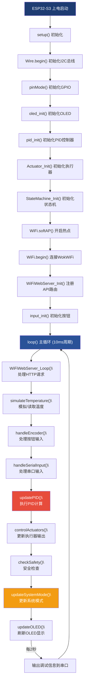

<div align="center"><b>图 2 系统整体运行流程图</b></div>

在图 2-2 所示的主循环中，各模块按固定顺序执行以保证状态一致性。首先处理 WiFi 客户端请求（`WiFiWebServer_Loop`），确保 Web 和小程序的指令能及时写入共享变量；接着更新温度数据（模拟或真实 NTC 读取），作为后续 PID 计算的输入；然后处理按钮和串口输入以实现本地交互；最后依次执行 PID 计算、执行器输出、安全检查、模式更新和 OLED 刷新。这种串行化的轮询架构使仿真调试十分直观——任一时刻只需关注当前函数的行为即可定位问题。

### 2.1 模块调用关系总图

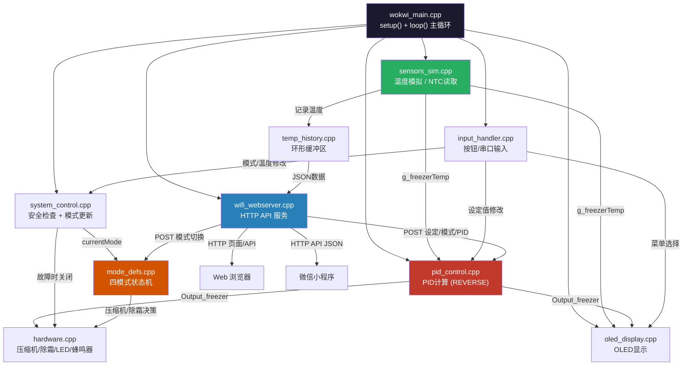

<div align="center"><b>图 3 模块调用关系总图</b></div>

图 2-3 揭示了系统模块间的数据依赖关系。虚线边框节点表示外部系统（Web 浏览器和微信小程序），圆角矩形节点表示核心功能模块，实线箭头上的标签标注了模块间传递的关键变量名。三条主要数据流向值得关注：其一，温度数据从传感器模块流向 PID 控制器、OLED 显示和历史记录模块，形成控制-显示-存储三条并行通路；其二，PID 输出同时驱动执行器硬件和 OLED 显示；其三，WiFi Web 服务器接收外部 POST 请求后，将设定值和模式变更分别写入 PID 控制器和状态机，构成完整的远程控制闭环。

### 2.2 文件组织结构

```
fridge_pid_control/
├── include/                    # 头文件（模块接口定义）
│   ├── actuator.h              # 执行器控制接口
│   ├── input_handler.h         # 按钮/串口输入处理接口
│   ├── oled_display.h          # OLED显示接口
│   ├── pid_control.h           # PID控制接口
│   ├── pin_config.h            # 引脚配置（Wokwi仿真版）
│   ├── sensors_sim.h           # 传感器模拟接口
│   ├── state_machine.h         # 状态机控制接口
│   ├── system_control.h        # 系统控制接口
│   ├── temp_history.h          # 温度历史记录接口
│   ├── web_interface.h         # 嵌入式网页HTML字符串
│   └── wifi_webserver.h        # WiFi Web服务器接口
├── src/                        # 源文件（模块实现）
│   ├── main.cpp                # 物理硬件版主程序（FreeRTOS多任务）
│   ├── wokwi_main.cpp          # Wokwi仿真版主程序（单循环）
│   ├── pid_control.cpp         # PID控制器实现
│   ├── hardware.cpp            # 执行器控制实现
│   ├── sensors_sim.cpp         # 传感器模拟实现
│   ├── oled_display.cpp        # OLED显示实现
│   ├── input_handler.cpp       # 输入处理实现
│   ├── system_control.cpp      # 系统控制实现
│   ├── temp_history.cpp        # 温度历史记录实现
│   ├── wifi_webserver.cpp      # Web服务器实现
│   └── mode_defs.cpp           # 模式定义与状态机实现
├── wechatapp/                  # 微信小程序
│   └── miniprogram/
│       ├── app.js / app.json   # 小程序入口与配置
│       └── pages/
│           ├── device/         # 设备连接页
│           ├── control/        # 控制面板页
│           ├── chart/          # 温度曲线页
│           └── pid/            # PID参数调整页
├── platformio.ini              # PlatformIO 项目配置
└── diagram.json                # Wokwi 仿真电路图定义
```

---

## 3. 硬件平台设计

### 3.1 主控制器

本系统选用 **ESP32-S3-DevKitC-1** 开发板作为主控制器。ESP32-S3 搭载 Xtensa 双核 32 位 LX7 处理器，主频最高 240 MHz，集成 2.4 GHz WiFi 与 Bluetooth 5 (LE) 双模无线通信能力，片上配备 512 KB SRAM 和最高 16 MB 的外部 Flash。其丰富的外设接口——包括两路 12 位 SAR ADC（共 20 个通道）、两路 8 位 DAC、4 路 SPI、3 路 UART、2 路 I2C、LEDC PWM 控制器以及多达 45 个可编程 GPIO——能够满足本系统对多传感器采集、多执行器驱动和无线通信的全部需求。尤其值得指出的是，ESP32-S3 原生支持 FreeRTOS 实时操作系统，为物理硬件版的多任务并发架构提供了底层支撑。

### 3.2 外围器件与引脚连接

下表汇总了本系统涉及的全部外围器件、核心规格及其在 ESP32-S3 上的引脚分配：

<div align="center"><b>表 1 外围器件与引脚分配表</b></div>

| 器件 | 型号/规格 | 连接引脚 | 接口类型 |
|------|----------|---------|---------|
| OLED 显示屏 | SSD1306 128×64 I2C | SDA=8, SCL=9 | I2C (0x3C) |
| 冷冻室NTC传感器 | 100KΩ, β=3950 | GPIO1 (ADC) | 模拟输入 |
| 冷藏室NTC传感器 | 100KΩ, β=3950 | GPIO2 (ADC) | 模拟输入 |
| SHT40 温湿度传感器 | Adafruit SHT4x | I2C总线 | I2C |
| ADS1115 ADC | 16位4通道 | I2C总线 (0x48) | I2C |
| 旋转编码器 | EC11 (A/B/SW) | A=1, B=2, SW=3 | GPIO中断 |
| 压缩机继电器 | 220V/10A | GPIO12 | GPIO输出 |
| 除霜加热继电器 | 220V/10A | GPIO13 | GPIO输出 |
| PWM风扇接口 | 12V PWM调速 | GPIO11 | LEDC PWM |
| 蜂鸣器 | 有源蜂鸣器 3.3V | GPIO14 | GPIO输出 |
| 运行指示灯(绿) | LED | GPIO15 | GPIO输出 |
| 待机指示灯(黄) | LED | GPIO16 | GPIO输出 |
| 故障指示灯(红) | LED | GPIO17 | GPIO输出 |
| 压缩机状态灯(蓝) | LED | GPIO18 | GPIO输出 |

传感器方面，冷冻室和冷藏室各配置一路 100KΩ NTC 热敏电阻，通过 ESP32-S3 内置 ADC 采集分压值后经 Beta 公式换算为温度；SHT40 和 ADS1115 共享 I2C 总线，前者提供环境温湿度参考，后者为物理硬件版提供 16 位高精度 ADC 以替代内置 ADC 的精度不足。执行器方面，压缩机和除霜加热丝各由一路继电器独立控制——这种隔离方式既保护了 ESP32 的 GPIO 引脚，也实现了弱电控制强电的工业安全要求；PWM 风扇通过 LEDC 控制器实现四级调速以匹配不同工作模式的散热需求。状态指示方面，四颗 LED 分别以常亮、慢闪（500ms）和快闪（200ms）三种状态指示系统的运行、待机、故障和压缩机制冷状态；一颗有源蜂鸣器在传感器故障或温度异常时发出分级报警。

### 3.3 Wokwi 仿真电路

在 Wokwi 仿真平台中，物理 NTC 热敏电阻由 `wokwi-ntc-temperature-sensor` 虚拟器件模拟，其 β 参数（3950）、基准电阻（100KΩ）和参考温度（25°C）均与实际 NTC 规格一致，保证了仿真与物理环境下的温度换算逻辑无需修改即可复用。物理 OLED 由 `wokwi-ssd1306` 替换，保留相同的 I2C 地址 0x3C 和 128×64 分辨率。旋转编码器简化为三个 `wokwi-pushbutton` 按钮（A/B/SW），分别模拟左转、右转和单击操作。执行器端以两个 LED 指示灯可视化压缩机和除霜的开关状态。所有虚拟器件的电气连接定义在 `diagram.json` 文件中，Wokwi 引擎根据该文件自动构建仿真电路拓扑。

> **[此处插入图片：Wokwi仿真电路连接图]**
<div align="center"><b>图 4 Wokwi 仿真电路连接图</b></div>

---

## 4. 核心模块详细设计与实现

### 4.1 引脚配置模块

**文件**：`include/pin_config.h`

引脚配置模块以宏常量的形式集中管理 Wokwi 仿真环境下的硬件引脚映射。使用宏而非硬编码数字的好处在于：当引脚分配因布线调整或硬件版本迭代而变更时，仅需修改此头文件中的对应宏定义，所有引用该引脚的模块（传感器、执行器、OLED、按钮等）无需逐一改动。仿真版共定义 10 个宏，涵盖 I2C 总线（SDA/SCL）、两路 NTC ADC 输入、三按钮编码器模拟和两路 LED 指示灯。

```c
// OLED I2C 总线引脚
#define OLED_SDA  8
#define OLED_SCL  9

// NTC 温度传感器 ADC 输入
#define NTC_FREEZER_PIN  1
#define NTC_FRESH_PIN    2

// 按钮（Wokwi 三按钮替代编码器）
#define ENC_PIN_A  4
#define ENC_PIN_B  5
#define ENC_PIN_SW 6

// Wokwi 仿真指示灯
#define COMPRESSOR_LED_PIN  18
#define DEFROST_LED_PIN     19
```

物理硬件版 `main.cpp` 中独立定义了一套更完整的引脚配置（额外包含 I2C_SDA/SCL、旋转编码器 EC11 和 PWM 风扇等），与仿真版通过 PlatformIO 的 `build_src_filter` 编译隔离机制互斥编译——编译物理固件时排除 `wokwi_main.cpp` 等仿真源文件，编译仿真固件时排除 `main.cpp`，确保两套引脚体系在各自的编译目标中均以唯一形式存在，不会产生符号冲突。

---

### 4.2 传感器模块

**文件**：`include/sensors_sim.h`、`src/sensors_sim.cpp`

#### 4.2.1 功能概述

传感器模块负责获取冷冻室温度数据，支持两种工作模式：
1. **软件模拟模式**（`g_useSimulatedTemp = true`）：根据压缩机和除霜状态物理模拟温度变化
2. **真实NTC模式**（`g_useSimulatedTemp = false`）：读取 NTC 热敏电阻 ADC 值并转换为温度

#### 4.2.2 温度物理模拟算法

模拟模式下每秒更新一次温度值，依据当前系统状态动态变化：

```c
void simulateTemperature() {
    if (millis() - lastTempChange > 1000) {
        if (currentMode == MODE_DEFROST && Actuator_IsDefrostOn())
            simulatedTemp += 0.8;           // 除霜加热：每秒升温0.8°C
        else if (currentMode == MODE_ERROR)
            simulatedTemp += 0.1;           // 故障停机：每秒升温0.1°C
        else if (Actuator_IsCompressorOn())
            simulatedTemp -= 0.5;           // 压缩机制冷：每秒降温0.5°C
        else
            simulatedTemp += 0.1;           // 自然回温：每秒升温0.1°C

        // 温度范围限幅：-30°C ~ +10°C
        if (simulatedTemp < -30.0) simulatedTemp = -30.0;
        if (simulatedTemp > 10.0)  simulatedTemp = 10.0;
    }
    g_freezerTemp = simulatedTemp;
    temp_history_record(simulatedTemp); // 每次调用记录历史
}
```

#### 4.2.3 NTC温度换算

使用 Beta 公式将 ADC 读数转换为温度：

$$
T = \frac{1}{\frac{\ln\left(\frac{1}{\frac{4095}{\text{ADC}} - 1}\right)}{\beta} + \frac{1}{T_0}} - 273.15
$$

其中 β=3950, T₀=298.15K (25°C)。采用 EMA（指数移动平均）滤波平滑，α=0.3：

```
filtered = filtered × 0.7 + raw × 0.3
```

#### 4.2.4 传感器模块执行流程图

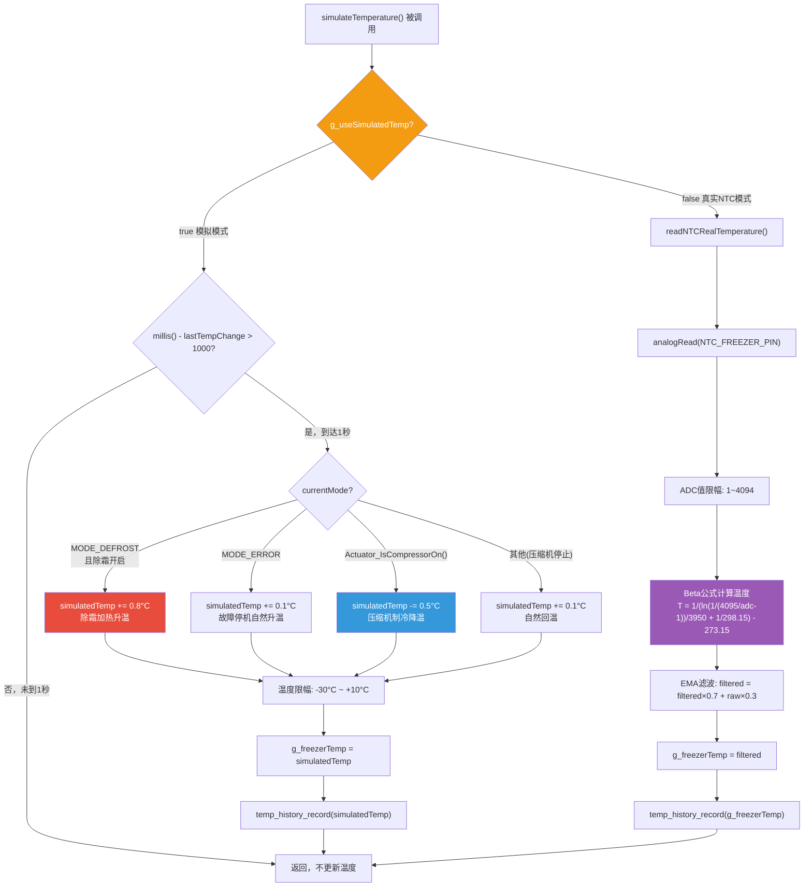

<div align="center"><b>图 5 传感器模块执行流程图</b></div>

模拟模式的温度变化率经过精心标定以逼近真实冰箱的热力学行为：压缩机制冷速率（-0.5°C/s）约为自然回温速率（+0.1°C/s）的 5 倍，反映了制冷系统的功率优势；除霜加热速率最高（+0.8°C/s），模拟了电热丝的快速升温特性。温度限幅（-30°C 至 +10°C）一方面防止浮点溢出，另一方面界定了冰箱物理上可能的温度范围——低于 -30°C 意味着传感器故障或控制系统异常，高于 +10°C 意味着制冷完全失效。每次温度更新后立即调用 `temp_history_record` 将当前值写入环形缓冲区，为 Web 前端的实时温度曲线提供数据源。真实 NTC 模式下，ADC 采样值先限幅至有效范围（1~4094，排除断路/短路极端值），经 Beta 公式转换为开尔文温度再减去 273.15 得到摄氏度值，最后通过 EMA 低通滤波（α=0.3）抑制 ADC 采样的高频噪声。

#### 4.2.5 关键全局变量

传感器模块通过以下全局变量向其他模块暴露温度数据：

<div align="center"><b>表 2 传感器模块全局变量</b></div>

| 变量 | 类型 | 说明 |
|------|------|------|
| `g_useSimulatedTemp` | bool | 温度数据源开关 |
| `g_freezerTemp` | float | 冷冻室当前温度（Web查询用） |
| `simulatedTemp` | float | 软件模拟温度值 |

其中 `g_useSimulatedTemp` 为模式切换开关，在串口输入 `'t'/'T'` 时翻转，使系统能在仿真调试和真实硬件两种场景间无缝切换而不必重新编译。`g_freezerTemp` 是系统的核心数据枢纽——PID 控制器将其作为输入、OLED 将其用于本地显示、Web 服务器将其嵌入 `/api/status` 的 JSON 响应，三处读取均不涉及写入，故无需额外的互斥保护。

---

### 4.3 PID控制模块

**文件**：`include/pid_control.h`、`src/pid_control.cpp`

#### 4.3.1 控制器设计

本系统采用 **单温区 PID 控制器**（冷冻室），基于 Arduino 社区广泛使用的 `PID_v1` 库实现。该库内部维护比例（P）、积分（I）、微分（D）三项误差累加器，每次调用 `Compute()` 时根据当前输入与设定值的偏差，自动计算三项加权和并输出到 0~255 范围的 PWM 等效值。区别于常规加热系统的 DIRECT 方向，制冷系统使用 **REVERSE** 方向——当前温度高于设定值时 PID 输出增大以驱动压缩机制冷，温度低于设定值时输出减小使压缩机停转。REVERSE 方向的适配是制冷 PID 区别于通用 PID 的关键设计决策，选择错误将导致系统正反馈发散。

#### 4.3.2 PID参数配置

<div align="center"><b>表 3 PID 控制器参数配置</b></div>

| 参数 | 默认值 | 说明 |
|------|--------|------|
| Kp（比例系数） | 2.0 | 决定响应速度 |
| Ki（积分系数） | 5.0 | 消除稳态误差 |
| Kd（微分系数） | 1.0 | 抑制超调 |
| 输出范围 | 0~255 | 8位PWM值 |
| 采样时间 | 200ms | PID计算间隔 |

这组参数（Kp=2.0, Ki=5.0, Kd=1.0）是在仿真环境中经过多轮手动整定确定的经验值。Ki 取值较大（5.0）是为了在冷冻室受到开门或放入常温物品等扰动后能快速消除稳态偏移，使温度回归设定值——这是冰箱实际使用场景中最常见的扰动形式。Kd 取值适中（1.0）则兼顾了抑制制冷惯性过冲和避免微分项对测量噪声过度放大之间的折中。

#### 4.3.3 核心实现

```c
// PID对象创建（REVERSE方向：制冷系统）
PID myPID_freezer(&Input_freezer, &Output_freezer, &Setpoint_freezer,
                  Kp_freezer, Ki_freezer, Kd_freezer, REVERSE);

void pid_init() {
    myPID_freezer.SetMode(AUTOMATIC);       // 自动模式
    myPID_freezer.SetOutputLimits(0, 255);  // PWM输出限制
    myPID_freezer.SetSampleTime(200);       // 200ms采样周期
}

void updatePID() {
    Input_freezer = g_freezerTemp;          // 输入当前温度
    myPID_freezer.Compute();                // 执行PID计算

    // 输出大于30 → 启动压缩机（带滞回，避免频繁切换）
    if (Output_freezer > 30.0 && !Actuator_IsCompressorOn()) {
        Actuator_SetCompressor(COMPRESSOR_ON);
        digitalWrite(COMPRESSOR_LED_PIN, HIGH);
    }
    // 输出小于10 → 关闭压缩机
    else if (Output_freezer < 10.0 && Actuator_IsCompressorOn()) {
        Actuator_SetCompressor(COMPRESSOR_OFF);
        digitalWrite(COMPRESSOR_LED_PIN, LOW);
    }
}
```

#### 4.3.4 PID控制流程图

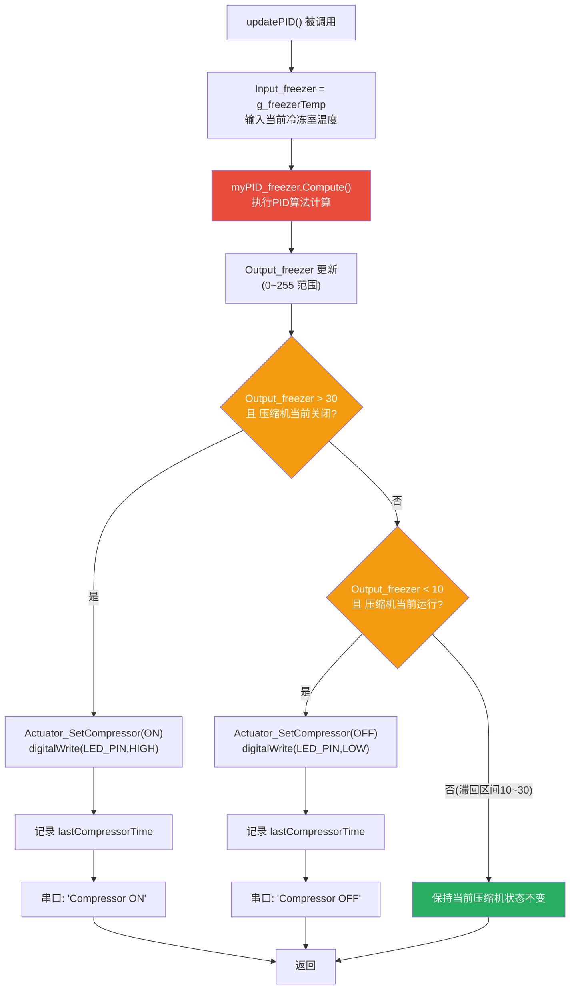

<div align="center"><b>图 6 PID 控制流程图</b></div>

图 4-2 展示了 `updatePID()` 的完整决策链路。每次调用首先将当前冷冻室温度写入 PID 输入变量，随后调用 `myPID_freezer.Compute()` 执行 PID 算法——该函数内部会检查距上次计算是否已满 200ms 采样周期，未满则直接返回而不更新输出，从而实现固定频率的离散控制。计算完成后，输出值进入滞回判断逻辑：大于 30 开压缩机，小于 10 关压缩机，10~30 之间保持原状态不变。

**PID控制滞回说明**：当 PID 输出在 10～30 之间时，压缩机状态保持不变。此设计避免了在临界点附近频繁启停（滞回区间宽度为 20），有效保护压缩机寿命。图 4-3 以状态机形式直观展示了三个工作区域之间的切换条件。

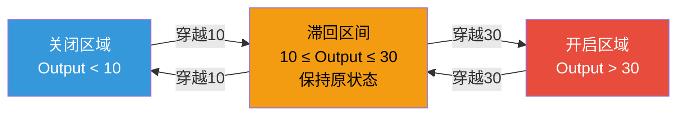

<div align="center"><b>图 7 压缩机滞回阈值状态图</b></div>

#### 4.3.5 全局设定温度同步

`g_freezerSetpoint` 和 `Setpoint_freezer` 通过信号量 `setpointMutex`（FreeRTOS 互斥锁）保护并发访问，确保 Web POST 请求和 PID 计算线程同时修改设定值时不会出现竞态。

---

### 4.4 状态机模块

**文件**：`include/state_machine.h`、`src/mode_defs.cpp`

状态机模块是系统运行逻辑的核心调度器，负责管理冰箱的四种工作模式以及模式间的切换条件。其设计借鉴了有限状态机（FSM）的形式化思想，将每种模式抽象为一个独立的执行上下文，模式切换通过明确的触发条件驱动，避免了 `if-else` 嵌套带来的逻辑耦合和可维护性下降。

#### 4.4.1 状态定义

系统定义了四种工作模式、四种控制状态和五种故障类型，分别对应不同的运行层级：

<div align="center"><b>表 4 系统模式枚举（SystemMode）</b></div>

| 枚举值 | 模式 | 说明 |
|--------|------|------|
| MODE_COOLING (0) | 制冷模式 | PID正常运行，压缩机根据输出启停 |
| MODE_DEFROST (1) | 除霜模式 | 关闭压缩机，开启加热丝，温度升至-5°C或20分钟超时退出 |
| MODE_ECO (2) | 节能模式 | 目标温度提高2°C，关闭风扇 |
| MODE_ERROR (3) | 故障模式 | 关闭所有执行器，蜂鸣器报警 |

<div align="center"><b>表 5 控制状态枚举（ControlState）</b></div>

| 枚举值 | 状态 | 说明 |
|--------|------|------|
| STATE_INIT (0) | 初始化 | 首次上电状态 |
| STATE_STABLE (1) | 温度稳定 | 温度在设定范围内 |
| STATE_TUNING (2) | PID调谐 | 自动调谐中 |
| STATE_RUNNING (3) | 正常运行 | 正常PID控制运行 |

<div align="center"><b>表 6 故障类型枚举（ErrorType）</b></div>

| 枚举值 | 故障 | 触发条件 |
|--------|------|---------|
| ERROR_SENSOR | 传感器故障 | 温度 < -50°C 或 > 100°C |
| ERROR_TEMP_HIGH | 温度过高 | 温度 > 10°C |
| ERROR_TEMP_LOW | 温度过低 | 温度 < -30°C |
| ERROR_DOOR_OPEN | 门未关闭 | 门开超过5分钟 |
| ERROR_COMPRESSOR | 压缩机故障 | （预留） |

#### 4.4.2 状态机模式切换流程图

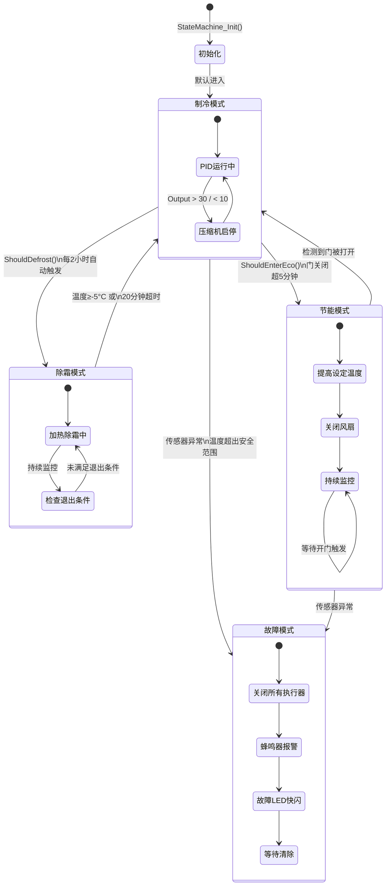

<div align="center"><b>图 8 状态机模式切换状态图</b></div>

图 4-4 采用 Mermaid 状态图语法描述了四种模式的层级结构和切换路径。系统启动后默认进入制冷模式，在该模式下 PID 控制器正常运转并根据压缩机的启停状态在"PID 运行中"和"压缩机启停"两个子状态间循环。除霜模式每 2 小时自动触发一次，除霜结束后自动返回制冷模式，形成定时闭环。节能模式在门关闭超过 5 分钟后自动切入，开门事件则触发退出——这一逻辑模拟了真实冰箱的"假日模式"行为。故障模式具有最高优先级：无论是传感器读数越界、温度超出安全范围还是用户手动下发故障指令，系统均立即关闭所有大功率执行器并触发蜂鸣器报警，保证设备和人身安全。

<div align="center"><b>表 7 模式切换条件汇总</b></div>

| 切换路径 | 触发条件 | 代码位置 |
|---------|---------|---------|
| 制冷 → 除霜 | 每2小时自动触发 | `StateMachine_ShouldDefrost()` |
| 制冷 → 节能 | 门曾打开且关闭超5分钟 | `StateMachine_ShouldEnterEco()` |
| 制冷 → 故障 | 温度 < -50°C 或 > 100°C | `StateMachine_CheckSensorError()` |
| 除霜 → 制冷 | 温度升至 -5°C 或 20分钟超时 | `StateMachine_DefrostMode()` |
| 节能 → 制冷 | 检测到门打开 | `StateMachine_EcoMode()` |
| 任意 → 故障 | 手动设置 mode=3 (Web/小程序) | `handleSetMode()` / `onSetMode()` |

#### 4.4.3 压缩机延时保护

```c
// 最小停机时间 3 分钟（防止频繁启动损坏压缩机）
const unsigned long MIN_COMPRESSOR_OFF_TIME = 180000;

// 最小运行时间 5 分钟（防止短周期运行）
const unsigned long MIN_COMPRESSOR_ON_TIME = 300000;

void StateMachine_UpdateCompressorProtection() {
    // 停机状态下检查是否达到最小停机间隔
    if (!g_systemState.compressorOn) {
        if (millis() - g_compressorOffTime >= MIN_COMPRESSOR_OFF_TIME)
            g_canStartCompressor = true;
    }
    // 运行状态下检查是否达到最小运行时长
    if (g_systemState.compressorOn) {
        if (millis() - g_compressorOnTime >= MIN_COMPRESSOR_ON_TIME)
            g_canStopCompressor = true;
    }
}
```

#### 4.4.4 系统状态数据结构

```c
typedef struct {
    SystemMode currentMode;         // 当前模式
    ControlState controlState;      // 控制状态
    float freezerTemp;              // 冷冻室温度
    float freshTemp;                // 冷藏室温度
    float setpoint;                 // 设定温度
    bool doorOpen;                  // 门状态
    unsigned long doorOpenTime;     // 门打开时间
    ErrorType errorType;            // 故障类型
    bool hasError;                  // 故障标识
    bool compressorOn;              // 压缩机状态
    bool defrostOn;                 // 除霜状态
    bool fanOn;                     // 风扇状态
    unsigned long stateStartTime;   // 状态起始时间
    unsigned long lastModeSwitch;   // 上次模式切换时间
} SystemState;
```

---

### 4.5 执行器控制模块

**文件**：`include/actuator.h`、`src/hardware.cpp`

#### 4.5.1 功能概述

执行器模块作为系统控制指令的最终执行出口，封装了所有硬件输出设备的底层操作接口。上层模块（PID 控制器、状态机、系统控制）仅需调用 `Actuator_SetCompressor()`、`Actuator_SetDefrost()` 等高层函数，无需关心底层是 GPIO 直接驱动还是通过继电器隔离——这种分层设计使得硬件变更时只需修改 `hardware.cpp` 内部的 `digitalWrite` 和 `ledcWrite` 调用，上层业务逻辑完全不受影响。模块共管理五类执行器：压缩机继电器和除霜加热继电器通过 GPIO 高低电平控制通断，PWM 调速风扇通过 ESP32 的 LEDC 控制器输出四档占空比，四颗 LED 指示灯支持常亮/常灭/慢闪/快闪四种状态模式，有源蜂鸣器则在传感器故障和温度异常时发出不同频率的报警信号。

#### 4.5.2 执行器调用流程图

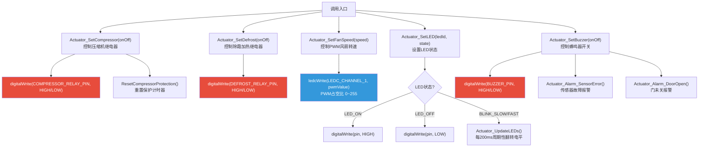

<div align="center"><b>图 9 执行器调用流程图</b></div>

图 4-5 按功能聚合展示了五类执行器的控制路径。压缩机启动时会额外调用 `ResetCompressorProtection()` 重置保护计时器，该计时器在 4.4.3 节的延时保护逻辑中用于强制最小停机间隔；LED 的闪烁逻辑并非在 `Actuator_SetLED` 中直接实现，而是将状态标记写入数组后交由后续的 `Actuator_UpdateLEDs()` 周期性处理——这种"设置即忘"的设计分离了状态设定与行为执行，使得闪烁频率的调整只需修改 `Actuator_UpdateLEDs` 中的时间常量而不影响所有调用 `Actuator_SetLED` 的上层模块。

#### 4.5.3 LED闪烁管理流程图

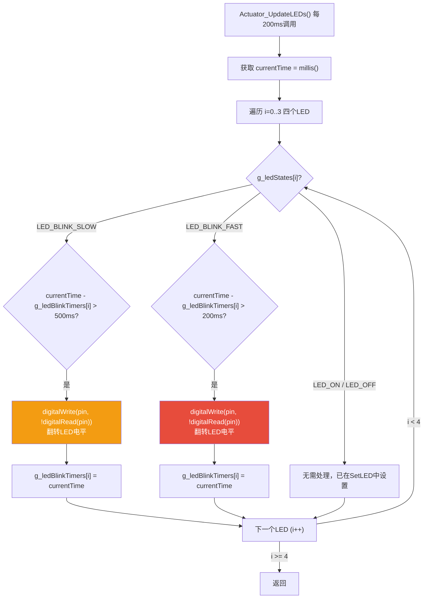

<div align="center"><b>图 10 LED 闪烁管理流程图</b></div>

图 4-6 展示了 `Actuator_UpdateLEDs()` 的轮询更新逻辑。该函数在主循环中每 200ms 被调用一次，依次遍历 4 颗 LED 的状态数组 `g_ledStates`：若当前 LED 设为慢闪模式，则每 500ms 翻转一次 GPIO 电平；若为快闪模式则每 200ms 翻转一次；常亮或常灭模式无需额外处理，因为其在 `Actuator_SetLED` 调用时已一次性设置完成。

#### 4.5.4 核心功能接口

以下列出执行器模块对外暴露的核心 API 及其功能说明：

**压缩机控制**：
```c
void Actuator_SetCompressor(CompressorState state);  // 启停压缩机
bool Actuator_CanStartCompressor();                    // 检查启动条件
bool Actuator_CanStopCompressor();                     // 检查停止条件
```

**除霜控制**：
```c
void Actuator_SetDefrost(DefrostState state);  // 启停除霜加热丝
```

**风扇控制**（4级调速）：
```c
typedef enum {
    FAN_OFF = 0,      // 关闭
    FAN_LOW = 85,     // 33% PWM
    FAN_MEDIUM = 170, // 66% PWM
    FAN_HIGH = 255    // 100% PWM
} FanSpeed;
```

**LED 指示灯**（4种状态）：
```c
typedef enum {
    LED_OFF = 0,          // 常灭
    LED_ON = 1,           // 常亮
    LED_BLINK_SLOW = 2,   // 慢闪(500ms)
    LED_BLINK_FAST = 3    // 快闪(200ms)
} LEDState;
```

**报警功能**：
```c
void Actuator_Alarm_TemperatureTooHigh(float currentTemp, float setpoint);
void Actuator_Alarm_TemperatureTooLow(float currentTemp, float setpoint);
void Actuator_Alarm_SensorError();
void Actuator_Alarm_DoorOpen(unsigned long doorOpenTime);
```

#### 4.5.5 LED 闪烁管理（代码实现）

LED 闪烁通过 `Actuator_UpdateLEDs()` 函数在循环中每 200ms 周期性调用实现，使用 `g_ledBlinkTimers[4]` 数组记录每个 LED 的上次电平翻转时间戳。这种基于时间戳比较（而非 `delay()` 阻塞延时）的非阻塞闪烁方案避免了因 `delay` 导致的 PID 控制周期抖动和 Web 请求超时问题：

```c
void Actuator_UpdateLEDs() {
    for (int i = 0; i < 4; i++) {
        if (g_ledStates[i] == LED_BLINK_SLOW) {
            if (millis() - g_ledBlinkTimers[i] > 500)
                digitalWrite(pin, !digitalRead(pin)); // 翻转电平
        } else if (g_ledStates[i] == LED_BLINK_FAST) {
            if (millis() - g_ledBlinkTimers[i] > 200)
                digitalWrite(pin, !digitalRead(pin));
        }
    }
}
```

---

### 4.6 OLED显示模块

**文件**：`include/oled_display.h`、`src/oled_display.cpp`

#### 4.6.1 硬件接口

OLED 显示模块使用 `U8g2` 图形库驱动 SSD1306 128×64 单色 OLED 屏幕，通过 I2C 硬件接口通信（SDA 接 GPIO8，SCL 接 GPIO9，设备地址 0x3C）。U8g2 库采用帧缓冲区（Frame Buffer）机制——所有绘制操作首先写入内存中的缓冲区，最后通过 `sendBuffer()` 一次性将整个缓冲区通过 I2C 总线写入 SSD1306 的 GDDRAM，这种批量传输方式相比逐个像素写入可大幅降低 I2C 总线占用率，避免与 SHT40、ADS1115 等共享 I2C 总线的传感器产生通信冲突。

#### 4.6.2 双版本UI设计

系统提供了两套 OLED 界面实现以适配不同的硬件环境：

**Wokwi仿真版（oled_display.cpp）** 为 2 页精简界面。主界面以大字体显示冷冻室温度和设定温度，同时紧凑地展示压缩机状态、PID 输出值和当前模式名称，充分利用 128×64 的有限像素空间。菜单界面以带 `>` 光标的四行列表形式提供模式切换、温度设定、返回和系统复位四项操作，光标随按钮输入上下移动。

```c
void updateOLED() {
    u8g2.clearBuffer();
    if (!inMenu) {
        // 主界面：温度、目标、压缩机状态、PID输出、模式
        u8g2.print("Fridge PID Control");
        u8g2.print("Freezer: "); u8g2.print(g_freezerTemp, 1); u8g2.print(" C");
        u8g2.print("Target:  "); u8g2.print(g_freezerSetpoint, 1); u8g2.print(" C");
        u8g2.print("Comp:"); u8g2.print(Actuator_IsCompressorOn() ? " ON " : "OFF");
        u8g2.print("Mode: "); /* COOLING/DEFROST/ECO/ERROR */
    } else {
        // 菜单界面：模式选择、温度设定、返回、复位
        u8g2.drawFrame(0, 15, 128, 45);
    }
    u8g2.sendBuffer();
}
```

**物理硬件版（main.cpp）**：5页完整UI

- **PAGE_MAIN**：主页，大字体显示冷冻室温度 + 冷藏室温度
- **PAGE_SENSORS**：传感器详情页，SHT40温湿度 + 两路NTC温度
- **PAGE_PID**：PID参数页，Kp/Ki/Kd + PWM百分比 + 系统模式
- **PAGE_MENU**：设置菜单，4项（设定冷冻室温度/设定冷藏室温度/PID调谐/返回）
- **PAGE_EDIT**：温度编辑页，旋转编码器调节 ±0.5°C，单击确认、双击取消

#### 4.6.3 页面导航逻辑（物理硬件版5页UI状态机）

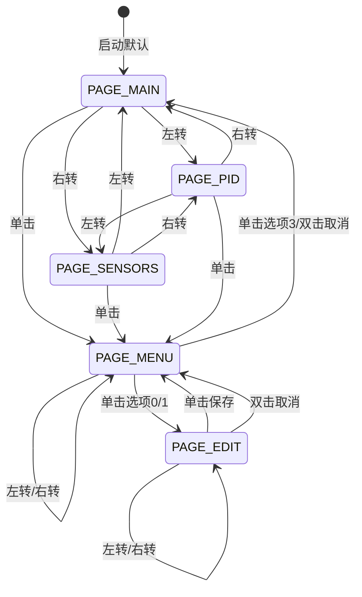

<div align="center"><b>图 11 OLED 五页导航状态图</b></div>

图 4-7 展示了物理硬件版的五页 OLED UI 导航状态机。三个信息展示页（主页、传感器详情、PID 参数）之间通过左右旋转编码器循环切换，底栏的页码提示（如 "1/3 Turn"）告知用户当前所在位置。从任意信息页单击编码器均可进入设置菜单，菜单中通过旋转移动光标选择要编辑的项目，单击进入温度编辑页进行 ±0.5°C 的精细调节，单击保存或双击取消后返回菜单。这种"信息浏览-菜单选择-值编辑"三层交互模型在 128×64 的极小屏幕上实现了清晰的操作层级而无需复杂的上下文记忆。

#### 4.6.4 OLED渲染流程图

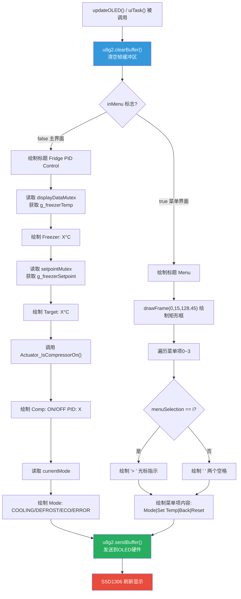

<div align="center"><b>图 12 OLED 渲染流程图</b></div>

图 4-8 详细刻画了 `updateOLED()` 内部的双分支渲染路径。`inMenu` 标志决定当前帧绘制主界面还是菜单界面：主界面分支需要依次读取 `displayDataMutex` 和 `setpointMutex` 获取温度显示数据，调用 `Actuator_IsCompressorOn()` 查询压缩机状态，并读取 `currentMode` 全局变量拼接模式名称字符串；菜单界面分支则基于 `menuSelection` 游标位置决定是否绘制 `>` 选中指示符。无论哪个分支，最终都通过 `sendBuffer()` 将帧缓冲区的全部 1024 字节一次性写入 SSD1306。

---

### 4.7 输入处理模块

**文件**：`include/input_handler.h`、`src/input_handler.cpp`

#### 4.7.1 双输入通道

输入处理模块同时支持物理按键和串口指令两种输入通道，以适应仿真调试和真实部署两种场景。Wokwi 仿真版使用三个独立按钮模拟旋转编码器的三类操作：
- **A 按钮**（ENCODER_A, GPIO4）：上/左移动，菜单中向上选择
- **B 按钮**（ENCODER_B, GPIO5）：下/右移动，菜单中向下选择
- **SW 按钮**（ENCODER_SW, GPIO6）：确认/进入菜单

所有按钮使用 `INPUT_PULLUP` 模式，读取时与静止电平比较，实现下降沿检测去抖动：

```c
void input_init() {
    pinMode(ENC_PIN_A, INPUT_PULLUP);
    pinMode(ENC_PIN_B, INPUT_PULLUP);
    pinMode(ENC_PIN_SW, INPUT_PULLUP);
    delay(50); // 等待按钮稳定
    btnA_REST = digitalRead(ENC_PIN_A); // 记录静止电平
    // ...
}
```

**串口键盘模拟**：
- 键盘发送 `'a'/'A'`：模拟 A 按钮
- 键盘发送 `'b'/'B'`：模拟 B 按钮
- 键盘发送 `'t'/'T'`：切换模拟/真实温度数据源
- 键盘发送 `'s'/'S'`：模拟 SW 按钮

#### 4.7.2 物理硬件版旋转编码器

`main.cpp` 使用 `GyverEncoder` 库驱动物理 EC11 旋转编码器，支持：
- **左转（event=1）**：页面切换 / 菜单向上 / 设定温度减0.5°C
- **右转（event=2）**：页面切换 / 菜单向下 / 设定温度加0.5°C
- **单击（event=3）**：确认选择 / 进入菜单 / 保存设定
- **双击（event=4）**：取消 / 快速返回

编码器事件通过 FreeRTOS 队列 `uiEventQueue` 传递到 UI 任务处理。

---

### 4.8 温度历史记录模块

**文件**：`include/temp_history.h`、`src/temp_history.cpp`

#### 4.8.1 环形缓冲区设计

使用固定大小为 60 的环形数组存储温度历史数据，每秒记录一次：

```c
#define HISTORY_SIZE 60

static float tempHistory[HISTORY_SIZE];
static int historyIndex = 0;
static bool historyFilled = false;

void temp_history_record(float temp) {
    if (millis() - lastTempRecord > 1000) {
        tempHistory[historyIndex] = temp;
        historyIndex = (historyIndex + 1) % HISTORY_SIZE;
        if (historyIndex == 0) historyFilled = true;
        lastTempRecord = millis();
    }
}
```

#### 4.8.2 环形缓冲区读写流程图

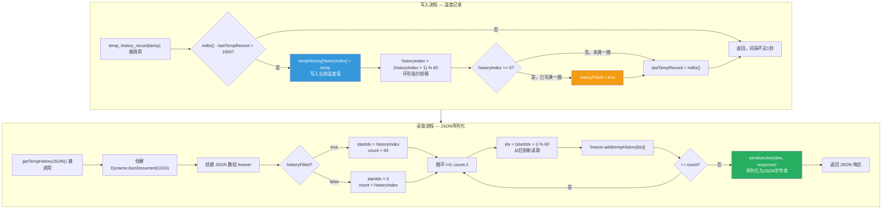

<div align="center"><b>图 13 环形缓冲区读写流程图</b></div>

图 4-9 将写入和读取两条路径并置比较。写入侧以 1 秒为间隔调用，新温度值覆盖 `historyIndex` 指向的槽位后指针循环前移，当 `historyIndex` 绕回 0 时置 `historyFilled` 标志表示缓冲区已满，此后新数据将覆盖最旧的数据（60 秒前的温度）。读取侧根据 `historyFilled` 状态决定遍历范围：未满时读取 0 到 `historyIndex-1` 的有效数据段，已满时从 `historyIndex`（最旧数据位置）开始读取完整一圈 60 个数据点。`serializeJson` 将 JSON 文档序列化为字符串后通过 HTTP 响应体返回，小程序和 Web 前端即可获取时序温度数组。

<div align="center"><b>图 14 环形缓冲区结构示意图</b></div>

```
historyIndex=5  (下一个写入位置)
       ↓
 [0] [1] [2] [3] [4] [5] [6] ... [58] [59]
  ↑                    ↑
  │  已写满一圈时       │  写入方向 →
  │  startIdx=5,       │
  │  读取 count=60     │
```

#### 4.8.3 JSON序列化

使用 `ArduinoJson` 库将历史数据序列化为 JSON 格式，供 Web API 和微信小程序查询：

```c
String getTempHistoryJSON() {
    DynamicJsonDocument doc(1024);
    JsonArray freezer = doc.createNestedArray("freezer");

    int startIdx = historyFilled ? historyIndex : 0;
    int count = historyFilled ? HISTORY_SIZE : historyIndex;

    for (int i = 0; i < count; i++) {
        int idx = (startIdx + i) % HISTORY_SIZE;
        freezer.add(tempHistory[idx]); // 按时间从旧到新
    }
    String response;
    serializeJson(doc, response);
    return response;
}
```

---

### 4.9 系统控制模块

**文件**：`include/system_control.h`、`src/system_control.cpp`

#### 4.9.1 功能职责

系统控制模块作为顶层调度器，在 `loop()` 主循环中以固定顺序整合执行器驱动、安全检查和模式更新三类职责，避免了各模块之间因相互调用顺序不确定而产生的状态不一致问题。

<div align="center"><b>表 8 系统控制模块核心函数</b></div>

| 函数 | 功能 |
|------|------|
| `controlActuators()` | 根据当前模式驱动压缩机LED、除霜LED、蜂鸣器 |
| `checkSafety()` | 检查温度传感器读数的合法性（NaN/范围越界） |
| `updateSystemMode()` | 处理各模式的定时逻辑（除霜120秒退出、ECO模式设定值调整） |
| `resetSystem()` | 系统全局复位（恢复到制冷模式、默认设定-18°C） |

#### 4.9.2 安全检查实现（代码）

```c
void checkSafety() {
    // 传感器故障检测：NaN或温度超出物理可能范围
    if (isnan(g_freezerTemp) || g_freezerTemp < -50.0 || g_freezerTemp > 50.0) {
        currentMode = MODE_ERROR;  // 触发故障模式
    }
    // 温度过高（>10°C）→ 制冷系统失效，进入故障
    if (g_freezerTemp > 10.0) {
        currentMode = MODE_ERROR;
    }
    // 温度过低（<-30°C）→ 控制系统异常，进入故障
    if (g_freezerTemp < -30.0) {
        currentMode = MODE_ERROR;
    }
}
```

#### 4.9.3 模式更新逻辑（代码）

```c
void updateSystemMode() {
    switch (currentMode) {
    case MODE_DEFROST:
        Actuator_SetCompressor(COMPRESSOR_OFF);  // 除霜时关闭压缩机
        if (millis() - lastDefrostTime > 120000)  // 120秒后自动退出
            currentMode = MODE_COOLING;
        break;
    case MODE_ECO:
        Setpoint_freezer = -16.0;  // 节能模式下目标温度-16°C
        break;
    case MODE_ERROR:
        // 故障模式关闭所有大功率设备
        Actuator_SetCompressor(COMPRESSOR_OFF);
        Actuator_SetDefrost(DEFROST_OFF);
        break;
    }
}
```

---

### 4.10 WiFi Web服务器模块

**文件**：`include/wifi_webserver.h`、`src/wifi_webserver.cpp`

#### 4.10.1 HTTP请求处理流程图

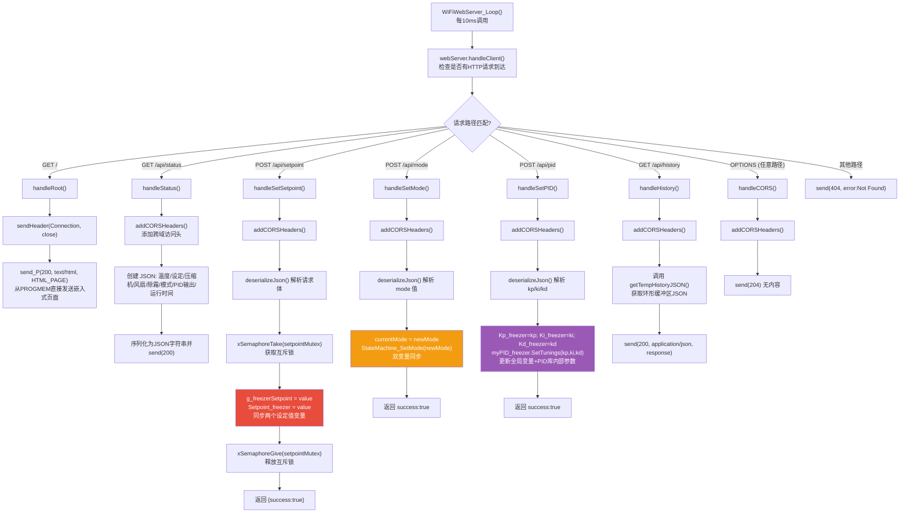

<div align="center"><b>图 15 HTTP 请求处理流程图</b></div>

图 4-11 完整展示了 Web 服务器的路由分发逻辑。服务器在 `loop()` 中每 10ms 调用一次 `webServer.handleClient()` 检查是否有新的 HTTP 请求到达，并根据请求路径和 HTTP 方法分派到对应的处理函数。其中 CORS 预检请求（OPTIONS 方法）由 `handleCORS` 统一处理，返回 HTTP 204 无内容，确保跨域 AJAX 请求能通过浏览器的预检校验。所有响应处理函数均调用 `addCORSHeaders()` 添加 `Access-Control-Allow-Origin: *` 等跨域响应头，使得微信小程序和任意来源的 Web 页面均能以 AJAX 方式调用 API 而无需代理中转。

#### 4.10.2 ESP32 WiFi双模启动流程图

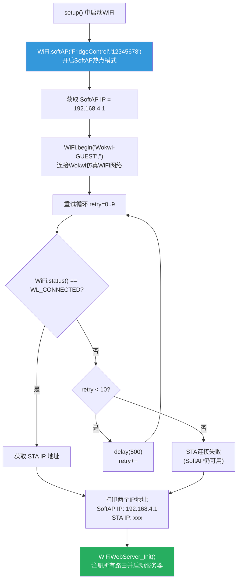

<div align="center"><b>图 16 ESP32 WiFi 双模启动流程图</b></div>

图 4-12 描述了 WiFi 模块的双模启动过程。ESP32 首先以 SoftAP 模式创建自建热点（SSID: "FridgeControl"），该热点不依赖外部路由器即可供手机或电脑直接连接访问，是设备在没有外部 WiFi 覆盖时的兜底通信方案。随后尝试以 STA 模式连接 Wokwi-GUEST 仿真网络（物理部署中可替换为实际路由器），最多重试 10 次。即使 STA 连接失败，SoftAP 模式仍然可用，系统将仅通过 192.168.4.1 对外提供服务。

#### 4.10.3 网络架构

ESP32-S3 同时运行两种 WiFi 模式：SoftAP（热点模式）以 SSID "FridgeControl"、密码 "12345678" 创建自建网络，固定 IP 为 192.168.4.1，为无路由器环境提供直接连接能力；STA（客户端模式）在仿真环境中连接 Wokwi-GUEST 网络以获取额外的局域网 IP 地址。Web 服务器监听 80 端口，支持 CORS（跨域资源共享），允许任意来源的 HTTP 请求——这是微信小程序能通过 `wx.request` 直接调用的技术前提。

#### 4.10.4 HTTP API 接口

<div align="center"><b>表 9 HTTP API 接口一览</b></div>

| 路由 | 方法 | 功能 | 请求参数 | 响应内容 |
|------|------|------|---------|---------|
| `/` | GET | 返回Web控制页面 | - | HTML文本 |
| `/api/status` | GET | 获取系统状态 | - | JSON：温度、模式、压缩机、PID输出等 |
| `/api/setpoint` | POST | 设置目标温度 | `{"zone":"freezer","value":-18.0}` | `{"success":true}` |
| `/api/mode` | POST | 设置工作模式 | `{"mode":0~3}` | `{"success":true}` |
| `/api/pid` | POST | 设置PID参数 | `{"kp":2.0,"ki":5.0,"kd":1.0}` | `{"success":true}` |
| `/api/history` | GET | 获取温度历史 | - | `{"freezer":[-18.0,...]}` |
| OPTIONS `*` | ANY | CORS预检请求 | - | HTTP 204 |

#### 4.10.5 /api/status 响应示例

```json
{
    "freezer_temp": -18.5,
    "freezer_setpoint": -18.0,
    "compressor": true,
    "fan": 85,
    "defrost": false,
    "mode_code": 0,
    "mode": "制冷模式",
    "pid_output": 128.5,
    "uptime": 3600
}
```

#### 4.10.6 线程安全

Web 服务器的 POST 处理函数通过 `setpointMutex`（FreeRTOS 信号量）保护全局变量的并发写入：

```c
void handleSetSetpoint() {
    if (xSemaphoreTake(setpointMutex, pdMS_TO_TICKS(100)) == pdTRUE) {
        g_freezerSetpoint = value;    // 全局变量（Web查询用）
        Setpoint_freezer = value;     // PID实际使用的变量
        xSemaphoreGive(setpointMutex);
    }
}
```

---

### 4.11 Web界面模块

**文件**：`include/web_interface.h`

#### 4.11.1 技术方案

嵌入式 HTML5 页面存储在 PROGMEM（Flash 程序存储区），避免占用 RAM。前端使用原生 JavaScript + Plotly.js CDN 图表库，采用 AJAX 轮询方式每 2 秒获取设备状态、每 5 秒更新实时温度曲线。

#### 4.11.2 页面功能分区

| 区域 | 功能描述 |
|------|---------|
| **Header** | 标题 "冰箱PID控制系统 - 仿真监控" + 运行时间 + 连接状态 |
| **实时状态卡片** | 大字体温度显示 + 设定温度 + 压缩机状态指示灯 + 系统模式 + PID输出值 |
| **温度设置卡片** | 输入框设定目标温度 + 应用按钮 + 操作结果提示 |
| **系统模式卡片** | 4个模式切换按钮（制冷/除霜/节能/故障），活动模式高亮 |
| **PID参数卡片** | Kp/Ki/Kd 三个输入框 + 应用按钮 |
| **温度曲线卡片** | Plotly.js 实时折线图，最多60个数据点，限制内存 |

#### 4.11.3 前端JavaScript核心逻辑

```javascript
// 每2秒获取状态
async function getStatus() {
    const resp = await fetch('/api/status');
    const data = await resp.json();
    // 更新温度、压缩机、模式、PID输出、运行时间等UI
    // 记录温度历史数据用于图表
    tempHistory.push(data.freezer_temp);
    timeHistory.push(nowTimeString);
}

// 每5秒更新Plotly图表（降低渲染频率，避免浏览器内存泄漏）
function updateChart() {
    if (tempHistory.length > 60) {
        tempHistory = tempHistory.slice(-60);  // 保持最多60个点
    }
    Plotly.react('temp-chart', [{x: timeHistory, y: tempHistory, ...}], layout);
}
```

#### 4.11.4 Web前端JavaScript执行流程图

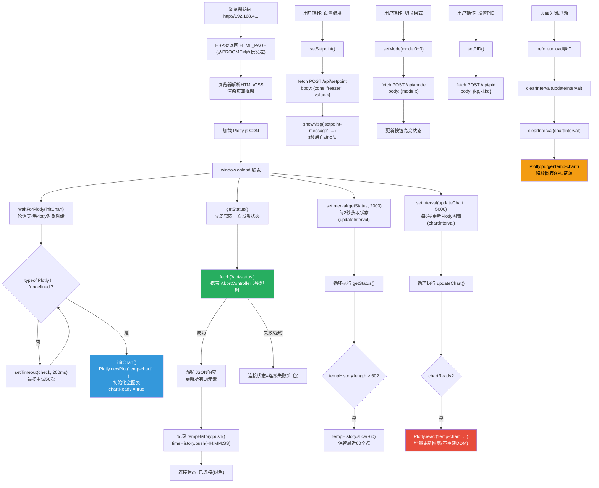

<div align="center"><b>图 17 Web 前端 JavaScript 执行流程图</b></div>

图 4-13 描绘了浏览器端 JavaScript 从页面加载到卸载的完整生命周期。页面加载后首先等待 Plotly.js CDN 脚本就绪并初始化空图表，随后立即发起一次 `/api/status` 请求获取当前设备状态以填充 UI。此后启动两个独立的 `setInterval` 定时器分别以 2 秒和 5 秒的间隔轮询设备状态和刷新图表，避免过高的刷新频率导致 ESP32 处理能力不足或浏览器内存泄漏。用户的操作（设置温度、切换模式、调节 PID）通过独立的 `fetch` POST 请求异步发送，不阻塞定时轮询。

#### 4.11.5 资源管理

页面卸载时清理所有定时器和 Plotly 图表对象，防止内存泄漏和 GPU 资源占用：

```javascript
window.addEventListener('beforeunload', function() {
    clearInterval(updateInterval);
    clearInterval(chartInterval);
    Plotly.purge('temp-chart');
});
```

---

### 4.12 模式定义模块

**文件**：`src/mode_defs.cpp`

此文件定义了 `SystemState g_systemState` 全局变量（状态机核心数据结构），以及状态机相关函数的实现，与 `state_machine.h` 配合构成完整的状态机框架。关键实现已在 4.4 节中详述。

---

## 5. 双平台实现方案

为支持物理硬件部署和在线仿真调试，系统实现了两套主程序入口。

### 5.1 物理平台版本（main.cpp）

**编译隔离**：在 `platformio.ini` 中通过 `build_src_filter = +<*> -<wokwi_main.cpp>` 排除仿真文件。

#### 5.1.1 FreeRTOS多任务架构图

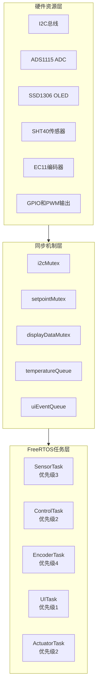

<div align="center"><b>图 18 FreeRTOS 多任务架构图</b></div>

> **图注**：三层架构自下而上为：硬件资源层提供 I2C/ADC/GPIO/PWM 等外设接口；中间同步机制层通过互斥锁和队列保证多任务数据安全；顶层 FreeRTOS 任务层包含 5 个独立任务并行运行。具体通信关系如下：SensorTask 通过 I2C 读取 ADS1115 和 SHT40，经 EMA 滤波后写入 temperatureQueue；ControlTask 从 temperatureQueue 取温度执行 PID 计算，输出 PWM 值到 pwmOutputQueue；PWMTask 读取 pwmOutputQueue 驱动硬件 PWM；EncoderTask 轮询 EC11 编码器，事件通过 uiEventQueue 发送；UITask 从 uiEventQueue 获取事件更新 5 页 OLED 界面；ActuatorTask 周期性更新 LED 闪烁状态。

#### 5.1.2 物理版传感器任务流程图

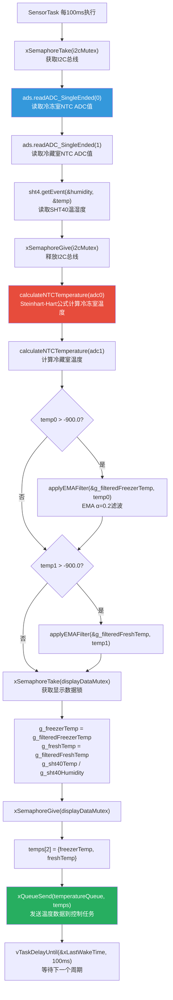

<div align="center"><b>图 19 物理版传感器任务流程图</b></div>

图 5-2 展示了最高优先级任务 SensorTask 的完整执行路径，核心设计要点在于 I2C 总线的互斥访问：ADS1115、SHT40 和 SSD1306 三者共享同一条 I2C 总线，SensorTask 在读取前通过 `xSemaphoreTake(i2cMutex)` 获取总线独占权，读取完毕后立即释放，避免与 UITask 的 OLED 刷新产生总线竞争。温度换算采用 Steinhart-Hart 简化公式（β 参数法），EMA 滤波系数 α=0.2 相比仿真版的 0.3 更为保守，以适应真实硬件上 ADC 噪声更大的实际情况。

**架构特点**：

物理硬件版基于 FreeRTOS 实现了 7 个独立任务的多任务并发架构，各任务通过优先级抢占式调度在 ESP32-S3 双核处理器上并行运行：

<div align="center"><b>表 10 FreeRTOS 任务配置表</b></div>

| 任务名 | 栈大小 | 优先级 | 功能 | 周期 |
|--------|--------|--------|------|------|
| SensorTask | 4096 | 3 | I2C读取ADS1115+SHT40，NTC换算+EMA滤波 | 100ms |
| ControlTask | 4096 | 2 | 接收温度数据→PID计算→输出PWM值 | 事件驱动 |
| PWMTask | 2048 | 2 | 接收PWM值→硬件PWM输出 | 事件驱动 |
| EncoderTask | 2048 | 4 | 旋转编码器轮询+事件生成 | 5ms |
| UITask | 4096 | 1 | 5页OLED界面绘制 | 50ms |
| ActuatorTask | 2048 | 2 | LED闪烁状态更新 | 200ms |
| StateMachineTask | 3072 | 2 | 状态机更新+异常检测 | 500ms |

**同步机制**：4个互斥锁（`i2cMutex`, `setpointMutex`, `displayDataMutex`, `pwmMutex`）+ 4个队列（温度队列、PWM输出队列、UI事件队列、报警队列）确保多任务数据安全。

**传感器硬件**：
- **ADS1115** 16位ADC（0x48）：两路差分读取NTC分压
- **SHT40** 温湿度传感器：I2C总线读取环境温湿度
- **NTC换算**：使用 Steinhart-Hart 简化公式（β参数法）
- **EMA滤波**：α=0.2 指数移动平均

**PID双温区**：同时控制冷冻室（`myPID_freezer`）和冷藏室（`myPID_fresh`）两路PID。

### 5.2 仿真平台版本（wokwi_main.cpp）

**编译隔离**：通过 `build_src_filter = +<*> -<main.cpp>` 排除物理平台文件。

**架构特点**：
- 单循环轮询架构（`loop()` 中顺序调用各模块函数），简化调试
- **ESP32 SoftAP 热点**：SSID "FridgeControl"，密码 "12345678"
- **Wokwi WiFi**：同时连接 Wokwi-GUEST 获取 STA IP
- **单温区控制**：仅控制冷冻室（与Wokwi仿真器件匹配）
- **温度模拟**：软件物理模拟取代真实ADC读取
- **三按钮输入**：替代旋转编码器
- **精简OLED界面**：2页（主界面+菜单）
- **Web服务器完整集成**：HTTP路由、CORS支持

---

## 6. 微信小程序客户端

### 6.1 项目结构

```
wechatapp/miniprogram/
├── app.js              # 全局App实例（设备IP存储）
├── app.json            # 页面路由+TabBar配置
└── pages/
    ├── device/         # 设备连接页（第1个Tab）
    │   ├── device.js   # 连接/断开逻辑、IP地址管理、状态轮询
    │   ├── device.wxml # 连接状态、IP输入、设备信息、操作日志
    │   └── device.wxss # 页面样式
    ├── control/        # 控制面板页（第2个Tab）
    │   ├── control.js  # 温度显示、模式切换、温度加减、设备状态
    │   ├── control.wxml# 温度卡片、模式选择、温度调整、状态指示
    │   └── control.wxss# 控制页样式
    ├── chart/          # 温度曲线页（第3个Tab）
    │   ├── chart.js    # 历史数据加载、Canvas绑图、统计计算
    │   ├── chart.wxml  # 时间范围选择、Canvas画布、温度统计
    │   └── chart.wxss  # 图表页样式
    └── pid/            # PID参数调整页（隐藏页面）
        ├── pid.js      # Kp/Ki/Kd滑块调整、预设加载、API请求
        ├── pid.wxml    # 当前参数显示、滑块组、预设列表
        └── pid.wxss    # PID页样式
```

### 6.2 页面功能详述

**设备连接页（device）**：
- IP 地址输入框（支持 127.0.0.1:8180 格式的 Wokwi 端口转发地址）
- 连接/断开按钮 + 连接状态指示灯（绿=已连接，红=未连接）
- 二维码扫描连接功能
- 连接成功后的设备信息展示（冷冻室温度、工作模式、运行时间）
- 操作日志（最多50条，实时滚动）
- 每 2 秒自动轮询刷新设备状态
- 页面隐藏时停止轮询，显示时恢复

**控制面板页（control）**：
- 冷冻室温度大字体显示（绿色=正常，红色=异常温度 > -15°C）
- 工作模式切换（制冷/除霜/节能，高亮当前模式）
- 温度调节（+/- 按钮，步进1°C，范围 -30°C ~ -10°C）
- 设备状态网格（压缩机运行/停止、风扇运行/停止、除霜开启/关闭）
- 快捷操作（立即除霜、刷新状态）
- 支持真实设备和模拟数据双模式（`MOCK_MODE` 开关）

**温度曲线页（chart）**：
- 时间范围选择（1小时/6小时/24小时/7天）
- Canvas 2D 绑定温度折线图（x轴时间，y轴温度 -25°C ~ 25°C）
- 温度统计卡片（冷冻室最高温/最低温/平均温）
- 手动刷新按钮
- 设备离线时自动使用模拟数据

**PID参数调整页（pid）**：
- 当前参数展示（Kp/Ki/Kd 大字体显示）
- Slider 滑块实时调节（Kp: 0~10, Ki: 0~1, Kd: 0~5）
- 三组预设参数（默认/激进/保守）
- 应用按钮发送 POST /api/pid
- 参数说明帮助卡片

### 6.3 小程序页面导航与数据流

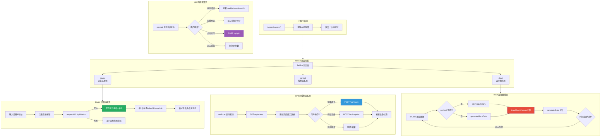

<div align="center"><b>图 20 小程序页面导航与数据流图</b></div>

图 6-1 展示了微信小程序四个功能页面的内部执行逻辑和 API 通信路径。启动时从本地存储恢复上次连接的设备 IP，实现跨会话的连接状态持久化。三个 TabBar 页面（设备连接、控制面板、温度曲线）各自维护独立的轮询机制，页面切换时通过 `onShow`/`onHide` 生命周期控制轮询的启停，避免后台页面消耗不必要的网络请求。PID 参数调整页为隐藏页面（不在 TabBar 中），通过设置菜单中的"PID参数"跳转按钮进入，其滑块和预设加载功能均实时更新显示值但仅在点击"应用"后才通过 POST `/api/pid` 下发到设备。

### 6.4 API通信

小程序通过 `wx.request()` 与 ESP32 Web 服务器通信：

```javascript
requestAPI(path, options = {}) {
    const ip = app.globalData.deviceIP || '127.0.0.1:8180';
    const baseUrl = `http://${ip}`;
    wx.request({
        url: `${baseUrl}${path}`,
        method: options.method || 'GET',
        data: options.data || null,
        timeout: 5000
    });
}
```

---

## 7. 模块间关系与数据流

### 7.1 物理平台FreeRTOS任务间通信图

```
                      ┌──────────────┐
                      │   main.cpp   │  (FreeRTOS多任务调度)
                      └──┬───┬───┬───┘
                         │   │   │
        ┌────────────────┘   │   └──────────────┐
        ▼                    ▼                  ▼
┌──────────────┐  ┌──────────────┐  ┌──────────────┐
│   Sensors    │  │ PID Control  │  │   OLED       │
│  (NTC/SHT40) │──►│ (REVERSE)   │  │  Display     │
└──────────────┘  └──────┬───────┘  └──────────────┘
                          │
         ┌────────────────┼────────────────┐
         ▼                ▼                ▼
┌──────────────┐  ┌──────────────┐  ┌──────────────┐
│   Actuator   │  │State Machine │  │   System     │
│  (Relay/LED) │◄─│ (4 Modes)    │──►│   Control    │
└──────────────┘  └──────────────┘  └──────┬───────┘
                                            │
                    ┌───────────────────────┘
                    ▼
            ┌──────────────┐     ┌──────────────┐
            │ WiFi Web     │────►│  微信小程序   │
            │  Server      │     │  (WX MiniApp) │
            └──────────────┘     └──────────────┘
```

<div align="center"><b>图 21 物理平台 FreeRTOS 任务间通信图</b></div>

图 7-1 以 ASCII 框图形式描述了物理硬件版各模块间的宏观数据流。传感器数据自左向右流动：NTC/SHT40 采集的温度经 EMA 滤波后输入 PID 控制器，PID 输出的 PWM 值分发至执行器驱动硬件，状态机根据模式决策控制执行器的启停，Web 服务器将设备状态对外暴露为 HTTP API 供微信小程序和 Web 浏览器消费。

### 7.2 核心数据流（ASCII版）

```
NTC传感器 ──ADC读取──► EMA滤波 ──► g_freezerTemp ──► PID.Compute()
                                                         │
                                              ┌──────────┘
                                              ▼
                                   Output_freezer (0~255)
                                              │
                          ┌───────────────────┼───────────────────┐
                          ▼                   ▼                   ▼
                   Actuator_Set       StateMachine_        Web API
                   Compressor()       Update()             /api/status
                       │                   │                   │
                       ▼                   ▼                   ▼
                  GPIO12继电器      模式切换决策          微信小程序
                  LED指示灯        (制冷/除霜/节能/故障)   实时显示
```

<div align="center"><b>图 22 核心数据流图</b></div>

图 7-2 以单线 ASCII 流形式展示了一条完整的温度数据从传感器采集到最终用户展示的全链路。数据流以 `g_freezerTemp` 为枢纽分岔为三条并行的消耗路径：PID 计算控制压缩机、状态机更新进行模式决策、Web API 提供远程查询，直观体现了该全局变量作为系统核心数据枢纽的角色。

### 7.3 FreeRTOS任务通信Mermaid图

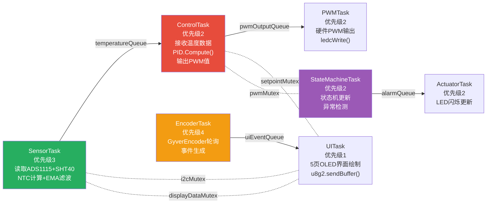

<div align="center"><b>图 23 FreeRTOS 任务间通信图</b></div>

图 7-3 以扁平化节点布局重绘了 7 个 FreeRTOS 任务之间的通信关系。实线箭头表示通过 FreeRTOS 队列（`xQueueSend`）传递数据——温度数据经 `temperatureQueue` 从 SensorTask 流向 ControlTask，PWM 值经 `pwmOutputQueue` 从 ControlTask 流向 PWMTask，UI 事件经 `uiEventQueue` 从 EncoderTask 流向 UITask，报警消息经 `alarmQueue` 从 StateMachineTask 流向 ActuatorTask。虚线表示互斥锁的保护关系——四个 Mutex 分别用于 I2C 总线、设定温度、显示数据和 PWM 输出的并发互斥。

### 7.4 线程安全设计（FreeRTOS版）

物理平台版本的线程安全设计主要围绕 FreeRTOS 的互斥锁（Mutex）和消息队列（Queue）两类同步原语展开。四个互斥锁各自守护一个共享资源的临界区：`i2cMutex` 保护 SensorTask 与 UITask 对 I2C 总线的独占访问，确保在 ADS1115/SHT40 采样期间 OLED 不会发起 I2C 传输；`setpointMutex` 保护 Web POST 处理函数与 PID 计算线程对 `g_freezerSetpoint` 的并发读写，防止设定值更新到一半时被 PID 读取导致计算异常；`displayDataMutex` 保护温度显示数据的写入一致性；`pwmMutex` 保护 PWM 输出值的原子更新。四个消息队列则承载任务间的异步数据传输：`temperatureQueue`（5×float×2）承载传感器任务向控制任务传递的双温区温度数据，`pwmOutputQueue`（5×uint8_t×2）承载控制任务向 PWM 任务传递的双通道占空比，`uiEventQueue`（10×int）将编码器的旋转/点击事件送达 UI 任务，`alarmQueue`（5×64 字节）将状态机任务检测到的报警信息送达 ActuatorTask 以触发 LED 和蜂鸣器的分级响应。

### 7.5 本文档中所有流程图索引

| 序号 | 流程图名称 | 所在章节 | 说明 |
|------|----------|---------|------|
| 1 | 系统整体运行流程图 | 2.0 | 系统启动到主循环的完整执行路径 |
| 2 | 模块调用关系总图 | 2.1 | 11个模块之间的依赖和调用关系 |
| 3 | 传感器模块执行流程图 | 4.2.4 | 模拟温度/NTC温度的获取流程 |
| 4 | PID控制流程图 | 4.3.4 | PID计算+压缩机滞回控制逻辑 |
| 5 | 压缩机状态切换阈值图 | 4.3.4 | 滞回区间(10~30)的开关阈值说明 |
| 6 | 状态机模式切换状态图 | 4.4.2 | 4种模式的Mermaid状态机图 |
| 7 | 执行器调用流程图 | 4.5.2 | 压缩机/除霜/LED/蜂鸣器/风扇的调用关系 |
| 8 | LED闪烁管理流程图 | 4.5.3 | Actuator_UpdateLEDs()的LED翻转逻辑 |
| 9 | OLED 5页导航状态图 | 4.6.3 | 物理硬件版5页UI的Mermaid状态机 |
| 10 | OLED渲染流程图 | 4.6.4 | updateOLED()从clearBuffer到sendBuffer |
| 11 | 环形缓冲区读写流程图 | 4.8.2 | 温度历史记录的写入和JSON读取 |
| 12 | HTTP请求处理流程图 | 4.10.1 | 7个API路由的请求分发处理 |
| 13 | ESP32 WiFi双模启动流程图 | 4.10.2 | SoftAP+STA双模WiFi启动过程 |
| 14 | Web前端JS执行流程图 | 4.11.4 | 浏览器端JS的完整生命周期 |
| 15 | FreeRTOS多任务架构图 | 5.1.1 | 7个FreeRTOS任务+4锁+4队列 |
| 16 | 物理版传感器任务流程图 | 5.1.2 | ADS1115+SHT40读取及EMA滤波 |
| 17 | 小程序页面导航与数据流图 | 6.3 | 4个页面的完整执行流程+API通信 |
| 18 | FreeRTOS任务间通信Mermaid图 | 7.3 | 7个任务的队列和互斥锁通信 |

---

## 8. 结果展示

### 8.1 Wokwi 仿真运行结果

系统在 Wokwi 仿真平台中完整运行，所有器件正常工作。串口输出展示系统启动、WiFi连接、传感器读取、PID输出、压缩机和模式切换等完整日志。

> **[此处插入图片：Wokwi仿真整体运行截图]**
<div align="center"><b>图 24 Wokwi 仿真整体运行截图</b></div>

**串口输出示例**：
```
Fridge PID Control System - Wokwi Simulation
============================================
Starting SoftAP...
SoftAP IP: 192.168.4.1
Connecting to WiFi: Wokwi-GUEST
WiFi connected! STA IP: 10.10.0.2
HTTP Web服务器已启动
访问地址: http://192.168.4.1
System initialized successfully!
===== System Status =====
Temperature: -18.50 C
Target: -18.00 C
PID Output: 45.00
Compressor: ON
Mode: COOLING
========================
```

<div align="center"><b>图 25 系统启动串口输出示例</b></div>

> **[此处插入图片：Wokwi串口监视器输出截图]**
<div align="center"><b>图 26 Wokwi 串口监视器截图</b></div>

### 8.2 OLED 显示界面展示

#### 8.2.1 物理硬件版5页UI

**主页（PAGE_MAIN）**：
- 显示 "Fridge PID Control" 标题
- 大字体（fub20）显示冷冻室温度和 °C 单位
- 中字体（fub14）显示 "Fresh:" + 冷藏室温度
- 底部提示 "1/3  Turn"

> **[此处插入图片：OLED主页界面截图]**

**传感器详情页（PAGE_SENSORS）**：
- 标题 "Sensors Info"
- SHT40 温度和湿度一行显示
- 冷冻室温度一行显示
- 冷藏室温度一行显示

> **[此处插入图片：OLED传感器详情页截图]**

**PID参数页（PAGE_PID）**：
- 标题 "PID Parameters"
- Kp 和 Ki 参数值一行显示
- Kd 参数值一行显示
- 当前 PWM 百分比显示
- 系统模式名称显示

> **[此处插入图片：OLED PID参数页截图]**

**设置菜单页（PAGE_MENU）**：
- 标题 "Settings" + 分隔线
- ">" 光标指示当前选项
- Freezer: -18.0°C（当前设定显示）
- Fresh: 4.0°C
- Start Tune
- Back

> **[此处插入图片：OLED设置菜单页截图]**

**温度编辑页（PAGE_EDIT）**：
- 标题 "Set Freezer Temp" 或 "Set Fresh Temp"
- 大字体显示当前编辑值 `[ -18.5 ]`
- 底部提示 "Turn: +/- 0.5C"
- "Click:Save  Double:Cancel"

> **[此处插入图片：OLED温度编辑页截图]**

#### 8.2.2 仿真版2页UI

**主界面**：冷冻室温度、设定温度、压缩机状态、PID输出、当前模式

> **[此处插入图片：Wokwi仿真OLED主界面截图]**

**菜单界面**：带边框的4项菜单，支持模式切换、温度设定、返回、系统复位

> **[此处插入图片：Wokwi仿真OLED菜单界面截图]**

### 8.3 Web控制面板展示

ESP32 自建 WiFi 热点后，浏览器访问 `http://192.168.4.1` 即可看到完整的控制面板。

**整体页面效果**：
- 深蓝色渐变背景 + 玻璃态半透明卡片
- 大字体实时温度显示（绿色发光效果）
- 压缩机状态指示灯（绿=运行，红=停止）
- 模式按钮高亮当前模式
- PID参数输入区
- Plotly.js 实时温度折线图

> **[此处插入图片：Web控制面板整体页面截图]**

**实时温度曲线**：
- 每5秒更新一次
- 最多保留60个数据点
- X轴显示时分秒时间标签
- 绿色折线

> **[此处插入图片：Web温度曲线截图]**

**温度设置与反馈**：
- 输入新目标温度 → 点击"应用设定" → 显示绿色成功提示
- 失败时显示红色错误提示

> **[此处插入图片：Web温度设置操作截图]**

**模式切换**：
- 点击"制冷"/"除霜"/"节能"/"故障"按钮
- 当前活动模式按钮变绿色高亮
- API请求成功后显示提示

> **[此处插入图片：Web模式切换操作截图]**

**PID参数调节**：
- Kp/Ki/Kd 三个输入框
- 点击"应用PID参数"实时生效
- 参数同步到硬件PID控制器

> **[此处插入图片：Web PID参数设置截图]**

### 8.4 微信小程序展示

#### 8.4.1 设备连接页

- 顶部连接状态指示灯（绿色圆点=已连接，红色=未连接）
- IP地址输入框（默认 127.0.0.1:8180）
- "连接设备"按钮（加载中状态显示"连接中..."）
- "断开连接"按钮
- "扫描二维码连接"按钮
- 连接成功后显示：设备信息卡片（冷冻室温度、工作模式、运行时间）
- 操作日志列表（时间 + 内容，最多50条）

> **[此处插入图片：微信小程序设备连接页截图]**

> **[此处插入图片：微信小程序设备已连接状态截图]**

#### 8.4.2 控制面板页

- 冷冻室温度大字体显示（正常=绿色，异常=红色）
- 设定温度展示
- 工作模式选择区（制冷❄️/除霜🔥/节能💚 三个图标按钮，高亮当前模式）
- 温度调节行（- 按钮 + 当前设定 + + 按钮），范围为-30°C至-10°C
- 设备状态区（压缩机运行/停止、风扇运行/停止、除霜开启/关闭）
- 快捷操作（立即除霜按钮、刷新状态按钮）

> **[此处插入图片：微信小程序控制面板页截图]**

> **[此处插入图片：微信小程序模式切换结果截图]**

#### 8.4.3 温度曲线页

- 时间范围选择栏（1小时/6小时/24小时/7天 四个标签切换）
- Canvas 2D 温度折线图（x轴时间标签，y轴温度25°C → -25°C）
- 统计卡片（冷冻室最高温/红色、最低温/绿色、平均温/蓝色）
- 刷新数据按钮

> **[此处插入图片：微信小程序温度曲线页截图]**

> **[此处插入图片：微信小程序不同时间范围曲线截图]**

#### 8.4.4 PID参数调整页

- 当前参数显示（Kp=2.0 / Ki=0.5 / Kd=1.0 大字体蓝色）
- 三个参数滑块（Kp 0~10 / Ki 0~1 / Kd 0~5，不同颜色区分）
- 预设参数列表（默认参数 / 激进模式 / 保守模式）
- "应用参数"和"重置"按钮
- 参数说明帮助卡片

> **[此处插入图片：微信小程序PID参数调整页截图]**

> **[此处插入图片：微信小程序PID预设加载截图]**

### 8.5 系统模式切换验证

#### 制冷模式
- 压缩机根据PID输出启停
- 压缩机LED指示灯亮/灭交替
- Web/小程序显示 "COOLING"
- 模拟温度以 0.5°C/秒 速率下降

> **[此处插入图片：制冷模式运行截图]**

#### 除霜模式
- 压缩机强制关闭（LED灭）
- 除霜加热丝启动（除霜LED亮）
- Web/小程序显示 "DEFROST"
- 模拟温度以 0.8°C/秒 速率上升
- 温度升至 -5°C 或120秒超时后自动返回制冷模式

> **[此处插入图片：除霜模式运行截图]**

#### 节能模式
- 目标温度自动设为 -16°C
- 风扇停止运行
- Web/小程序显示 "ECO"
- 开门操作触发退出

> **[此处插入图片：节能模式运行截图]**

#### 故障模式
- 传感器异常（温度>10°C 或 <-30°C） 或手动触发
- 所有执行器强制关闭
- 蜂鸣器以 500ms 间隔闪烁（PWM模拟）
- 故障LED快闪
- Web/小程序显示 "ERROR"

> **[此处插入图片：故障模式报警截图]**

### 8.6 PID控制效果验证

#### 压缩机制冷响应
- PID输出 > 30 时启动压缩机，模拟温度开始下降
- PID输出 < 10 时关闭压缩机，模拟温度自然回升
- 滞回区间（10~30）防止频繁切换

> **[此处插入图片：PID压缩机启停与温度变化曲线截图]**

#### 不同PID参数对比
- 默认参数 (Kp=2.0, Ki=5.0, Kd=1.0)：适中响应速度
- 激进参数 (Kp=5.0, Ki=1.0, Kd=2.0)：快速响应但可能超调
- 保守参数 (Kp=1.0, Ki=0.2, Kd=0.5)：缓慢平稳

> **[此处插入图片：不同PID参数控制效果对比图]**

### 8.7 多平台协同工作展示

展示 ESP32 仿真、Web 浏览器控制面板、微信小程序三端同时运行的截图，证明系统的多终端协同控制能力。

> **[此处插入图片：三端协同工作截图（仿真+Web+小程序）]**

---

## 9. 总结与展望

### 9.1 项目成果总结

本项目从嵌入式硬件、控制算法、网络通信到多端前端展示，完整实现了一套冰箱 PID 温度闭环控制系统。在硬件层面，基于 ESP32-S3 完成了多传感器融合采集（两路 NTC 热敏电阻、SHT40 温湿度传感器和 ADS1115 高精度 ADC）、多执行器驱动（压缩机/除霜继电器、四级 PWM 调速风扇、四色状态 LED 和有源蜂鸣器报警）以及 OLED 本地显示和旋转编码器交互。在控制算法层面，基于 PID_v1 库实现了 REVERSE 方向的制冷 PID 控制器，参数（Kp=2.0, Ki=5.0, Kd=1.0）经手动整定后具备良好的响应速度和稳态精度，同时设计了四模式状态机（制冷/除霜/节能/故障）并实现了最小停机 3 分钟和最小运行 5 分钟的压缩机延时保护。在网络通信层面，ESP32 以双模 WiFi（SoftAP + STA）同时提供自建热点和局域网接入能力，HTTP RESTful API 通过 6 个端点对外暴露设备状态查询、温度设定、模式切换、PID 参数调整和历史数据获取功能，CORS 头支持使得浏览器和微信小程序均可直接跨域调用。在前端展示层面，Web 控制面板以嵌入式 HTML5 + Plotly.js 提供了深蓝渐变玻璃态 UI 和实时温度曲线，物理硬件 OLED 实现了五页旋转编码器交互式菜单界面，微信小程序以四个功能页面（设备连接、控制面板、温度曲线、PID 调参）和 TabBar 导航提供了移动端远程操控能力。此外，系统通过 PlatformIO 的 `build_src_filter` 编译隔离机制同时支持物理硬件版（FreeRTOS 七任务多任务架构）和 Wokwi 在线仿真版（单循环轮询架构），两套代码共享核心业务模块，仅主程序入口和引脚配置各自独立。

### 9.2 技术亮点

在 PID 控制适配方面，系统采用 REVERSE 方向配合滞回区间（阈值为 10~30）的设计，既确保了制冷系统的控制方向正确性，又通过 20 个单位的滞回宽度有效减少了压缩机在设定值附近的频繁启停次数。压缩机的延时保护机制（最小停机 3 分钟、最小运行 5 分钟）参考了真实工业制冷设备的时间常数，避免了短周期运行对压缩机电机和启动电容的损害。温度物理模拟引擎依据当前工作模式和执行器状态，以不同的变化率（压缩机制冷 -0.5°C/s、除霜加热 +0.8°C/s、自然回温 +0.1°C/s）动态更新模拟温度，在无真实硬件的仿真环境下仍能验证完整的控制逻辑。物理硬件版通过 4 个 FreeRTOS 互斥锁和 4 个消息队列构建了七任务并发环境下的线程安全体系，在 I2C 总线共享、设定值并发写入、显示数据一致性和 PWM 输出原子性四个关键竞争点上实现了可靠的同步保护。前端架构采用 AJAX 轮询获取设备状态而非全页刷新，使 Web 页面和微信小程序均能实现无闪烁的实时数据更新；设备离线时通过 MOCK 模式自动降级到模拟数据展示，确保界面在任何网络条件下均可正常演示。

### 9.3 未来优化方向

在控制算法方面，可集成 PID-AutoTune 库的继电器振荡法（Relay Tuning）实现 PID 参数在线自整定，省去当前手动试凑参数的时间成本；冷藏室独立 PID 控制回路的完善将实现冷冻室与冷藏室的双温区协同控制。在网络通信方面，引入 MQTT 协议（PubSubClient 库）替代当前纯 HTTP 轮询模式，可实现设备到云端的数据主动推送和低功耗保活连接。在数据持久化方面，利用 ESP32 内置的 Preferences NVS（非易失性存储）保存 PID 参数和温度历史数据，可在设备断电重启后恢复最近的控制参数和工作状态。在传感器扩展方面，接入门磁开关传感器可实现完整的开门检测和节能逻辑闭环，使目前部分模拟的节能模式功能得以在真实硬件上运行。

---

**附录A：项目开发环境**

<div align="center"><b>表 11 项目开发环境</b></div>

| 工具 | 版本/说明 |
|------|----------|
| IDE | VS Code + PlatformIO |
| 编译器 | espressif32 (Arduino Framework) |
| 仿真平台 | Wokwi for VS Code |
| 微信开发者工具 | miniprogram开发 |
| 依赖库 | U8g2, GyverEncoder, PID_v1, PID-AutoTune, ArduinoJson, PubSubClient, Adafruit_SHT4x, Adafruit_ADS1X15 |
| 版本控制 | Git (GitHub: Forward123-hub) |

**附录B：项目文件清单**

<div align="center"><b>表 12 项目文件清单</b></div>

| 类别 | 文件数 | 说明 |
|------|--------|------|
| 头文件 (.h) | 11 | include/目录，模块接口定义 |
| 源文件 (.cpp) | 11 | src/目录，模块功能实现 |
| 配置文件 | 2 | platformio.ini, diagram.json |
| 小程序文件 (.js/.wxml/.wxss/.json) | 18 | wechatapp/目录，4个页面+入口文件 |
| 总计 | 42 | - |
