# 基于FreeRTOS与PID算法的冰箱智能温控系统

## 详细设计报告

**项目名称**：基于FreeRTOS与PID算法的冰箱智能温控系统  
**提交阶段**：阶段二——详细设计  
**撰写人**：董慧晴  
**学号**：423128040120  
**班级**：4231090303  
**提交日期**：2026年6月8日

---

## 目录

1. [引言](#一引言)
2. [系统总体架构设计](#二系统总体架构设计)
3. [数据结构设计](#三数据结构设计)
4. [模块详细设计](#四模块详细设计)
5. [FreeRTOS任务设计](#五freertos任务设计)
6. [人机交互设计](#六人机交互设计)
7. [安全保护设计](#七安全保护设计)
8. [通信协议设计](#八通信协议设计)
9. [总结](#九总结)

---

## 一、引言

### 1.1 报告目的

本报告为"基于FreeRTOS与PID算法的冰箱智能温控系统"的课程设计第二阶段（详细设计）交付文档。本报告在第一阶段需求分析的基础上，对系统各功能模块进行详细的模块化设计，明确各模块的功能边界、接口定义、数据结构、处理流程和实现方案。

### 1.2 设计范围

本报告的设计范围涵盖系统架构、数据结构、模块详细设计、FreeRTOS任务设计、人机交互、安全保护和通信协议七个方面。其中系统架构设计主要确定软件分层架构和模块划分，数据结构设计涉及系统所需的数据类型和结构体，模块详细设计包括各功能模块的处理流程、函数接口和实现方案。FreeRTOS任务设计则关注任务划分、优先级分配和任务间通信机制，人机交互设计涵盖OLED显示界面、编码器交互、网页界面和微信小程序界面。此外，安全保护设计涉及故障检测和安全保护机制，通信协议设计包括HTTP API接口和MQTT通信协议。

### 1.3 设计约束

本系统的设计受到多方面约束。硬件方面，使用ESP32-S3作为主控芯片，其资源有限（520KB SRAM，4MB Flash），需要在有限的硬件资源下实现完整的系统功能。实时性方面，温度控制需要保证实时响应，PID计算周期不能超过200ms。功耗方面，需要考虑节能模式，在门关闭时降低系统功耗。安全方面，需要完善的故障检测和保护机制，确保系统在任何情况下都能安全运行。

### 1.4 设计策略

本报告采用"自顶向下"的设计方法，首先设计系统总体架构并确定模块划分，然后设计数据结构以统一数据接口，接着设计各模块的详细处理流程，最后进行任务划分和通信机制的设计。

---

## 二、系统总体架构设计

### 2.1 设计思路

本系统采用分层架构设计，将系统分为四层。应用层负责用户交互和远程通信，控制层负责PID控制、状态管理和安全监控，数据处理层负责传感器数据采集、滤波和PWM输出，驱动层负责硬件驱动。采用这种分层架构设计的主要理由是它可以降低模块间的耦合度，每一层只依赖下一层，符合软件工程的基本原则，同时也便于并行开发，不同开发人员可以负责不同层次的模块。

### 2.2 系统整体架构图

```mermaid
graph TB
    subgraph "用户交互层"
        A1[OLED显示屏<br/>SSD1306 128x64]
        A2[旋转编码器<br/>EC11]
        A3[微信小程序]
        A4[Web网页界面]
    end

    subgraph "应用层 Application Layer"
        B1[OLED UI任务<br/>5页界面显示]
        B2[编码器输入任务<br/>事件处理]
        B3[WiFi Web服务器<br/>HTTP API]
        B4[MQTT通信任务<br/>云端通信]
    end

    subgraph "控制层 Control Layer"
        C1[PID控制任务<br/>增量式PID]
        C2[状态机任务<br/>4种模式管理]
        C3[执行器任务<br/>LED状态更新]
        C4[安全监控<br/>故障检测]
    end

    subgraph "数据处理层 Data Processing Layer"
        D1[传感器任务<br/>NTC+SHT40]
        D2[EMA滤波<br/>温度平滑]
        D3[PWM输出任务<br/>压缩机+风扇]
    end

    subgraph "驱动层 Driver Layer"
        E1[I2C总线<br/>OLED+SHT40]
        E2[ADS1115<br/>ADC采集]
        E3[LED PWM<br/>压缩机+风扇]
        E4[GPIO控制<br/>继电器+蜂鸣器]
    end

    subgraph "硬件层 Hardware Layer"
        F1[ESP32-S3]
        F2[NTC热敏电阻x2<br/>冷冻+冷藏]
        F3[SHT40<br/>温湿度传感器]
        F4[压缩机继电器]
        F5[除霜加热丝]
        F6[直流风扇]
    end

    A1 --> B1
    A2 --> B2
    A3 --> B3
    A4 --> B3
    B1 --> C2
    B2 --> C2
    B3 --> C2
    B4 --> C2
    C1 --> D3
    C2 --> C1
    C2 --> D3
    D1 --> D2
    D2 --> C1
    D3 --> E3
    B1 --> E1
    D1 --> E1
    D1 --> E2
    C3 --> E4
    ```

> **图1：系统整体架构图**
> 
> 该图展示了系统的四层架构设计，包括用户交互层、应用层、控制层、数据处理层和驱动层。各层之间通过明确的接口进行通信，降低了模块间的耦合度。

**架构设计说明**：
用户交互层提供本地和远程两种交互方式，让用户可以通过OLED屏幕、旋转编码器、网页和微信小程序等方式与系统交互。应用层处理用户交互和通信，不直接操作硬件，通过调用下层接口实现功能。控制层是系统的核心控制逻辑，负责PID计算、状态管理和安全监控。数据处理层负责数据处理和输出，隔离控制层和驱动层，使得上层逻辑不依赖于具体的硬件实现。驱动层直接操作硬件，提供统一的硬件接口供上层调用。

### 2.3 模块划分与职责

**表1：系统模块划分与职责表**

| 模块名称 | 源文件 | 职责描述 | 依赖模块 | 设计要点 |
|---------|--------|----------|----------|----------|
| 主程序模块 | `main.cpp` | 系统初始化、FreeRTOS任务创建、全局变量管理 | 所有模块 | 初始化顺序很重要 |
| PID控制模块 | `main.cpp` (controlTask) | 增量式PID算法、冷冻室/冷藏室双区控制 | 状态机模块 | 需要设为REVERSE方向 |
| 状态机模块 | `state_machine.cpp/.h` | 四种工作模式管理、模式自动切换 | 执行器模块 | 模式切换需要滞环 |
| 执行器模块 | `actuator.cpp/.h` | 压缩机、除霜、风扇、蜂鸣器、LED控制 | 无 | 需要保护压缩机 |
| 传感器模块 | `main.cpp` (sensorTask) | NTC温度采集、SHT40温湿度读取、EMA滤波 | 无 | 需要滤波平滑 |
| OLED UI模块 | `main.cpp` (uiTask) | 5页界面绘制、编码器事件处理 | 状态机模块 | 需要互斥锁保护I2C |
| WiFi/MQTT模块 | `wifi_mqtt.cpp/.h` | WiFi连接管理、MQTT发布订阅、JSON数据打包 | 状态机模块 | 需要处理断线重连 |
| Web服务器模块 | `wifi_webserver.cpp/.h` | HTTP API接口、网页控制界面 | WiFi模块 | 需要考虑并发 |

**模块划分理由**：
模块划分遵循高内聚低耦合原则，每个模块职责单一，模块间通过明确接口通信。每个模块都可以独立测试，修改一个模块不会影响其他模块。增加新功能只需增加新模块或修改现有模块接口，保证了系统的可测试性、可维护性和可扩展性。

### 2.4 系统工作流程设计

```mermaid
flowchart LR
    A[系统上电] --> B[初始化外设]
    B --> C[创建同步原语]
    C --> D[初始化传感器]
    D --> E[初始化PID]
    E --> F[创建8个任务]
    F --> G[多任务调度]
    
    G --> H[sensorTask<br/>100ms]
    G --> I[controlTask<br/>事件触发]
    G --> J[pwmTask<br/>事件触发]
    G --> K[encoderTask<br/>5ms]
    G --> L[uiTask<br/>100ms]
    G --> M[actuatorTask<br/>200ms]
    G --> N[stateMachineTask<br/>500ms]
    G --> O[mqttTask<br/>5s]
    
    H --> P[读取NTC温度]
    P --> Q[EMA滤波]
    Q --> R[发送温度队列]
    R --> I
    I --> S[PID计算]
    S --> T[发送PWM队列]
    T --> J
    J --> U[更新PWM占空比]
    K --> V[检测编码器]
    V --> W[发送UI事件队列]
    W --> L
    L --> X[更新OLED显示]
    N --> Y[检查模式切换]
    Y --> Z[更新系统模式]
    O --> Z1[发布MQTT状态]
    Z1 --> Z2[检查报警]
```

> **图2：系统工作流程图**
> 
> 该图展示了系统的工作流程，包括初始化阶段和多任务调度阶段。初始化阶段按顺序初始化硬件和软件，多任务调度阶段8个任务并行执行，通过队列和互斥锁进行通信。

**工作流程设计说明**：
初始化阶段需要按顺序初始化硬件和软件，确保依赖关系正确。多任务调度阶段8个任务并行执行，通过队列和互斥锁进行通信。数据采集流遵循传感器任务到控制任务再到PWM输出任务的数据流向。用户交互流通过编码器任务、UI任务和执行器任务实现人机交互。状态监控流通过状态机任务、MQTT任务将状态数据上传到云端。

---

## 三、数据结构设计

### 3.1 设计原则

数据结构设计遵循以下原则：
数据结构设计遵循简洁性、可扩展性、可维护性和内存效率四项原则。数据结构应该简洁明了，不包含冗余信息，同时预留扩展空间以便后续增加新功能。相关数据进行封装以提高可维护性，并充分考虑ESP32内存限制，避免过度使用内存。

### 3.2 系统模式枚举设计

**设计背景**：
冰箱控制系统需要支持多种工作模式，每种模式有不同的控制策略。使用枚举类型可以提高代码可读性，便于编译器进行类型检查，同时也有利于后续扩展新模式。

**文件**：`state_machine.h`

```c
// 系统工作模式
typedef enum {
    MODE_COOLING = 0,    // 制冷模式：PID正常运行，压缩机根据输出启停
    MODE_DEFROST = 1,     // 除霜模式：压缩机关闭，除霜加热丝开启
    MODE_ECO = 2,         // 节能模式：门关闭超过5分钟，设定温度提高2°C
    MODE_ERROR = 3         // 故障模式：传感器故障，关闭所有执行器，蜂鸣器报警
} SystemMode;
```

**枚举值设计说明**：
枚举值使用从0开始的连续整数，便于数组索引。每个模式都有明确的注释说明该模式的行为，同时预留了扩展空间，可以增加新的模式（如vacation度假模式）。

### 3.3 控制状态枚举设计

**设计背景**：
PID控制需要一个状态机来管理不同阶段的行为，如初始化、调谐、正常运行等。

```c
// PID控制状态机
typedef enum {
    STATE_INIT = 0,           // 初始化状态：系统启动后的初始状态
    STATE_STABLE = 1,         // 温度稳定状态：温度在设定值±1°C范围内
    STATE_TUNING = 2,        // PID自动调谐状态：使用Ziegler-Nichols方法
    STATE_RUNNING = 3         // 正常运行状态：PID正常输出
} ControlState;
```

**状态设计说明**：
`STATE_INIT`表示系统启动后的初始化状态，传感器可能需要预热。`STATE_STABLE`表示温度已经稳定，可以用于判断系统是否达到稳态。`STATE_TUNING`是PID自动调谐状态，需要调整Kp、Ki、Kd参数。`STATE_RUNNING`是正常运行状态，PID根据误差计算输出。

### 3.4 故障类型枚举设计

**设计背景**：
系统需要检测多种故障类型，并使用枚举来标识故障类型，便于故障处理和用户提示。

```c
// 故障类型定义
typedef enum {
    ERROR_NONE = 0,          // 无故障
    ERROR_SENSOR = 1,        // 传感器故障：NTC返回-998/-999
    ERROR_TEMP_HIGH = 2,      // 温度过高：冷冻室 > -10°C
    ERROR_TEMP_LOW = 3,       // 温度过低：冷冻室 < -30°C
    ERROR_DOOR_OPEN = 4,      // 门未关闭：超过5分钟
    ERROR_COMPRESSOR = 5      // 压缩机故障：启动后温度不下降
} ErrorType;
```

**故障类型设计说明**：
`ERROR_NONE`表示无故障状态，便于判断是否有故障发生。`ERROR_SENSOR`表示传感器故障，可能是NTC断路或短路导致。`ERROR_TEMP_HIGH`和`ERROR_TEMP_LOW`分别表示温度过高或过低，超出安全范围需要停机保护。`ERROR_DOOR_OPEN`表示门未关闭超过5分钟，可能导致冷量损失。`ERROR_COMPRESSOR`表示压缩机故障，可能是继电器损坏或压缩机本身故障。

### 3.5 执行器状态枚举设计

**设计背景**：
执行器有多种状态，使用枚举可以明确状态含义，避免魔法数字。

**文件**：`actuator.h`

```c
// 压缩机状态
typedef enum {
    COMPRESSOR_OFF = 0,       // 压缩机关闭
    COMPRESSOR_ON = 1         // 压缩机运行
} CompressorState;

// 除霜加热丝状态
typedef enum {
    DEFROST_OFF = 0,         // 除霜关闭
    DEFROST_ON = 1           // 除霜开启
} DefrostState;

// 风扇速度（PWM占空比）
typedef enum {
    FAN_OFF = 0,             // 风扇关闭
    FAN_LOW = 85,            // 低速 33% PWM
    FAN_MEDIUM = 170,        // 中速 66% PWM
    FAN_HIGH = 255           // 高速 100% PWM
} FanSpeed;

// 蜂鸣器状态
typedef enum {
    BUZZER_OFF = 0,         // 蜂鸣器关闭
    BUZZER_ON = 1           // 蜂鸣器开启
} BuzzerState;

// LED闪烁状态
typedef enum {
    LED_OFF = 0,             // LED常灭
    LED_ON = 1,              // LED常亮
    LED_BLINK_SLOW = 2,      // 慢闪 500ms周期
    LED_BLINK_FAST = 3       // 快闪 200ms周期
} LEDState;
```

**枚举设计说明**：
`FanSpeed`枚举使用具体的PWM值，便于直接赋值给PWM寄存器。`LEDState`枚举使用枚举值表示不同的闪烁模式，便于统一处理LED闪烁逻辑。

### 3.6 OLED UI页面枚举设计

**设计背景**：
OLED需要显示多个页面，使用枚举可以明确页面ID，便于页面切换逻辑实现。

**文件**：`main.cpp`

```c
// OLED显示页面
typedef enum {
    PAGE_MAIN,      // 主页面：显示冷冻室温度（大字体）
    PAGE_SENSORS,   // 传感器页面：显示所有传感器数据
    PAGE_PID,       // PID页面：显示PID参数和PWM输出
    PAGE_MENU,      // 菜单页面：设置选项
    PAGE_EDIT       // 编辑页面：修改设定温度
} UIPage;
```

**页面设计说明**：
使用枚举而不是宏定义，便于编译器进行类型检查。页面顺序就是默认切换顺序，用户通过编码器旋转即可切换页面，同时预留了扩展空间，可以增加新的页面（如关于页面）。

### 3.7 系统状态数据结构设计

**设计背景**：
系统需要维护一个全局状态结构体，包含系统运行所需的所有状态信息。将这些信息组织为一个结构体可以提高数据内聚性，便于数据传递和统一管理。

**文件**：`state_machine.h`

```c
typedef struct {
    // ===== 模式状态 =====
    SystemMode currentMode;       // 当前工作模式
    ControlState controlState;    // PID控制状态
    
    // ===== 温度数据 =====
    float freezerTemp;            // 冷冻室温度（°C）
    float freshTemp;              // 冷藏室温度（°C）
    float setpoint;               // 设定温度（°C）
    
    // ===== 门状态 =====
    bool doorOpen;               // 门是否打开
    unsigned long doorOpenTime;  // 门打开时间（ms）
    
    // ===== 故障状态 =====
    ErrorType errorType;          // 故障类型
    bool hasError;               // 是否有故障
    
    // ===== 执行器状态 =====
    bool compressorOn;           // 压缩机是否运行
    bool defrostOn;              // 除霜加热丝是否开启
    bool fanOn;                  // 风扇是否运行
    
    // ===== 时间戳 =====
    unsigned long stateStartTime; // 当前状态开始时间
    unsigned long lastModeSwitch; // 上次模式切换时间
} SystemState;
```

**结构体设计说明**：
1. **数据分组**：使用注释将相关数据分组，提高可读性
2. **数据类型选择**：温度使用`float`保留小数，时间戳使用`unsigned long`匹配millis()返回值，布尔量使用`bool`节省内存
3. **预留扩展**：可以根据需要增加新的字段

### 3.8 NTC温度计算参数设计

**设计背景**：
NTC热敏电阻的温度计算需要使用Steinhart-Hart方程，需要定义相关参数。

**文件**：`main.cpp`

```c
// NTC热敏电阻参数（B值法）
const float NTC_BETA = 3950.0;      // B值
const float NTC_R0 = 100000.0;      // 25°C时阻值（Ω）
const float NTC_T0 = 25.0 + 273.15; // 参考温度（K）
const float R_SERIES = 100000.0;    // 串联电阻（Ω）
const float ADC_VREF = 3.3;         // ADC参考电压（V）

// EMA滤波参数
float EMA_ALPHA = 0.2;             // 滤波系数（0-1，越小越平滑）
bool g_firstReadingFreezer = true;  // 首次读取标志
bool g_firstReadingFresh = true;
```

**参数设计说明**：
1. **NTC参数**：
   - `NTC_BETA = 3950.0`：常用NTC的B值，精度满足要求
   - `NTC_R0 = 100000.0`：25°C时阻值为100KΩ
   - `R_SERIES = 100000.0`：串联电阻100KΩ，与NTC阻值匹配，提高测量精度
   - `ADC_VREF = 3.3`：ESP32的ADC参考电压为3.3V

2. **EMA滤波参数**：
   - `EMA_ALPHA = 0.2`：当前值权重20%，历史值权重80%
   - 响应速度：τ = 1/α = 5个采样周期
   - 如果采样周期100ms，则响应时间约500ms

---

## 四、模块详细设计

### 4.1 主程序模块设计

#### 4.1.1 模块功能概述

主程序模块是系统的入口点，负责：
1. 硬件初始化（I2C、ADC、PWM、串口）
2. FreeRTOS同步原语创建（互斥锁、队列）
3. 传感器初始化（OLED、ADS1115、SHT40）
4. PID参数初始化
5. 创建所有FreeRTOS任务
6. 全局变量定义

**设计考虑**：
- 初始化顺序很重要，需要保证依赖关系正确
- 硬件初始化失败需要明确提示，便于调试
- 全局变量需要合理组织，便于管理

#### 4.1.2 引脚分配设计

```c
// ==================== 引脚定义 ====================
#define I2C_SDA_PIN         8    // I2C数据线
#define I2C_SCL_PIN         9    // I2C时钟线
#define ENC_A_PIN           1    // 编码器A相
#define ENC_B_PIN           2    // 编码器B相
#define ENC_SW_PIN          3    // 编码器按键
#define PWM_COMPRESSOR_PIN  10   // 压缩机PWM
#define PWM_FAN_PIN         11   // 风扇PWM

// 以下引脚定义在 actuator.h：
// COMPRESSOR_RELAY_PIN  12   // 压缩机继电器
// DEFROST_RELAY_PIN     13   // 除霜加热丝继电器
// BUZZER_PIN            14   // 蜂鸣器
// LED_RUN_PIN           15   // 运行指示灯（绿）
// LED_STANDBY_PIN       16   // 待机指示灯（黄）
// LED_FAULT_PIN         17   // 故障指示灯（红）
// LED_COMP_PIN          18   // 压缩机状态灯（蓝）
```

**引脚分配说明**：
1. **I2C引脚**：使用GPIO 8/9，是ESP32-S3的默认I2C引脚
2. **编码器引脚**：使用GPIO 1/2/3，支持外部中断
3. **PWM引脚**：使用GPIO 10/11，支持LEDC硬件PWM
4. **继电器/LED引脚**：使用GPIO 12-18，均匀分配

#### 4.1.3 初始化流程设计

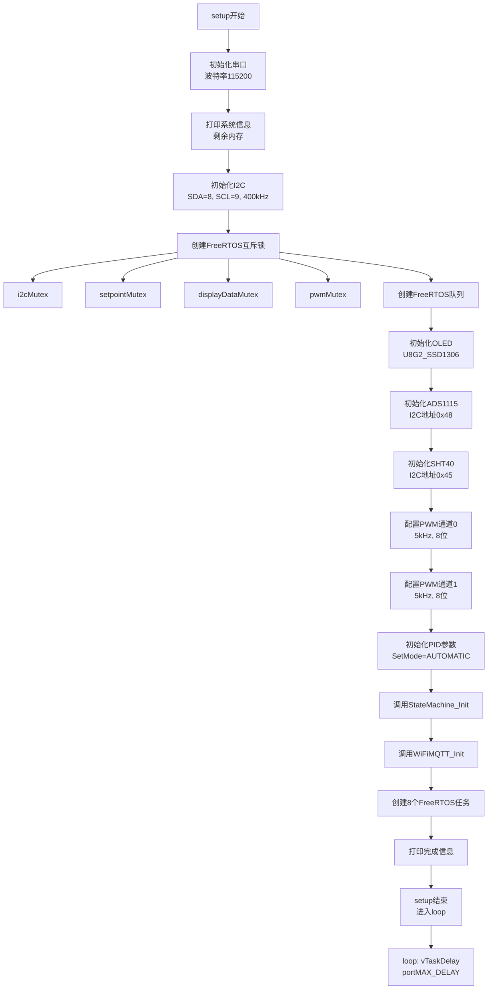

> **图3：系统初始化流程图**
> 
> 该图展示了系统初始化的详细流程，包括硬件初始化、FreeRTOS同步原语创建、传感器初始化、PID参数初始化和任务创建等步骤。初始化顺序很重要，需要保证依赖关系正确。

**初始化流程说明**：
系统初始化首先需要初始化串口，便于后续打印调试信息。然后初始化I2C总线，设置I2C时钟为400kHz以提高通信速度。接着创建FreeRTOS互斥锁和队列，这些同步原语必须在任务创建前完成。之后初始化各个传感器，包括OLED、ADS1115和SHT40，这些传感器需要I2C总线，所以要在I2C初始化后。然后初始化PID参数和模式。最后创建所有FreeRTOS任务，启动多任务调度。

**失败处理策略**：
如果OLED初始化失败，系统会打印错误信息并继续执行，因为OLED不是关键设备。如果ADS1115初始化失败，系统会打印错误信息并继续执行，因为可以禁用相关功能。如果SHT40初始化失败，系统会打印错误信息并继续执行，因为SHT40不是关键设备。

#### 4.1.4 FreeRTOS任务创建设计

```c
// 任务创建代码
xTaskCreate(sensorTask,       "SensorTask",       4096, NULL, 3, NULL);
xTaskCreate(controlTask,      "ControlTask",      4096, NULL, 2, NULL);
xTaskCreate(pwmOutputTask,    "PWMTask",          2048, NULL, 2, NULL);
xTaskCreate(encoderInputTask, "EncoderTask",      2048, NULL, 4, NULL);
xTaskCreate(uiTask,           "UITask",           4096, NULL, 1, NULL);
xTaskCreate(actuatorTask,     "ActuatorTask",     2048, NULL, 2, NULL);
xTaskCreate(stateMachineTask, "StateMachineTask", 3072, NULL, 2, NULL);
xTaskCreate(mqttTask,         "MQTTTask",         5120, NULL, 1, NULL);
```

**任务创建参数说明**：
1. **任务函数**：任务入口函数
2. **任务名称**：用于调试和监控
3. **栈大小**：
   - 传感器任务：4096字节，需要局部变量存储传感器数据
   - 控制任务：4096字节，需要PID计算缓冲区
   - PWM输出任务：2048字节，逻辑简单
   - 编码器输入任务：2048字节，逻辑简单
   - OLED UI任务：4096字节，需要字体缓冲区
   - 执行器任务：2048字节，逻辑简单
   - 状态机任务：3072字节，需要状态判断逻辑
   - MQTT任务：5120字节，需要JSON缓冲区
4. **任务参数**：NULL，不使用
5. **优先级**：
   - 编码器任务：优先级4（最高），确保用户操作实时响应
   - 传感器任务：优先级3，确保温度采集实时性
   - 控制任务：优先级2，中等优先级
   - 其他任务：优先级1或2，低优先级
6. **任务句柄**：NULL，不使用

### 4.2 传感器模块设计

#### 4.2.1 模块功能概述

传感器模块负责：
1. 通过ADS1115读取NTC热敏电阻的ADC值（冷冻室+冷藏室）
2. 通过SHT40读取环境温湿度
3. 使用Steinhart-Hart方程计算NTC温度
4. 使用EMA（指数移动平均）滤波平滑温度数据
5. 将处理后的温度数据发送至队列

**设计考虑**：
- 传感器读取需要I2C总线，需要使用互斥锁保护
- 温度数据需要滤波，避免噪声导致PID震荡
- 传感器读取失败需要有容错机制

#### 4.2.2 NTC温度计算原理

NTC热敏电阻的阻值随温度变化，关系由Steinhart-Hart方程描述：

```
1/T = 1/B × ln(R/R0) + 1/T0
```

其中：
- T：当前温度（K）
- B：NTC的B值
- R：当前阻值（Ω）
- R0：参考阻值（25°C时的阻值）
- T0：参考温度（25°C = 298.15K）

**电路设计**：
```
3.3V ── R_SERIES ── ADC ── NTC ── GND
```

ADC电压与NTC阻值的关系：
```
V_adc = 3.3 × R_ntc / (R_SERIES + R_ntc)
```

因此：
```
R_ntc = R_SERIES × V_adc / (3.3 - V_adc)
```

#### 4.2.3 NTC温度计算流程图

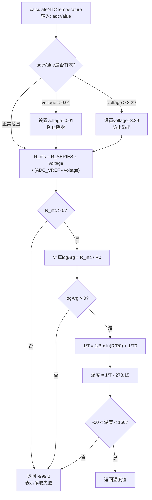

> **图4：NTC温度计算流程图**
> 
> 该图展示了NTC温度计算的详细流程，包括电压计算、防止除零、阻值计算、合法性检查、温度计算和范围检查等步骤。如果计算失败，返回-999.0表示NTC断路。

**计算流程说明**：
NTC温度计算首先将ADC值转换为电压值，如果电压接近0或3.3，会强制限制以防止除零错误。然后根据电路计算NTC阻值，接着检查阻值是否合法。如果阻值合法，使用Steinhart-Hart方程计算温度，最后检查温度是否在合理范围内。如果任何步骤失败，将返回-999.0表示NTC断路或-998.0表示温度超出范围。

**失败返回值**：
返回-999.0表示NTC断路，返回-998.0表示温度超出范围。

#### 4.2.4 EMA滤波算法设计

**算法原理**：
EMA（指数移动平均）滤波是一种简单的数字滤波算法，公式如下：

```
y[n] = α × x[n] + (1-α) × y[n-1]
```

其中：
- y[n]：当前滤波值
- x[n]：当前采样值
- α：滤波系数（0 < α < 1）
- y[n-1]：上次滤波值

**算法特点**：
- α越大，滤波效果越弱，响应速度越快
- α越小，滤波效果越强，响应速度越慢
- 响应时间约为1/α个采样周期

**代码实现**：
```c
// 指数移动平均滤波
float applyEMAFilter(float *filtered, float current, bool *firstFlag) {
    if (*firstFlag) {
        *filtered = current;      // 第一次：直接赋值
        *firstFlag = false;
    } else {
        // EMA = α × 当前值 + (1-α) × 历史值
        *filtered = EMA_ALPHA * current + (1.0 - EMA_ALPHA) * (*filtered);
    }
    return *filtered;
}
```

**参数选择**：
- `EMA_ALPHA = 0.2`：表示当前值权重20%，历史值权重80%
- 优点：平滑噪声，响应速度可调
- 缺点：有滞后性

**响应时间计算**：
- 采样周期：100ms
- 响应时间：1/0.2 × 100ms = 500ms
- 如果需要更快响应，可以增大EMA_ALPHA

#### 4.2.5 传感器任务流程设计

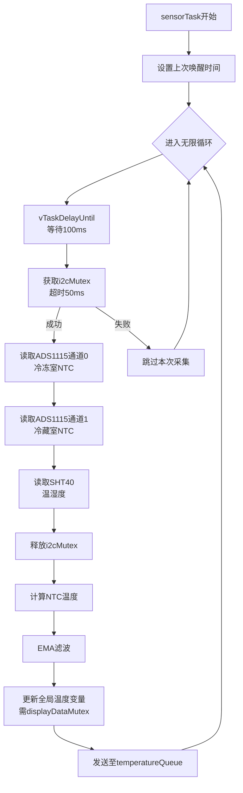

> **图5：传感器任务流程图**
> 
> 该图展示了传感器任务的详细流程，包括周期延时、I2C互斥锁获取、传感器读取、温度计算、滤波处理、数据更新和队列发送等步骤。

**任务流程说明**：
传感器任务首先使用vTaskDelayUntil实现精确周期延时。然后获取I2C互斥锁以保护I2C总线，防止多个任务同时访问。接着读取ADS1115和SHT40传感器数据，并将ADC值转换为温度值。然后使用EMA滤波平滑温度数据，更新全局变量（需要使用displayDataMutex保护），最后将温度数据发送到队列以触发控制任务。

**失败处理策略**：
如果获取i2cMutex失败（超时），系统会跳过本次采集。如果NTC读取失败（返回-999），系统不会更新温度值。如果SHT40读取失败，系统不会更新温湿度值。

### 4.3 PID控制模块设计

#### 4.3.1 模块功能概述

PID控制模块实现双区温度控制：
1. **冷冻室PID**：控制压缩机PWM输出
2. **冷藏室PID**：控制风扇PWM输出
3. 使用Arduino PID库，配置为REVERSE方向（输出增加→温度降低）

**设计考虑**：
- 制冷系统必须使用REVERSE方向
- PID参数需要根据系统特性调整
- PID计算需要周期性执行

#### 4.3.2 PID控制原理

**PID控制算法**：
PID控制器是一种线性控制器，根据给定值与实际输出值构成控制偏差：

```
e(t) = setpoint(t) - input(t)
```

PID控制规律为：

```
u(t) = Kp × e(t) + Ki × ∫e(t)dt + Kd × de(t)/dt
```

其中：
- u(t)：控制器输出
- e(t)：控制偏差
- Kp：比例系数
- Ki：积分系数
- Kd：微分系数

**离散化PID算法**：
在数字系统中，需要对PID算法进行离散化：

```
u[k] = Kp × e[k] + Ki × T_s × Σe[i] + Kd × (e[k] - e[k-1]) / T_s
```

其中：
- u[k]：第k次采样时的控制器输出
- e[k]：第k次采样时的控制偏差
- T_s：采样周期

**增量式PID算法**：
为了避免积分饱和，可以使用增量式PID算法：

```
Δu[k] = Kp × (e[k] - e[k-1]) + Ki × T_s × e[k] + Kd × (e[k] - 2e[k-1] + e[k-2]) / T_s
u[k] = u[k-1] + Δu[k]
```

Arduino PID库使用的是位置式PID算法，但可以通过设置输出限制来避免积分饱和。

#### 4.3.3 PID方向选择

**制冷系统必须使用REVERSE方向**：

```
常规系统：输出↑ → 过程变量↑
制冷系统：输出↑（压缩机功率↑）→ 温度↓
```

Arduino PID库的方向定义：
- `DIRECT`：输出增加 → 输入增加
- `REVERSE`：输出增加 → 输入减少

**代码示例**：
```c
// 制冷需要 REVERSE
PID myPID_freezer(&Input_freezer, &Output_freezer, &Setpoint_freezer,
                  Kp_freezer, Ki_freezer, Kd_freezer, REVERSE);
```

**方向验证**：
```
Setpoint（设定温度）= -18.0°C
Input（当前温度）= -16.0°C
Error = Setpoint - Input = -2.0°C

REVERSE模式：
  Error > 0 → 输出需要增加 → 压缩机功率增加 → 温度下降
```

#### 4.3.4 PID参数设计

**表2：PID参数配置表**

| 参数 | 冷冻室 | 冷藏室 | 说明 |
|------|--------|--------|------|
| Kp | 2.0 | 1.0 | 比例系数：当前误差的影响 |
| Ki | 5.0 | 0.5 | 积分系数：累积误差的影响 |
| Kd | 1.0 | 0.1 | 微分系数：误差变化率的影响 |
| 采样时间 | 100ms | 100ms | 比默认1000ms快10倍 |
| 输出限制 | 0-255 | 0-255 | 8位PWM范围 |
| 方向 | REVERSE | REVERSE | 制冷系统专用 |

**参数选择依据**：
1. **Kp选择**：
   - Kp越大，响应速度越快，但可能导致超调
   - 冷冻室热惯性大，Kp可以稍大
   - 冷藏室热惯性小，Kp应该稍小

2. **Ki选择**：
   - Ki越大，消除稳态误差的速度越快，但可能导致积分饱和
   - 冷冻室需要消除稳态误差，Ki可以稍大
   - 冷藏室对稳态误差要求不高，Ki可以稍小

3. **Kd选择**：
   - Kd可以预测误差变化趋势，提前抑制超调
   - 但Kd对噪声敏感，不宜过大
   - 冷冻室需要抑制超调，Kd可以稍大
   - 冷藏室对超调要求不高，Kd可以稍小

4. **采样时间选择**：
   - 采样时间越短，控制效果越好，但计算负担越大
   - 温度系统响应慢，100ms采样周期足够
   - 比分默认1000ms快10倍，可以提高控制精度

#### 4.3.5 PID控制任务流程设计

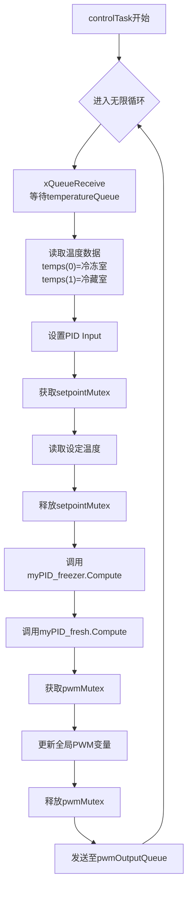

> **图6：PID控制任务流程图**
> 
> 该图展示了PID控制任务的详细流程，包括队列接收、输入设置、设定值读取、PID计算、输出更新和队列发送等步骤。PID计算使用队列接收触发，有温度数据时才进行计算。

**任务流程说明**：
PID控制任务首先阻塞等待温度数据，有数据时才进行计算。然后将温度数据设置为PID输入，读取设定温度（需要使用setpointMutex保护）。接着调用Arduino PID库的Compute函数进行PID计算。之后更新全局PWM变量（需要使用pwmMutex保护），最后将PWM值发送到队列以触发PWM输出任务。

**PID计算触发方式**：
系统使用队列接收触发方式，有温度数据时才进行计算。这种方式避免使用定时器触发，可以节省CPU资源，同时确保PID计算频率与温度采集频率一致。

#### 4.3.6 PID输出与执行器控制逻辑设计

**滞环控制策略**：
为了避免压缩机频繁启停，需要使用滞环控制：

```c
// PID输出到执行器的映射逻辑
if (Output_freezer > 30.0 && !Actuator_IsCompressorOn()) {
    Actuator_SetCompressor(COMPRESSOR_ON);
} else if (Output_freezer < 10.0 && Actuator_IsCompressorOn()) {
    Actuator_SetCompressor(COMPRESSOR_OFF);
}
```

**滞环参数设计**：
- 开启阈值：30（约12% PWM）→ 防止频繁启停
- 关闭阈值：10（约4% PWM）→ 滞环控制
- 滞环宽度：20 → 避免临界点震荡

**滞环控制原理**：

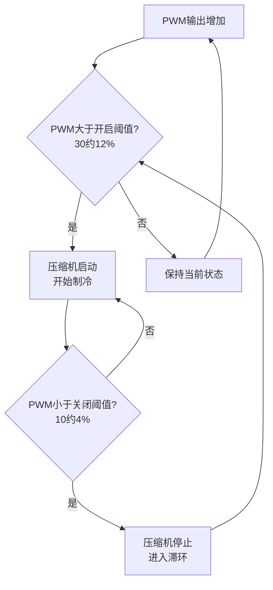

> **图7：滞环控制原理图**
> 
> 该图展示了压缩机的滞环控制原理。当PWM输出大于开启阈值（30，约12%）时，压缩机启动开始制冷；当PWM输出小于关闭阈值（10，约4%）时，压缩机停止进入滞环区间。在开启阈值和关闭阈值之间，压缩机状态保持不变，避免了频繁启停。

- 当PWM输出 > 开启阈值时，启动压缩机
- 当PWM输出 < 关闭阈值时，停止压缩机
- 在开启阈值和关闭阈值之间，压缩机状态保持不变

**参数选择依据**：
- 滞环宽度太小：压缩机频繁启停
- 滞环宽度太大：温度控制精度降低
- 选择20（约8% PWM）：平衡启停频率和控制精度

### 4.4 状态机模块设计

#### 4.4.1 模块功能概述

状态机模块管理系统四种工作模式：
1. **制冷模式**：正常PID控制
2. **除霜模式**：定时除霜，防止蒸发器结霜
3. **节能模式**：门关闭超过5分钟，提高设定温度
4. **故障模式**：传感器故障，安全停机

**设计考虑**：
- 模式切换需要明确的切换条件
- 模式切换需要滞环，避免频繁切换
- 故障模式优先级最高，任何时候都可以进入故障模式

#### 4.4.2 状态转换设计

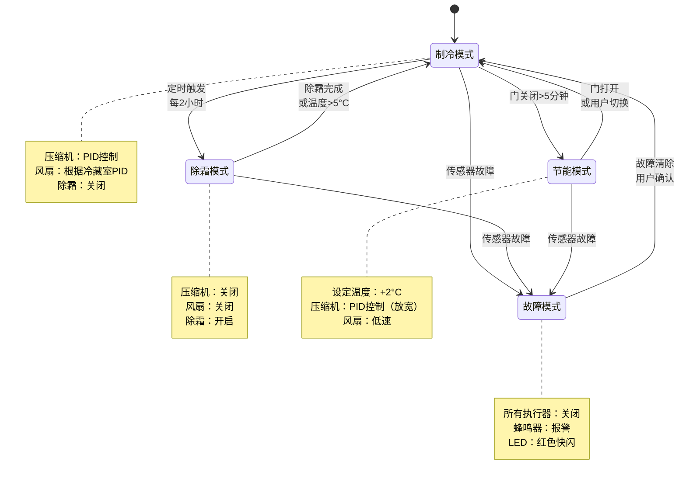

> **图8：系统状态转换图**
> 
> 该图展示了系统四种工作模式之间的转换关系，包括制冷模式、除霜模式、节能模式和故障模式。每种模式都有明确的触发条件和设计理由。

**状态转换说明**：
制冷模式会在每2小时自动转换为除霜模式，因为蒸发器会结霜影响制冷效果，需要定期除霜。当门关闭超过5分钟时，制冷模式会转换为节能模式，因为门关闭时冷量损失小，可以提高设定温度以节能。当传感器故障时，任意模式都会转换为故障模式，因为传感器故障时无法保证控制安全性，需要停机保护。除霜模式会在除霜完成（温度 > 5°C）或除霜时间超过30分钟时转换为制冷模式，因为除霜完成后需要恢复制冷。当门打开或用户手动切换时，节能模式会转换为制冷模式，因为门打开时冷量损失大，需要恢复正常工作模式。当故障清除且用户确认时，故障模式会转换为制冷模式，因为故障清除后需要手动恢复，避免自动恢复导致危险。

#### 4.4.3 状态机任务流程设计

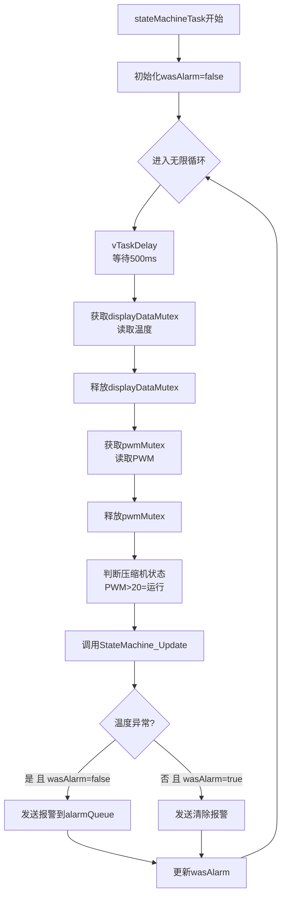

> **图9：状态机任务流程图**
> 
> 该图展示了状态机任务的详细流程，包括周期延时、温度读取、PWM读取、状态机更新和报警检查等步骤。状态机任务每500ms执行一次，检查模式切换条件。

**任务流程说明**：
状态机任务首先进行周期延时，以500ms为周期检查模式切换条件。然后读取当前温度，这需要使用displayDataMutex保护。接着读取PWM值以判断压缩机状态。之后调用StateMachine_Update函数来判断是否需要切换模式。最后检查温度是否异常，如果异常则发送报警。

**模式切换检查频率**：
系统以500ms为周期检查一次模式切换条件，这样可以在实时性和CPU负担之间取得平衡。由于模式切换条件通常需要持续一段时间，500ms的检查周期已经足够。

#### 4.4.4 核心函数接口设计

```c
// 初始化状态机
// 功能：初始化系统状态，设置为制冷模式
// 参数：无
// 返回：无
void StateMachine_Init();

// 更新状态机（在主循环中定期调用）
// 功能：检查模式切换条件，根据需要切换模式
// 参数：
//   freezerTemp - 冷冻室温度
//   freshTemp - 冷藏室温度
//   doorOpen - 门是否打开
// 返回：无
void StateMachine_Update(float freezerTemp, float freshTemp, bool doorOpen);

// 获取当前模式
// 功能：返回当前工作模式
// 参数：无
// 返回：当前模式（SystemMode枚举）
SystemMode StateMachine_GetMode();

// 获取模式名称字符串
// 功能：返回模式名称字符串，用于显示
// 参数：mode - 模式枚举值
// 返回：模式名称字符串
const char* StateMachine_GetModeName(SystemMode mode);

// 设置系统模式（手动切换）
// 功能：手动切换系统模式
// 参数：mode - 目标模式
// 返回：无
void StateMachine_SetMode(SystemMode mode);

// 设置目标温度
// 功能：设置冷冻室目标温度
// 参数：temp - 目标温度
// 返回：无
void StateMachine_SetTargetTemp(float temp);

// 清除故障
// 功能：清除当前故障，切换到制冷模式
// 参数：无
// 返回：无
void StateMachine_ClearError();

// 获取系统状态结构体
// 功能：返回系统状态结构体指针，便于访问状态数据
// 参数：无
// 返回：系统状态结构体指针
SystemState* StateMachine_GetState();
```

**接口设计说明**：
1. **初始化函数**：StateMachine_Init，在系统启动时调用
2. **更新函数**：StateMachine_Update，需要周期性调用
3. **获取函数**：StateMachine_GetMode、StateMachine_GetModeName，用于查询状态
4. **设置函数**：StateMachine_SetMode、StateMachine_SetTargetTemp，用于手动控制
5. **清除函数**：StateMachine_ClearError，用于故障恢复

### 4.5 执行器模块设计

#### 4.5.1 模块功能概述

执行器模块封装所有执行器的控制接口：
1. 压缩机继电器控制
2. 除霜加热丝控制
3. PWM风扇控制
4. 蜂鸣器报警控制
5. LED状态指示控制（运行、待机、故障、压缩机）

**设计考虑**：
- 执行器控制需要保护，避免频繁切换
- LED控制需要支持闪烁模式
- 蜂鸣器控制需要支持报警模式

#### 4.5.2 执行器状态更新机制设计

**LED闪烁控制**：
LED闪烁需要使用定时器或任务周期性翻转LED状态。本设计使用任务周期性检查LED状态，根据需要翻转LED。

```c
// LED闪烁更新（在actuatorTask中每200ms调用）
void Actuator_UpdateLEDs() {
    unsigned long now = millis();
    
    // 运行指示灯（绿）：常亮
    digitalWrite(LED_RUN_PIN, (currentMode == MODE_COOLING) ? HIGH : LOW);
    
    // 待机指示灯（黄）：节能模式常亮
    digitalWrite(LED_STANDBY_PIN, (currentMode == MODE_ECO) ? HIGH : LOW);
    
    // 故障指示灯（红）：故障模式快闪
    if (currentMode == MODE_ERROR) {
        digitalWrite(LED_FAULT_PIN, (now / 200) % 2);
    } else {
        digitalWrite(LED_FAULT_PIN, LOW);
    }
    
    // 压缩机状态灯（蓝）：压缩机运行时慢闪
    if (compressorOn) {
        digitalWrite(LED_COMP_PIN, (now / 500) % 2);
    } else {
        digitalWrite(LED_COMP_PIN, LOW);
    }
}
```

**LED闪烁设计说明**：
1. **运行指示灯（绿）**：
   - 常亮：表示系统正常运行
   - 设计理由：用户需要明确知道系统是否正常运行

2. **待机指示灯（黄）**：
   - 常亮：表示系统处于节能模式
   - 设计理由：用户需要明确知道系统是否处于节能模式

3. **故障指示灯（红）**：
   - 快闪（200ms周期）：表示系统故障
   - 设计理由：红色和快闪能够吸引用户注意

4. **压缩机状态灯（蓝）**：
   - 慢闪（500ms周期）：表示压缩机正在运行
   - 设计理由：用户需要明确知道压缩机是否在运行

**蜂鸣器报警控制**：
蜂鸣器需要支持报警模式，即周期性鸣响。

```c
// 蜂鸣器报警
void Actuator_Beep(unsigned int durationMs) {
    digitalWrite(BUZZER_PIN, HIGH);
    vTaskDelay(pdMS_TO_TICKS(durationMs));
    digitalWrite(BUZZER_PIN, LOW);
}
```

#### 4.5.3 执行器任务流程设计

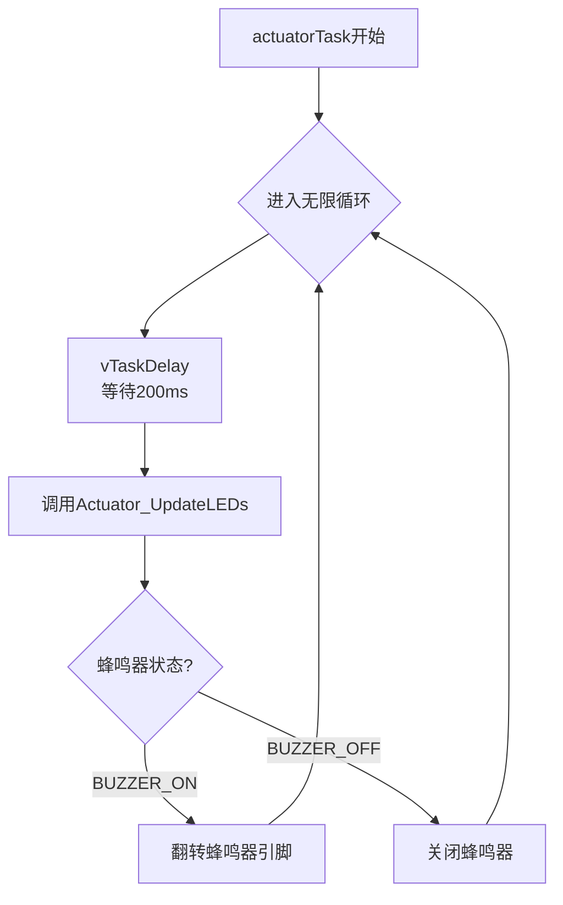

> **图10：执行器任务流程图**
> 
> 该图展示了执行器任务的详细流程，包括周期延时、LED更新和蜂鸣器更新等步骤。执行器任务每200ms执行一次，更新LED状态和蜂鸣器状态。

**任务流程说明**：
执行器任务首先进行周期延时，以200ms为周期更新LED状态。然后调用Actuator_UpdateLEDs函数更新所有LED状态。接着检查蜂鸣器状态，如果蜂鸣器处于开启状态，翻转蜂鸣器引脚以产生鸣响。

**LED更新频率**：
系统以200ms为周期更新LED状态，这样可以在LED闪烁效果和CPU负担之间取得平衡。由于故障指示灯快闪周期为200ms，所以需要每200ms更新一次。压缩机状态灯慢闪周期为500ms，所以200ms更新一次已经足够。

#### 4.5.4 压缩机保护逻辑设计

**压缩机保护需求**：
压缩机是冰箱的核心部件，频繁启停会缩短压缩机寿命。需要：
1. 最小停机时间：3分钟，防止频繁启动
2. 最小运行时间：5分钟，防止频繁停止

**保护逻辑实现**：
```c
// 压缩机最小停机时间：3分钟
// 防止频繁启停损坏压缩机
if (compressorOn && !wasCompressorOn) {
    compressorStartTime = millis();
    if (millis() - compressorStopTime < MIN_COMPRESSOR_OFF_TIME) {
        // 停机时间不足，延迟启动
        return;
    }
}

// 压缩机最小运行时间：5分钟
if (!compressorOn && wasCompressorOn) {
    compressorStopTime = millis();
    if (millis() - compressorStartTime < MIN_COMPRESSOR_ON_TIME) {
        // 运行时间不足，延迟停止
        return;
    }
}
```

**保护逻辑说明**：
1. **最小停机时间**：
   - 压缩机关闭后，需要等待3分钟才能再次启动
   - 设计理由：压缩机停机后，高低压需要平衡，立即启动会导致启动电流过大

2. **最小运行时间**：
   - 压缩机启动后，需要运行至少5分钟才能停止
   - 设计理由：压缩机频繁启停会缩短寿命

**参数选择依据**：
- 最小停机时间：3分钟，常见冰箱压缩机的停机平衡时间
- 最小运行时间：5分钟，确保制冷效果

### 4.6 OLED UI模块设计

#### 4.6.1 模块功能概述

OLED UI模块实现5页界面显示和编码器交互：
1. **主页面**：大字体显示冷冻室温度
2. **传感器页面**：显示所有传感器数据
3. **PID页面**：显示PID参数和PWM输出
4. **菜单页面**：设置选项
5. **编辑页面**：修改设定温度

**设计考虑**：
- OLED显示需要使用互斥锁保护I2C总线
- 界面切换需要明确的逻辑
- 编码器事件需要明确的处理逻辑

#### 4.6.2 OLED界面切换流程设计

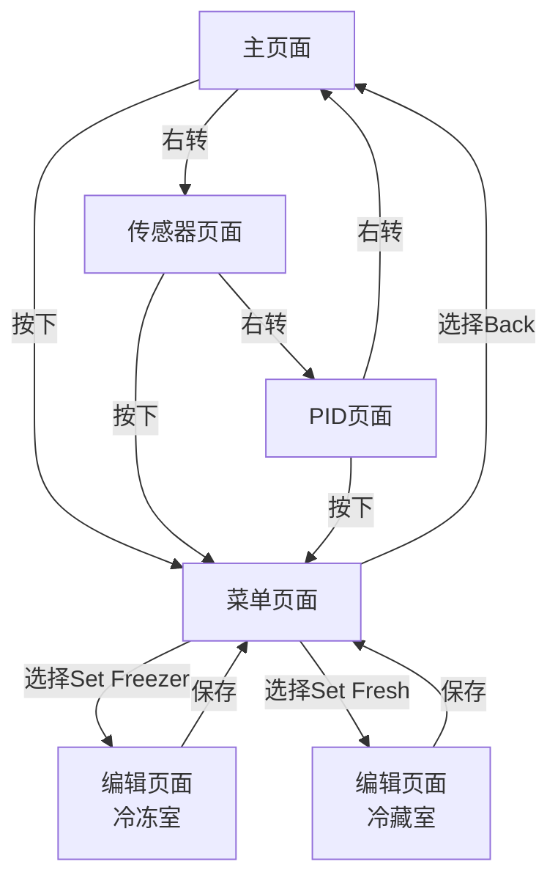

> **图11：OLED界面切换流程图**
> 
> 该图展示了OLED界面的切换流程，包括主页面、传感器页面、PID页面、菜单页面和编辑页面之间的切换关系。

**界面切换设计说明**：
主页面、传感器页面和PID页面之间通过编码器旋转进行切换，这样设计是为了让用户能够快速查看不同信息。菜单页面从主页面、传感器页面、PID页面按下编码器进入，统一入口便于用户记忆。编辑页面从菜单页面选择设置项进入，这样设计是为了避免误操作。

#### 4.6.3 编码器事件处理流程设计

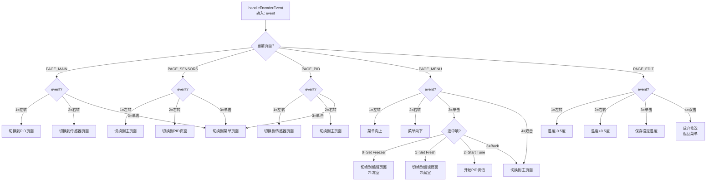

> **图12：编码器事件处理流程图**
> 
> 该图展示了编码器事件的处理流程，包括不同页面下左转、右转、单击和双击事件的处理逻辑。

**编码器事件处理说明**：
编码器事件处理首先定义了事件类型，包括1=左转（向上/减少/上一页）、2=右转（向下/增加/下一页）、3=单击（确认/进入）和4=双击（返回/取消）。然后针对不同页面设计了不同的处理逻辑，在主页面、传感器页面和PID页面中，旋转用于切换页面，单击用于进入菜单。在菜单页面中，旋转用于选择，单击用于确认，双击用于返回。在编辑页面中，旋转用于调整数值，单击用于保存，双击用于放弃修改。整个设计保持了一致性，旋转用于切换/调整，单击用于确认/进入，双击用于返回/取消。

#### 4.6.4 OLED显示内容设计

**主页面布局（128x64）**：
```
┌─────────────────────────┐
│  Fridge PID Control     │  ← 行1: 标题（8px字体）
│                        │
│       -18.5 °C         │  ← 行2-3: 大字体温度（20px）
│                        │
│  Fresh:  4.2 °C        │  ← 行4: 冷藏室温度（14px）
│                        │
│        1/3  Turn  →    │  ← 行5: 页面提示（微小字体）
└─────────────────────────┘
```

> **图13：主页面布局图**
> 
> 该图展示了OLED主页面（PAGE_MAIN）的显示布局。冷冻室温度是核心信息，使用大字体显示；冷藏室温度使用中等字体显示；页面提示使用微小字体，不干扰主要信息。

**传感器页面布局**：
```
┌─────────────────────────┐
│  Sensors Info           │
│                        │
│  SHT: 25.0C  60%      │  ← SHT40数据
│  Freezer: -18.5C       │  ← 冷冻室温度
│  Fresh:  4.2C          │  ← 冷藏室温度
│                        │
│        2/3  Turn  →    │
└─────────────────────────┘
```

> **图14：传感器页面布局图**
> 
> 该图展示了OLED传感器页面（PAGE_SENSORS）的显示布局。该页面显示所有传感器数据，包括SHT40温湿度、冷冻室温度和冷藏室温度，便于调试和监控。

**PID页面布局**：
```
┌─────────────────────────┐
│  PID Parameters         │
│                        │
│  Kp:2.0  Ki:5.0        │  ← PID参数
│  Kd:1.0                │
│  PWM: 45%              │  ← PWM输出
│  COOLING               │  ← 当前模式
│              3/3       │
└─────────────────────────┘
```

> **图15：PID页面布局图**
> 
> 该图展示了OLED PID页面（PAGE_PID）的显示布局。该页面显示PID参数、PWM输出和当前工作模式，便于调试和观察PID控制效果。

**菜单页面布局**：
```
┌─────────────────────────┐
│  Settings               │
│─────────────────────────│
│  > Freezer: -18.0C     │  ← 选中项用">"标记
│    Fresh: 4.0C         │
│    Start Tune           │
│    Back                 │
└─────────────────────────┘
```

> **图16：菜单页面布局图**
> 
> 该图展示了OLED菜单页面（PAGE_MENU）的显示布局。选中项用">"标记，明确当前选中项；同时显示当前设定值，便于用户确认。

**编辑页面布局**：
```
┌─────────────────────────┐
│  Set Freezer Temp       │
│─────────────────────────│
│                        │
│      [  -18.0  ]        │  ← 编辑框
│                        │
│  Turn: +/- 0.5C        │
│  Click:Save  Double:Back│
└─────────────────────────┘
```

> **图17：编辑页面布局图**
> 
> 该图展示了OLED编辑页面（PAGE_EDIT）的显示布局。编辑框明确显示当前设定值，底部提供操作提示，便于用户修改设定温度。

### 4.7 WiFi/MQTT通信模块设计

#### 4.7.1 模块功能概述

WiFi/MQTT模块负责：
1. WiFi连接管理和自动重连
2. MQTT连接管理和自动重连
3. 定时发布系统状态到MQTT主题
4. 接收MQTT控制指令
5. 报警信息推送

**设计考虑**：
- WiFi和MQTT连接可能断开，需要自动重连
- 状态发布需要周期性执行
- 控制指令需要解析和执行

#### 4.7.2 MQTT主题设计

**表3：MQTT主题设计表**

| 主题 | 方向 | 功能 | 数据格式 |
|------|------|------|----------|
| `fridge/status` | ESP32→手机 | 状态上报 | JSON |
| `fridge/alarm` | ESP32→手机 | 异常报警 | 纯文本 |
| `fridge/control` | 手机→ESP32 | 控制指令 | JSON |

**主题设计说明**：
1. **fridge/status**：
   - 功能：定时上报系统状态
   - 周期：5秒
   - 数据：JSON格式，包含温度、设定值、执行器状态、模式等

2. **fridge/alarm**：
   - 功能：推送报警信息
   - 触发条件：温度异常、传感器故障、门未关闭等
   - 数据：纯文本，便于显示

3. **fridge/control**：
   - 功能：接收控制指令
   - 指令：设置设定温度、设置模式、启动除霜等
   - 数据：JSON格式，便于解析

#### 4.7.3 状态上报JSON格式设计

```json
{
    "freezer_temp": -18.5,
    "fresh_temp": 4.2,
    "freezer_setpoint": -18.0,
    "fresh_setpoint": 4.0,
    "sht40_temp": 25.0,
    "sht40_humidity": 60.0,
    "compressor": true,
    "fan_pwm": 128,
    "defrost": false,
    "mode": "COOLING",
    "pid_output": 45.2,
    "uptime": 12345
}
```

**JSON格式设计说明**：
1. **温度数据**：
   - `freezer_temp`：冷冻室温度
   - `fresh_temp`：冷藏室温度
   - `freezer_setpoint`：冷冻室设定温度
   - `fresh_setpoint`：冷藏室设定温度

2. **传感器数据**：
   - `sht40_temp`：SHT40温度
   - `sht40_humidity`：SHT40湿度

3. **执行器状态**：
   - `compressor`：压缩机是否运行
   - `fan_pwm`：风扇PWM值
   - `defrost`：除霜是否开启

4. **系统状态**：
   - `mode`：当前模式
   - `pid_output`：PID输出
   - `uptime`：系统运行时间

#### 4.7.4 控制指令JSON格式设计

```json
{
    "command": "set_setpoint",
    "zone": "freezer",
    "value": -18.0
}
```

或

```json
{
    "command": "set_mode",
    "mode": "COOLING"
}
```

**指令格式设计说明**：
1. **command字段**：指定指令类型
   - `set_setpoint`：设置设定温度
   - `set_mode`：设置工作模式
   - `set_pid`：设置PID参数
   - `start_defrost`：启动除霜
   - `clear_error`：清除故障

2. **参数字段**：根据指令类型不同，参数不同
   - `set_setpoint`：需要`zone`和`value`参数
   - `set_mode`：需要`mode`参数

#### 4.7.5 MQTT通信时序设计

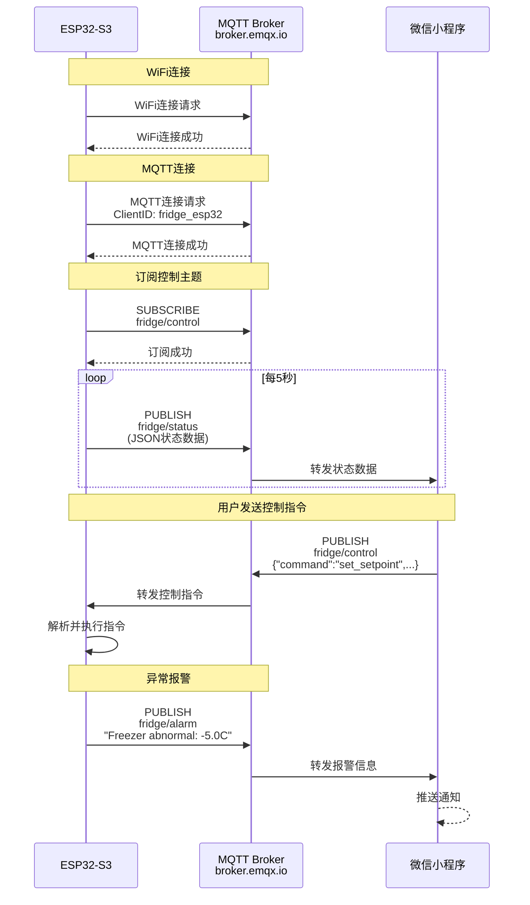

> **图18：MQTT通信时序图**
> 
> 该图展示了ESP32与MQTT Broker、微信小程序之间的通信时序，包括连接建立、状态上报、控制指令和异常报警等过程。

**时序说明**：
通信过程首先建立连接，包括ESP32连接到WiFi、ESP32连接到MQTT Broker、ESP32订阅控制主题。然后进入状态上报阶段，ESP32每5秒发布状态到`fridge/status`主题，MQTT Broker转发状态数据到微信小程序。当用户在微信小程序发送控制指令时，微信小程序发布指令到`fridge/control`主题，MQTT Broker转发指令到ESP32，ESP32解析并执行指令。当ESP32检测到异常时，会发布报警到`fridge/alarm`主题，MQTT Broker转发报警信息到微信小程序，微信小程序推送通知给用户。

### 4.8 Web服务器模块设计

#### 4.8.1 模块功能概述

Web服务器模块提供HTTP API接口和网页控制界面：
1. 获取系统状态API
2. 设置温度API
3. 设置模式API
4. 设置PID参数API
5. 获取温度历史API
6. 网页控制界面（HTML+Chart.js）

**设计考虑**：
- Web服务器需要提供RESTful API
- 网页界面需要响应式设计
- 温度曲线图需要实时更新

#### 4.8.2 API接口详细设计

**表4：HTTP API接口设计表**

| 接口 | 方法 | 功能 | 请求参数 | 返回格式 |
|------|------|------|----------|----------|
| `/api/status` | GET | 获取系统状态 | 无 | JSON |
| `/api/setpoint` | POST | 设置设定温度 | `{"zone":"freezer","value":-18.0}` | JSON |
| `/api/mode` | POST | 设置工作模式 | `{"mode":"COOLING"}` | JSON |
| `/api/pid` | POST | 设置PID参数 | `{"kp":2.0,"ki":5.0,"kd":1.0}` | JSON |
| `/api/history` | GET | 获取温度历史 | 无 | JSON |
| `/` | GET | 网页控制界面 | 无 | HTML |

**API设计说明**：
1. **RESTful设计**：
   - 使用HTTP方法表示操作类型（GET=查询，POST=修改）
   - 使用URL路径表示资源（`/api/status`表示系统状态资源）

2. **JSON格式**：
   - 请求和响应都使用JSON格式
   - 便于解析和生成

3. **错误处理**：
   - 如果请求参数错误，返回400 Bad Request
   - 如果内部错误，返回500 Internal Server Error

#### 4.8.3 Web界面功能设计

```
┌─────────────────────────────────────────┐
│  冰箱PID控制系统 - 网页控制              │
├─────────────────────────────────────────┤
│  【实时状态】                           │
│  冷冻室温度: -18.5°C   设定: -18.0°C   │
│  冷藏室温度:   4.2°C   设定:   4.0°C   │
│  压缩机: 运行    PWM: 45%               │
│  工作模式: 制冷模式                      │
├─────────────────────────────────────────┤
│  【温度设置】                           │
│  冷冻室: [  -18.0  ] [应用]            │
│  冷藏室: [    4.0   ] [应用]            │
├─────────────────────────────────────────┤
│  【模式切换】                           │
│  [制冷模式] [除霜模式] [节能模式] [故障] │
├─────────────────────────────────────────┤
│  【PID参数设置】                        │
│  Kp: [ 2.0 ]  Ki: [ 5.0 ]  Kd: [ 1.0 ]│
│            [应用PID参数]                │
├─────────────────────────────────────────┤
│  【温度曲线图】                         │
│  ┌─────────────────────────────────┐   │
│  │         Plotly.js 交互曲线       │   │
│  │    （显示最近60个温度点）        │   │
│  └─────────────────────────────────┘   │
└─────────────────────────────────────────┘
```

> **图19：Web界面功能设计布局图**
> 
> 该图展示了Web网页控制界面的功能布局。界面包含实时状态区域、温度设置区域、模式切换区域、PID参数设置区域和温度曲线图区域。实时状态区域显示当前温度、设定温度、执行器状态和工作模式，便于用户快速了解系统状态。温度设置区域提供输入框和按钮，输入验证范围为-30°C到10°C。模式切换区域提供按钮，当前模式高亮显示。PID参数设置区域提供输入框和按钮，输入验证为Kp>0、Ki≥0、Kd≥0。温度曲线图区域使用Plotly.js绘制交互曲线，显示最近60个温度点，便于用户观察温度趋势。

---

## 五、FreeRTOS任务设计

### 5.1 设计原则

FreeRTOS任务设计遵循以下原则：
1. **优先级分配**：高优先级任务优先执行，确保实时性
2. **栈大小分配**：根据任务需求分配栈大小，避免栈溢出
3. **任务间通信**：使用队列和互斥锁进行任务间通信，避免使用全局变量
4. **任务周期性**：根据任务需求设置周期或事件触发

### 5.2 任务划分详表

**表5：FreeRTOS任务划分详表**

| 任务名称 | 优先级 | 栈大小 | 周期/触发方式 | 功能描述 |
|---------|--------|--------|--------------|----------|
| `sensorTask` | 3 | 4096 | 100ms周期 | 读取ADS1115和SHT40，温度滤波，发送至队列 |
| `controlTask` | 2 | 4096 | 事件触发（队列） | 接收温度数据，PID计算，发送PWM值到队列 |
| `pwmOutputTask` | 2 | 2048 | 事件触发（队列） | 接收PWM值，更新LED PWM通道 |
| `encoderInputTask` | 4 | 2048 | 5ms轮询 | 检测编码器旋转和按键，发送事件到队列 |
| `uiTask` | 1 | 4096 | 100ms刷新 | 接收编码器事件，更新OLED显示 |
| `actuatorTask` | 2 | 2048 | 200ms周期 | 更新LED闪烁状态，蜂鸣器翻转 |
| `stateMachineTask` | 2 | 3072 | 500ms周期 | 检查模式切换条件，更新系统模式 |
| `mqttTask` | 1 | 5120 | 5s发布周期 | MQTT连接管理，状态发布，报警发送 |

**优先级设计说明**：
- 优先级数字越大，优先级越高
- 编码器任务优先级最高（4），确保用户操作实时响应
- 传感器任务优先级次高（3），确保温度采集实时性
- UI任务优先级最低（1），不影响控制逻辑

**栈大小设计说明**：
- 根据任务需求分配栈大小
- 传感器任务需要局部变量存储传感器数据，栈大小4096
- MQTT任务需要JSON缓冲区，栈大小5120
- 其他任务栈大小根据需求分配

### 5.3 任务间通信设计

#### 5.3.1 互斥锁（Mutex）设计

**设计背景**：
FreeRTOS提供互斥锁（Mutex）用于保护共享资源，避免多个任务同时访问共享资源导致数据不一致。

**表6：FreeRTOS互斥锁设计表**

| 互斥锁名称 | 保护资源 | 使用场景 |
|-----------|---------|---------|
| `i2cMutex` | I2C总线 | OLED显示、ADS1115读取、SHT40读取 |
| `setpointMutex` | 设定温度全局变量 | 编码器修改、PID读取、MQTT修改 |
| `displayDataMutex` | 温度显示数据 | 传感器任务写入、UI任务读取、MQTT读取 |
| `pwmMutex` | PWM输出值 | 控制任务写入、执行器任务读取、MQTT读取 |

**互斥锁使用规范**：
```c
// 正确用法：获取→操作→释放
if (xSemaphoreTake(displayDataMutex, pdMS_TO_TICKS(10)) == pdTRUE) {
    g_freezerTemp = g_filteredFreezerTemp;
    g_freshTemp = g_filteredFreshTemp;
    xSemaphoreGive(displayDataMutex);
}

// 错误用法：获取后不释放（会导致死锁）
if (xSemaphoreTake(displayDataMutex, portMAX_DELAY)) {
    // 忘记 xSemaphoreGive！
}
```

**互斥锁设计说明**：
`i2cMutex`保护I2C总线，因为多个任务（OLED显示、ADS1115读取、SHT40读取）可能同时访问I2C，使用互斥锁可以避免总线冲突。`setpointMutex`保护设定温度全局变量，`displayDataMutex`保护温度显示数据，`pwmMutex`保护PWM输出值，这些全局变量都可能被多个任务同时读写，使用互斥锁可以避免数据不一致。

#### 5.3.2 队列（Queue）设计

**设计背景**：
FreeRTOS提供队列（Queue）用于任务间数据传递，避免多个任务同时访问共享资源。

**表7：FreeRTOS队列设计表**

| 队列名称 | 元素类型 | 队列长度 | 发送任务 | 接收任务 | 功能 |
|---------|---------|---------|---------|---------|------|
| `temperatureQueue` | `float[2]` | 5 | sensorTask | controlTask | 传递温度数据 |
| `pwmOutputQueue` | `uint8_t[2]` | 5 | controlTask | pwmOutputTask | 传递PWM值 |
| `uiEventQueue` | `int` | 10 | encoderInputTask | uiTask | 传递编码器事件 |
| `alarmQueue` | `char[64]` | 5 | stateMachineTask | mqttTask | 传递报警信息 |

**队列使用规范**：
```c
// 发送（非阻塞）
float temps[2] = {g_filteredFreezerTemp, g_filteredFreshTemp};
xQueueSend(temperatureQueue, temps, 0);  // 队列满则丢弃

// 接收（阻塞）
float temps[2];
if (xQueueReceive(temperatureQueue, temps, portMAX_DELAY) == pdPASS) {
    // 处理温度数据
}
```

**队列设计说明**：
系统共设计了四个队列用于任务间数据传递。`temperatureQueue`由传感器任务发送温度数据、控制任务接收，队列长度5足够缓冲。`pwmOutputQueue`由控制任务发送PWM值、PWM输出任务接收，队列长度5足够缓冲。`uiEventQueue`由编码器输入任务发送编码器事件、UI任务接收，队列长度10足够缓冲。`alarmQueue`由状态机任务发送报警信息、MQTT任务接收，队列长度5足够缓冲。

### 5.4 任务调度时序设计

```mermaid
gantt
    title FreeRTOS任务调度时序（时间单位：ms）
    dateFormat X
    axisFormat %L
    
    section 高优先级(4)
    encoderInputTask :crit, 0, 5
    
    section 中优先级(3)
    sensorTask :active, 0, 100
    
    section 低优先级(2)
    controlTask :milestone, 10, 0
    pwmOutputTask :milestone, 12, 0
    actuatorTask :active, 0, 200
    stateMachineTask :active, 0, 500
    
    section 最低优先级(1)
    uiTask :active, 0, 100
    mqttTask :active, 0, 5000
```

> **图20：FreeRTOS任务调度时序图**
> 
> 该图展示了系统中8个任务的调度时序关系。编码器输入任务优先级最高（4），每5ms执行一次；传感器任务优先级次高（3），每100ms执行一次；控制任务、PWM输出任务、执行器任务和状态机任务优先级中等（2），根据事件触发或周期执行；UI任务和MQTT任务优先级最低（1），周期执行且不影响控制逻辑。

**调度时序说明**：
1. **编码器输入任务**：
   - 优先级最高（4）
   - 5ms轮询编码器
   - 确保用户操作实时响应

2. **传感器任务**：
   - 优先级次高（3）
   - 100ms周期采集传感器数据
   - 确保温度采集实时性

3. **控制任务、PWM输出任务、执行器任务、状态机任务**：
   - 优先级中等（2）
   - 事件触发或周期执行
   - 确保控制逻辑实时性

4. **UI任务、MQTT任务**：
   - 优先级最低（1）
   - 周期执行
   - 不影响控制逻辑

### 5.5 任务间数据流设计

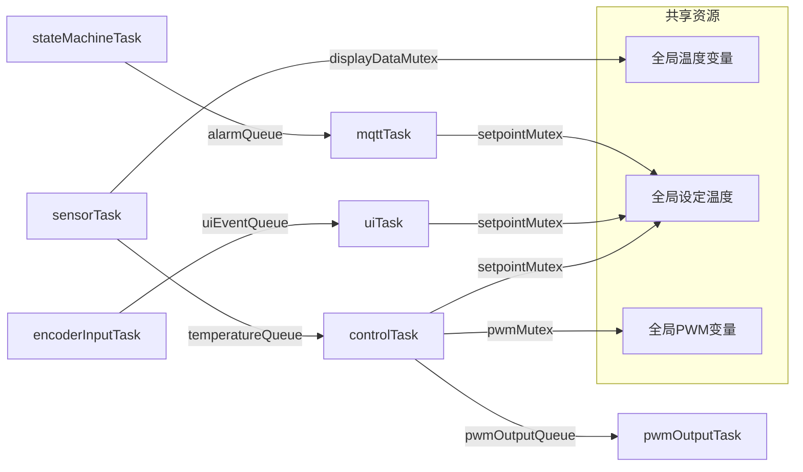

> **图21：任务间数据流图**
> 
> 该图展示了系统中各任务之间的数据流向，包括温度数据流、PWM数据流、编码器事件流和报警信息流。任务间通过队列和互斥锁进行通信。

**数据流说明**：
系统中存在多种数据流。温度数据流从传感器任务开始，传感器任务采集温度并发送到队列，控制任务接收温度后进行PID计算。PWM数据流从控制任务开始，控制任务计算PWM并发送到队列，PWM输出任务接收PWM后更新PWM输出。编码器事件流从编码器输入任务开始，编码器输入任务检测编码器事件并发送到队列，UI任务接收事件后更新OLED显示。报警信息流从状态机任务开始，状态机任务检测报警并发送到队列，MQTT任务接收报警后发布报警。

---

## 六、人机交互设计

### 6.1 编码器交互设计

#### 6.1.1 编码器事件定义

**表8：编码器事件定义表**

| 事件值 | 事件名称 | 触发条件 | 功能 |
|--------|---------|---------|------|
| 0 | 无事件 | 编码器无动作 | 无 |
| 1 | 左转 | 编码器逆时针旋转 | 向上/减少/上一页 |
| 2 | 右转 | 编码器顺时针旋转 | 向下/增加/下一页 |
| 3 | 单击 | 编码器按键短按 | 确认/进入 |
| 4 | 双击 | 编码器按键双击 | 返回/取消 |

**事件定义说明**：
- 使用简单的事件编码，便于处理和调试
- 事件定义与用户操作习惯一致

#### 6.1.2 各页面编码器操作映射

**表9：各页面编码器操作映射表**

| 页面 | 左转(1) | 右转(2) | 单击(3) | 双击(4) |
|------|---------|---------|---------|---------|
| 主页面 | →PID页面 | →传感器页面 | →菜单页面 | 无 |
| 传感器页面 | →主页面 | →PID页面 | →菜单页面 | 无 |
| PID页面 | →传感器页面 | →主页面 | →菜单页面 | 无 |
| 菜单页面 | 上移选中项 | 下移选中项 | 确认选中项 | →主页面 |
| 编辑页面 | 温度-0.5°C | 温度+0.5°C | 保存并返回 | 放弃并返回 |

**操作映射说明**：
- 保持操作一致性，降低用户学习成本
- 旋转：切换/调整
- 单击：确认/进入
- 双击：返回/取消

### 6.2 网页控制界面设计

#### 6.2.1 界面布局设计（响应式设计）

**设计原则**：
- 响应式布局，适应不同屏幕尺寸
- 清晰的视觉层次，突出重要信息
- 简洁的操作流程，降低用户学习成本

**HTML结构设计**：
```html
<!DOCTYPE html>
<html>
<head>
    <title>冰箱PID控制系统</title>
    <script src="https://cdn.plot.ly/plotly-latest.min.js"></script>
    <style>
        /* 响应式布局 */
        .container { max-width: 1200px; margin:0 auto; }
        .row { display: flex; flex-wrap: wrap; }
        .col { flex:1; min-width: 300px; margin: 10px; }
    </style>
</head>
<body>
    <div class="container">
        <h1>冰箱PID控制系统</h1>
        
        <!-- 实时状态卡片 -->
        <div class="row">
            <div class="col">
                <h3>实时状态</h3>
                <p>冷冻室温度: <span id="freezerTemp">-18.5</span>°C</p>
                <p>冷藏室温度: <span id="freshTemp">4.2</span>°C</p>
                <p>压缩机: <span id="compressor">运行</span></p>
                <p>模式: <span id="mode">制冷模式</span></p>
            </div>
            
            <!-- 温度设置卡片 -->
            <div class="col">
                <h3>温度设置</h3>
                <label>冷冻室: <input type="number" id="setpoint" value="-18.0">
                <button onclick="setSetpoint()">应用</button></label>
            </div>
        </div>
        
        <!-- 温度曲线图 -->
        <div id="tempChart"></div>
    </div>
</body>
</html>
```

#### 6.2.2 温度曲线图设计（Plotly.js）

**设计需求**：
- 实时显示温度曲线
- 支持缩放、平移等交互操作
- 自动更新数据

**JavaScript实现**：
```javascript
// 温度历史数据
let tempData = {
    x: [],  // 时间戳
    y: [],  // 温度值
    type: 'scatter',
    name: '冷冻室温度'
};

// 绘制图表
Plotly.newPlot('tempChart', [tempData], {
    title: '温度历史曲线',
    xaxis: { title: '时间' },
    yaxis: { title: '温度 (°C)' }
});

// 定时刷新（每5秒）
setInterval(() => {
    fetch('/api/history')
        .then(res => res.json())
        .then(data => {
            Plotly.update('tempChart', { x: [data.timestamps], y: [data.freezer] });
        });
}, 5000);
```

**曲线图设计说明**：
- 使用Plotly.js绘制交互曲线
- 支持缩放、平移、悬停显示数据等交互操作
- 定时刷新数据，保持曲线实时性

### 6.3 微信小程序设计

#### 6.3.1 页面结构设计

微信小程序的文件结构如下：

```
wechatapp/miniprogram/
├── pages/
│   ├── device/          # 设备连接页面
│   │   ├── device.js    # 逻辑：扫描/输入IP地址
│   │   ├── device.wxml  # 界面：IP输入框、连接按钮
│   │   └── device.wxss  # 样式
│   └── control/         # 控制主页面
│       ├── control.js   # 逻辑：刷新状态、设置温度、切换模式
│       ├── control.wxml # 界面：温度显示、模式按钮、设置控件
│       └── control.wxss # 样式
└── app.json             # 全局配置
```

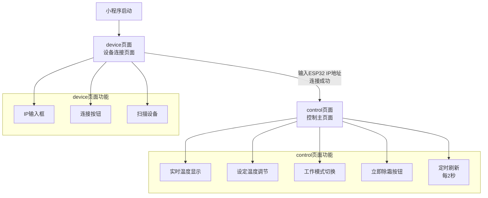

> **图22：微信小程序页面结构图**
> 
> 该图展示了微信小程序的文件结构和页面导航关系。小程序包含device页面和control页面，HTTP请求通过control.js内部封装的requestAPI方法实现。device页面用于设备连接，control页面用于状态显示和控制操作。

**页面结构说明**：
`device`页面是设备连接页面，用于输入ESP32的IP地址。`control`页面是控制主页面，用于显示状态、设置温度和切换模式。HTTP请求的封装（requestAPI方法）直接内联在`control.js`和`device.js`各自内部实现，未采用独立的`utils/api.js`文件。

#### 6.3.2 控制页面交互流程设计

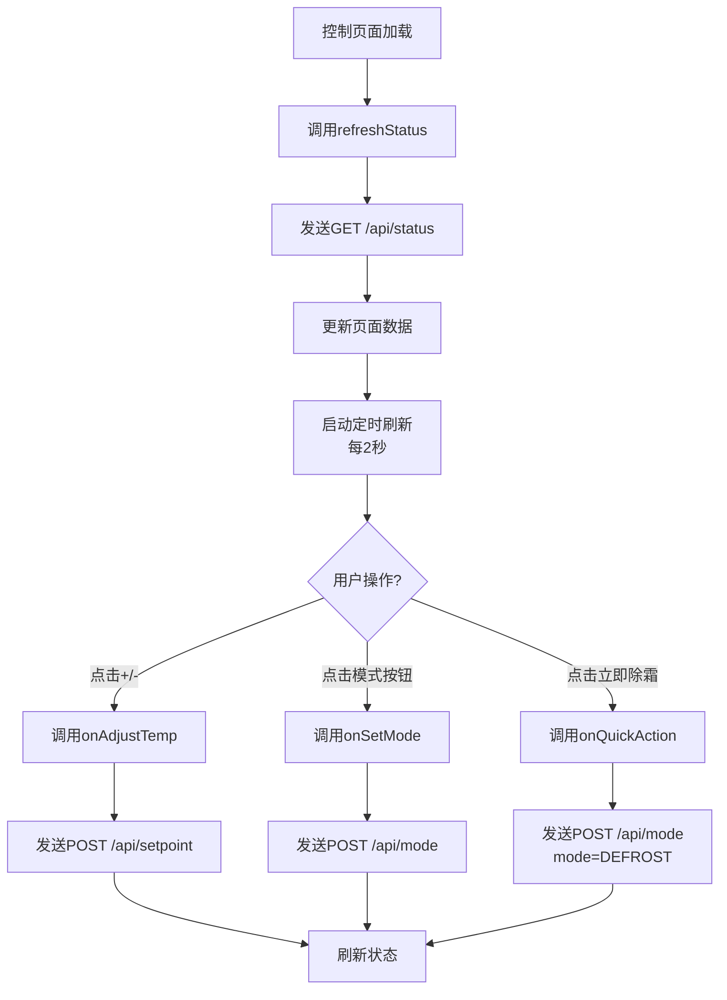

> **图23：控制页面交互流程图**
> 
> 该图展示了微信小程序控制页面的交互流程，包括页面加载、用户操作和刷新状态等步骤。

**交互流程说明**：
控制页面加载时，首先调用refreshStatus函数获取系统状态，然后启动定时刷新，每2秒刷新一次。用户可以进行多种操作，包括点击+/-按钮调整设定温度、点击模式按钮切换工作模式、点击立即除霜启动除霜。每次操作后系统会刷新状态，发送GET /api/status请求并更新页面数据。

#### 6.3.3 核心函数接口设计


```javascript
// requestAPI - 内联在control.js/device.js中，封装wx.request
const requestAPI = (url, options = {}) => {
    return new Promise((resolve, reject) => {
        wx.request({
            url: `http://${getApp().globalData.deviceIP}${url}`,
            method: options.method || 'GET',
            data: options.data || {},
            success: (res) => resolve(res.data),
            fail: (err) => reject(err)
        });
    });
};

// pages/control/control.js - 刷新状态
async function refreshStatus() {
    try {
        const res = await requestAPI('/api/status');
        this.setData({
            freezerTemp: res.freezer_temp.toFixed(1),
            freshTemp: res.fresh_temp.toFixed(1),
            freezerSetpoint: res.freezer_setpoint,
            freshSetpoint: res.fresh_setpoint,
            currentMode: res.mode_code,
            compressorOn: !!res.compressor,
            fanOn: res.fan > 0,
            defrostOn: !!res.defrost,
            pidOutput: res.pid_output.toFixed(1)
        });
    } catch (err) {
        console.error('刷新状态失败:', err);
        wx.showToast({ title: '连接失败', icon: 'none' });
    }
}

// 调整温度（冷冻室-30~-10°C，冷藏室0~10°C）
async function onAdjustTemp(e) {
    const zone = e.currentTarget.dataset.zone;
    const delta = parseInt(e.currentTarget.dataset.delta);
    const newSetpoint = this.data.freezerSetpoint + delta;
    
    // 分区域限制范围
    const minVal = zone === 'freezer' ? -30 : 0;
    const maxVal = zone === 'freezer' ? -10 : 10;
    if (newSetpoint < minVal || newSetpoint > maxVal) {
        wx.showToast({ title: '温度超出范围', icon: 'none' });
        return;
    }
    
    await requestAPI('/api/setpoint', {
        method: 'POST',
        data: { zone: zone, value: newSetpoint }
    });
    
    this.refreshStatus();
}

// 设置模式
async function onSetMode(e) {
    const mode = parseInt(e.currentTarget.dataset.mode);
    await requestAPI('/api/mode', {
        method: 'POST',
        data: { mode: mode }
    });
    this.refreshStatus();
}
```

**接口设计说明**：
1. **requestAPI**：封装wx.request，统一处理请求和响应，支持GET和POST方法。该函数直接内联在`control.js`和`device.js`各自内部，未使用独立的`utils/api.js`文件。2. **refreshStatus**：发送GET /api/status请求，更新页面数据，包含错误处理逻辑。3. **onAdjustTemp**：调整设定温度，按区域分别限制范围（冷冻室-30~-10°C，冷藏室0~10°C），发送POST /api/setpoint请求。4. **onSetMode**：切换工作模式，发送POST /api/mode请求。
   - 发送POST /api/mode请求

---

## 七、安全保护设计

### 7.1 设计原则

安全保护设计遵循以下原则：
1. **故障安全**：任何故障情况下，系统都应该进入安全状态
2. **多重保护**：关键功能需要多重保护，避免单点故障
3. **及时报警**：检测到故障后，及时报警，便于用户处理
4. **自动恢复**：故障清除后，支持自动恢复或手动恢复

### 7.2 温度传感器故障检测设计

#### 7.2.1 故障检测逻辑

```c
void checkSensorFault() {
    // 1. NTC返回值检查
    if (g_freezerTemp < -900.0 || g_freshTemp < -900.0) {
        // NTC读取失败（calculateNTCTemperature返回-999或-998）
        g_systemState.errorType = ERROR_SENSOR;
        g_systemState.hasError = true;
    }
    
    // 2. 温度范围检查
    if (g_freezerTemp > -10.0) {
        // 冷冻室温度过高
        g_systemState.errorType = ERROR_TEMP_HIGH;
        g_systemState.hasError = true;
    }
    if (g_freezerTemp < -30.0) {
        // 冷冻室温度过低
        g_systemState.errorType = ERROR_TEMP_LOW;
        g_systemState.hasError = true;
    }
    
    // 3. SHT40通信检查
    if (g_sht40Temp < -900.0) {
        Serial.println("警告: SHT40通信失败");
        // SHT40不是关键传感器，不直接进入故障模式
    }
}
```

**故障检测逻辑说明**：
1. **NTC返回值检查**：
   - 如果NTC读取失败，返回-999或-998
   - 检测到读取失败，进入故障模式

2. **温度范围检查**：
   - 如果温度超出安全范围，进入故障模式
   - 安全范围：-30°C到-10°C

3. **SHT40通信检查**：
   - 如果SHT40通信失败，打印警告信息
   - SHT40不是关键传感器，不直接进入故障模式

#### 7.2.2 故障处理流程设计

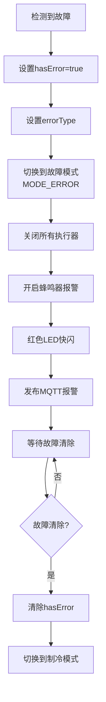

> **图24：故障处理流程图**
> 
> 该图展示了系统故障处理的详细流程，包括检测到故障、切换到故障模式、发布MQTT报警和等待故障清除等步骤。

**故障处理流程说明**：
当系统检测到故障时，首先设置hasError=true和errorType。然后切换到故障模式，关闭所有执行器，开启蜂鸣器报警，红色LED快闪。接着发布MQTT报警信息到`fridge/alarm`主题，通知用户处理故障。最后等待故障清除，系统会周期性检查故障是否清除，故障清除后需要手动恢复。

### 7.3 压缩机保护设计

#### 7.3.1 最小运行/停机时间保护

**设计需求**：
压缩机是冰箱的核心部件，频繁启停会缩短压缩机寿命。需要：
1. 最小停机时间：3分钟，防止频繁启动
2. 最小运行时间：5分钟，防止频繁停止

**保护逻辑实现**：
```c
const unsigned long MIN_COMPRESSOR_OFF_TIME = 180000;  // 3分钟 = 180000ms
const unsigned long MIN_COMPRESSOR_ON_TIME = 300000;   // 5分钟 = 300000ms

bool canStartCompressor() {
    if (!g_systemState.compressorOn) {
        // 当前压缩机关闭，检查是否可以启动
        if (millis() - g_systemState.compressorStopTime < MIN_COMPRESSOR_OFF_TIME) {
            Serial.println("压缩机保护: 停机时间不足3分钟");
            return false;
        }
    }
    return true;
}

bool canStopCompressor() {
    if (g_systemState.compressorOn) {
        // 当前压缩机运行，检查是否可以停止
        if (millis() - g_systemState.compressorStartTime < MIN_COMPRESSOR_ON_TIME) {
            Serial.println("压缩机保护: 运行时间不足5分钟");
            return false;
        }
    }
    return true;
}
```

**保护逻辑说明**：
1. **最小停机时间**：
   - 压缩机关闭后，需要等待3分钟才能再次启动
   - 设计理由：压缩机停机后，高低压需要平衡，立即启动会导致启动电流过大

2. **最小运行时间**：
   - 压缩机启动后，需要运行至少5分钟才能停止
   - 设计理由：压缩机频繁启停会缩短寿命

#### 7.3.2 压缩机保护状态图

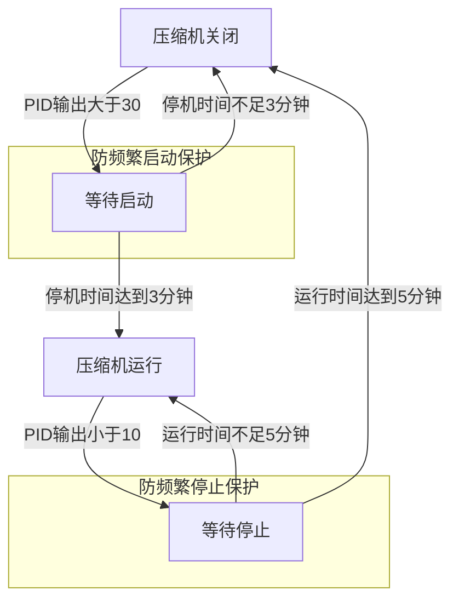

> **图25：压缩机保护状态图**
> 
> 该图展示了压缩机保护的状态转换关系，包括压缩机关闭、等待启动、压缩机运行和等待停止四个状态。系统通过最小停机时间（3分钟）和最小运行时间（5分钟）保护压缩机，防止频繁启停。当PID输出大于30时进入等待启动状态，停机时间达到3分钟后进入压缩机运行状态。当PID输出小于10时进入等待停止状态，运行时间达到5分钟后回到压缩机关闭状态。

**保护状态图说明**：
压缩机保护状态图包含四个状态。当压缩机关闭且PID输出>30时，系统进入等待启动状态。在等待启动状态中，系统等待停机时间达到3分钟，如果停机时间不足3分钟则返回压缩机关闭状态，如果停机时间达到3分钟则进入压缩机运行状态。当压缩机运行且PID输出<10时，系统进入等待停止状态。在等待停止状态中，系统等待运行时间达到5分钟，如果运行时间不足5分钟则返回压缩机运行状态，如果运行时间达到5分钟则进入压缩机关闭状态。

### 7.4 门未关闭报警设计

**设计需求**：
门未关闭会导致冷量损失，增加能耗。需要：
1. 检测门状态
2. 门打开超过5分钟，触发报警

**报警逻辑实现**：
```c
void checkDoorAlarm() {
    if (g_systemState.doorOpen) {
        // 门打开
        if (g_systemState.doorOpenTime == 0) {
            g_systemState.doorOpenTime = millis();
        }
        
        // 门打开超过5分钟
        if (millis() - g_systemState.doorOpenTime > 300000) {
            Actuator_SetBuzzer(BUZZER_ON);
            g_systemState.errorType = ERROR_DOOR_OPEN;
            g_systemState.hasError = true;
        }
    } else {
        // 门关闭
        g_systemState.doorOpenTime = 0;
        Actuator_SetBuzzer(BUZZER_OFF);
    }
}
```

**报警逻辑说明**：
1. **门打开**：
   - 记录门打开时间
   - 如果门打开超过5分钟，开启蜂鸣器报警
   - 设置故障类型

2. **门关闭**：
   - 清除门打开时间
   - 关闭蜂鸣器

### 7.5 除霜温度保护设计

**设计需求**：
除霜时，加热丝会使温度上升。需要：
1. 除霜温度超过5°C，强制结束除霜
2. 除霜时间超过30分钟，强制结束除霜

**保护逻辑实现**：
```c
void checkDefrostProtection() {
    if (g_systemState.currentMode == MODE_DEFROST) {
        // 除霜模式：检查温度是否过高
        if (g_freezerTemp > 5.0) {
            // 温度超过5°C，强制结束除霜
            Serial.println("除霜保护: 温度超过5°C，结束除霜");
            StateMachine_SetMode(MODE_COOLING);
        }
        
        // 除霜时间超过30分钟，强制结束
        if (millis() - g_systemState.stateStartTime > 1800000) {
            Serial.println("除霜保护: 时间超过30分钟，结束除霜");
            StateMachine_SetMode(MODE_COOLING);
        }
    }
}
```

**保护逻辑说明**：
1. **温度保护**：
   - 除霜时，温度会上升
   - 如果温度超过5°C，说明除霜已完成，强制结束除霜

2. **时间保护**：
   - 如果除霜时间超过30分钟，说明除霜异常，强制结束除霜
   - 避免加热丝长时间加热，导致温度过高

---

## 八、通信协议设计

### 8.1 设计原则

通信协议设计遵循以下原则：
1. **简洁性**：协议格式简洁，便于解析和生成
2. **可扩展性**：协议格式支持扩展，便于后续增加新功能
3. **可靠性**：协议需要错误处理，避免错误数据导致系统异常
4. **安全性**：协议需要考虑安全性，避免未授权访问

### 8.2 HTTP API设计

#### 8.2.1 获取系统状态接口

**请求**：
```
GET /api/status HTTP/1.1
Host: 192.168.4.1
```

**响应**：
```json
HTTP/1.1 200 OK
Content-Type: application/json

{
    "freezer_temp": -18.5,
    "fresh_temp": 4.2,
    "freezer_setpoint": -18.0,
    "fresh_setpoint": 4.0,
    "sht40_temp": 25.0,
    "sht40_humidity": 60.0,
    "compressor": true,
    "fan": 128,
    "defrost": false,
    "mode_code": 0,
    "mode": "制冷模式",
    "pid_output": 45.2,
    "uptime": 12345
}
```

**接口设计说明**：
- 使用GET方法，便于浏览器直接访问
- 返回JSON格式，便于解析
- 包含系统所有状态信息

#### 8.2.2 设置设定温度接口

**请求**：
```
POST /api/setpoint HTTP/1.1
Host: 192.168.4.1
Content-Type: application/json

{
    "zone": "freezer",
    "value": -18.0
}
```

**响应**：
```json
{
    "success": true,
    "message": "设定温度已更新"
}
```

**接口设计说明**：
- 使用POST方法，便于传递参数
- 请求JSON格式，包含zone和value参数
- 返回JSON格式，包含success和message字段

#### 8.2.3 设置工作模式接口

**请求**：
```
POST /api/mode HTTP/1.1
Host: 192.168.4.1
Content-Type: application/json

{
    "mode": "COOLING"
}
```

**可选模式**：
- `COOLING` 或 `0`：制冷模式
- `DEFROST` 或 `1`：除霜模式
- `ECO` 或 `2`：节能模式
- `ERROR` 或 `3`：故障模式

**接口设计说明**：
- 使用POST方法，便于传递参数
- 请求JSON格式，包含mode参数
- mode可以是字符串或数字

### 8.3 MQTT通信设计

#### 8.3.1 连接参数设计

**表10：MQTT连接参数设计表**

| 参数 | 值 | 说明 |
|------|---|------|
| Broker地址 | `broker.emqx.io` | 免费公共MQTT服务器 |
| 端口 | 1883 | 非加密端口 |
| ClientID | `fridge_esp32` | 客户端唯一标识 |
| 心跳包间隔 | 60秒 | KeepAlive |
| 连接超时 | 10秒 | 超时后重试 |
| 重连间隔 | 5秒 | 断开后重试间隔 |

**连接参数说明**：
1. **Broker地址**：
   - 使用免费公共MQTT服务器`broker.emqx.io`
   - 便于测试和演示

2. **ClientID**：
   - 使用`fridge_esp32`作为客户端ID
   - 确保唯一性

3. **心跳包间隔**：
   - 60秒发送一次心跳包
   - 保持连接活跃

#### 8.3.2 主题设计详解

**1. `fridge/status`（状态上报）**

发布周期：5秒  
数据格式：JSON（见8.2.1）

**2. `fridge/alarm`（报警通知）**

触发条件：
- 温度异常（> -10°C 或 < -30°C）
- 传感器故障
- 门未关闭超过5分钟

数据格式：纯文本
```
Freezer abnormal: -5.0°C
Sensor fault detected
Door open for more than 5 minutes
```

**3. `fridge/control`（控制指令）**

支持的指令：
- `set_setpoint`：设置设定温度
- `set_mode`：设置工作模式
- `set_pid`：设置PID参数
- `start_defrost`：启动除霜
- `clear_error`：清除故障

#### 8.3.3 MQTT通信状态机设计

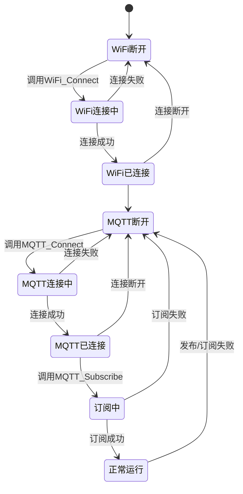

> **图26：MQTT通信状态机图**
> 
> 该图展示了MQTT通信的状态转换关系，包括WiFi连接状态机、MQTT连接状态机、订阅状态机和正常运行等状态。

**状态机说明**：
MQTT通信状态机包含多个子状态机。WiFi连接状态机包括WiFi断开、WiFi连接中和WiFi已连接等状态，如果连接失败或连接断开，都会返回WiFi断开状态。MQTT连接状态机包括MQTT断开、MQTT连接中和MQTT已连接等状态，如果连接失败或连接断开，都会返回MQTT断开状态。订阅状态机包括订阅中和正常运行等状态，如果订阅失败，会返回MQTT断开状态。正常运行状态下，系统会定时发布状态并接收控制指令，如果发布/订阅失败，会返回MQTT断开状态。

---

## 九、总结

### 9.1 已完成的设计内容

本报告在第一阶段需求分析的基础上，对基于FreeRTOS与PID算法的冰箱智能温控系统进行了详细的模块化设计，主要成果包括：

1. **系统总体架构设计**：完成了四层架构设计（应用层、控制层、数据处理层、驱动层），明确了各层之间的调用关系，设计了模块划分和职责。

2. **数据结构设计**：定义了系统模式枚举、控制状态枚举、故障类型枚举、执行器状态枚举、OLED UI页面枚举，以及系统状态数据结构。详细说明了每个数据结构的设计理由和注意事项。

3. **模块详细设计**：对8个核心模块进行了详细设计，包括功能描述、流程图、核心函数接口设计、实现方案等。每个模块都详细说明了设计考虑和实现要点。

4. **FreeRTOS任务设计**：完成了8个任务的划分、优先级分配、栈大小设置，以及任务间通信机制设计（4个互斥锁、4个队列）。详细说明了任务调度时序和任务间数据流。

5. **人机交互设计**：完成了OLED 5页界面设计、编码器交互设计、网页控制界面设计、微信小程序设计。详细说明了界面布局、交互流程、操作映射等。

6. **安全保护设计**：完成了温度传感器故障检测、压缩机保护、门未关闭报警、除霜温度保护等安全机制设计。详细说明了故障检测逻辑、保护策略、处理流程等。

7. **通信协议设计**：完成了HTTP API接口设计和MQTT通信协议设计。详细说明了接口格式、主题设计、数据格式、通信时序等。

### 9.2 设计特点

1. **实时性保障**：使用FreeRTOS多任务调度，确保温度采集、PID计算、用户交互的实时性。根据任务实时性要求分配优先级，高优先级任务优先执行。

2. **数据安全性**：使用互斥锁保护所有共享资源，避免数据竞争。使用队列进行任务间数据传递，避免使用全局变量。

3. **故障安全**：完善的故障检测和处理机制，确保系统安全运行。任何故障情况下，系统都应该进入安全状态。

4. **用户友好**：提供OLED本地界面、Web远程界面、微信小程序远程界面三种交互方式，满足不同场景的需求。

5. **可扩展性**：模块化设计，便于后续增加新功能（如WiFi配置页面、数据记录、云端接入等）。

### 9.3 下一步工作计划

根据本报告的设计方案，下一步工作计划如下：

1. **代码实现**：根据本报告的设计方案，进行详细设计和代码实现。
2. **Wokwi仿真**：在Wokwi平台进行仿真测试，验证设计方案的正确性。
3. **硬件部署**：在实际硬件上进行部署测试，验证系统功能。
4. **系统联调**：进行系统联调和性能测试，优化系统性能。
5. **撰写最终报告**：撰写最终报告，总结系统设计和实现过程。

---

## 附录A：文件清单

**表11：项目文件清单表**

| 文件名 | 路径 | 功能描述 |
|--------|------|----------|
| `main.cpp` | `fridge_pid_control/src/` | 真实硬件版本：主程序、FreeRTOS任务、传感器采集、PID控制、OLED UI |
| `wokwi_main.cpp` | `fridge_pid_control/src/` | Wokwi仿真版本：单循环架构，用于仿真测试 |
| `state_machine.cpp/.h` | `fridge_pid_control/src/`, `fridge_pid_control/include/` | 状态机管理：四种模式切换 |
| `actuator.cpp/.h` | `fridge_pid_control/src/`, `fridge_pid_control/include/` | 执行器控制：压缩机、除霜、风扇、蜂鸣器、LED |
| `wifi_webserver.cpp/.h` | `fridge_pid_control/src/`, `fridge_pid_control/include/` | WiFi Web服务器：HTTP API接口 |
| `wifi_mqtt.cpp/.h` | `fridge_pid_control/src/`, `fridge_pid_control/include/` | WiFi/MQTT通信：连接管理、数据发布/订阅 |
| `web_interface.h` | `fridge_pid_control/src/` | 网页界面HTML/JS/CSS代码 |
| `wifi_config.h.template` | `fridge_pid_control/include/` | WiFi配置模板文件 |
| `control.js/.wxml/.wxss` | `wechatapp/miniprogram/pages/control/` | 微信小程序控制页面 |
| `device.js/.wxml/.wxss` | `wechatapp/miniprogram/pages/device/` | 微信小程序设备连接页面 |

## 附录B：硬件BOM表

**表12：硬件物料清单表**

| 元件名称 | 型号/规格 | 数量 | 用途 | 预估价格 |
|---------|----------|------|------|----------|
| ESP32-S3开发板 | ESP32-S3-DevKitC-1 | 1 | 主控芯片 | ¥30 |
| OLED显示屏 | SSD1306 128×64 I2C | 1 | 系统状态显示 | ¥15 |
| 旋转编码器 | EC11 | 1 | 用户交互输入 | ¥5 |
| NTC热敏电阻 | 100K B=3950 | 2 | 冷冻室/冷藏室温度采集 | ¥10 |
| 温湿度传感器 | SHT40 | 1 | 环境温湿度监测 | ¥20 |
| ADC芯片 | ADS1115 | 1 | 高精度ADC采集 | ¥15 |
| 继电器模块 | 5V 10A | 2 | 压缩机/除霜控制 | ¥20 |
| 蜂鸣器 | 5V 有源 | 1 | 报警提示 | ¥3 |
| LED灯 | 3mm 红/黄/绿/蓝 | 4 | 状态指示 | ¥2 |
| 直流风扇 | 12V 40mm | 1 | 冷藏室空气循环 | ¥15 |
| 除霜加热丝 | 12V 20W | 1 | 蒸发器除霜 | ¥20 |
| 面包板 | 830孔 | 1 | 原型开发 | ¥10 |
| 杜邦线 | 若干 | 1套 | 连接线 | ¥10 |
| **总计** | | | | **约¥175** |

---

**报告完成日期**：2026年6月8日  
**撰写人**：董慧晴  
**学号**：423128040120  
**班级**：4231090303
